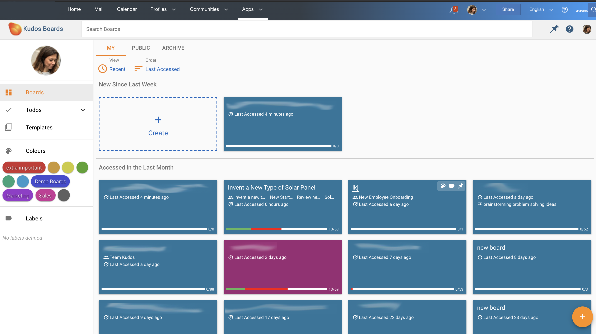

#Start Page

The picture below shows a start page with colourful tiles. Each tile is one Board with names (blurred in this image), when it was last accessed, progress on tasks and more.

##On this start page you can:

* Create a new Board by clicking on the **_Plus sign and Create_**

* Open an existing Board by clicking on one of the tiles

* Search for a Board by entering the search word in the **_Search Boards_** field at the top

* Filter Boards by **_My_**, **_Public_** and **_Archive_**

* Sort Boards by **_Recent_** and **_Last accessed_**

* **Colours** These are colour tags you can drag and drop onto the tiles. Click on the menu to edit the tags.

* Add tags to the Boards for easy sorting and filtering in the same way as with colours above.

* See all your collected tasks from all your Boards by clicking on **_Todos_**

* Find the template library by clicking on **_Templates_**
