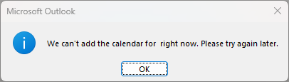

{ style="float: right" width=200 }

#Board iCalendar feed

If there are scheduled tasks in a board, a calendar feed can be enabled allowing you or others to subscribe to the feed of board tasks as events in your calendar app.

Calendar applications such as Microsoft Outlook will perform regular synchronisation with the feed, so any changes made to the scheduled tasks in Boards will be updated in your calendar automatically.

### Enabling a calendar feed for a board

1.  Navigate to `Open Board Options` found in the title of your board, to the left of the search bar.

    

1.  Underneath the action bar on the right hand sideyou will see an `iCalendar feed` box with an `Enable` button. Click this to enable the calendar feed for this board.

    

1.  After clicking enable, additional buttons will become available for subscribing to, copying the link for, or disabling the calendar feed:

    

    1.  Click `Subscribe` to open your chosen calendar app for your operating system and subscribe to the feed.
    1.  Click `Copy feed link` to copy the link to the feed to your clipboard. This may be useful for pasting into a calendar application, or sharing the calendar feed to people who may not have access to the board.

        !!! note

            If you are experiencing problems subscribing to the feed in a calendar app, try changing the `webcals` part of the copied URL to `https`.

        !!! note

            You may experience an error similar to the following when attempting to subscribe to a board calendar feed within Microsoft Outlook for Windows.

            

            In this case, follow [the steps shown here](https://www.uwec.edu/kb/article/email-disable-shared-calendar-improvements-in-outlook/) to disable shared calendar improvements.
            After restarting Outlook, the calendar subscription should now work.

    1.  Click `Disable` to disable the feed for the board. The feed will no longer be available and any subscriptions to this board feed will not continue to sync.
