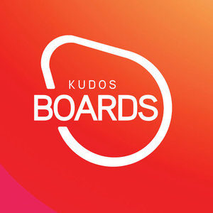
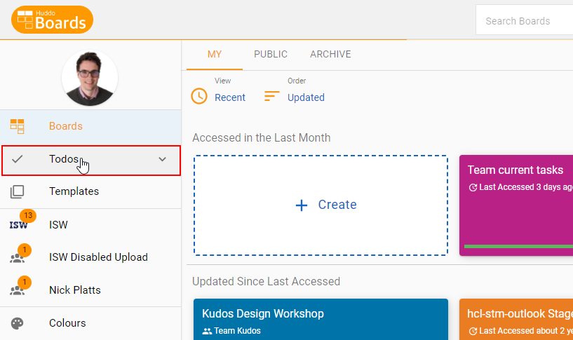
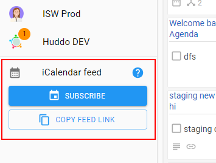
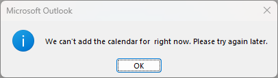

{ style="float: right" width=200 }

#Personal iCalendar feed

A calendar feed can be subscribed to for _all_ scheduled tasks you are assigned to within Huddo Boards.

Calendar applications such as Microsoft Outlook will perform regular synchronisation with the feed, so any changes made to the scheduled tasks in Boards will be updated in your calendar automatically.

### Subscribing to your personal calendar feed

1.  From the My Boards Dashboard/Homepage, navigate to my `Todos` found in the left hand side menu.

    

1.  Once in the Todos view you will see an iCalendar feed section at the bottom of the left hand side menu.

    

    1.  Click `Subscribe` to open your chosen calendar app for your operating system and subscribe to the feed.
    1.  Click `Copy feed link` to copy the link to the feed to your clipboard. This may be useful for pasting into a calendar application.

    !!! note

        If you are experiencing problems subscribing to the feed from within in a calendar app, try changing the `webcals` part of the copied URL to `https`.

    !!! note

        You may experience an error similar to the following when attempting to subscribe to a calendar feed within Microsoft Outlook for Windows.

        

        In this case, follow [the steps shown here](https://www.uwec.edu/kb/article/email-disable-shared-calendar-improvements-in-outlook/) to disable shared calendar improvements.
        After restarting Outlook, the calendar subscription should now work.
