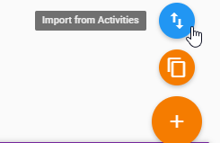
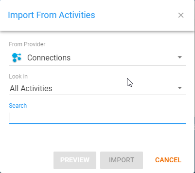
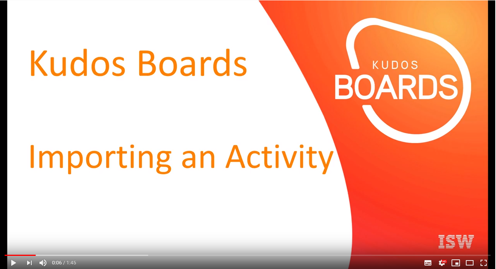

# Import Activities

### Import a single activity for Hybrid Installations

Activities that already exist in HCL Connections can be individually imported into Huddo Boards.

First, hover over the 'Create Board' button in the bottom right and select the 'Import from Activities' option that appears

From here, you can search for the Activity you wish to import, either previewing the result or just importing directly. A new card will be created at the start which indicates this has been done as well as a link to the Board.

