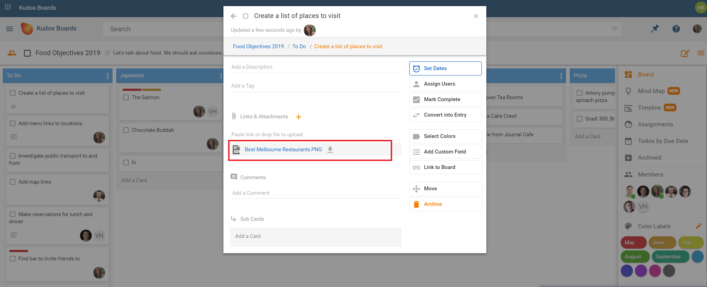
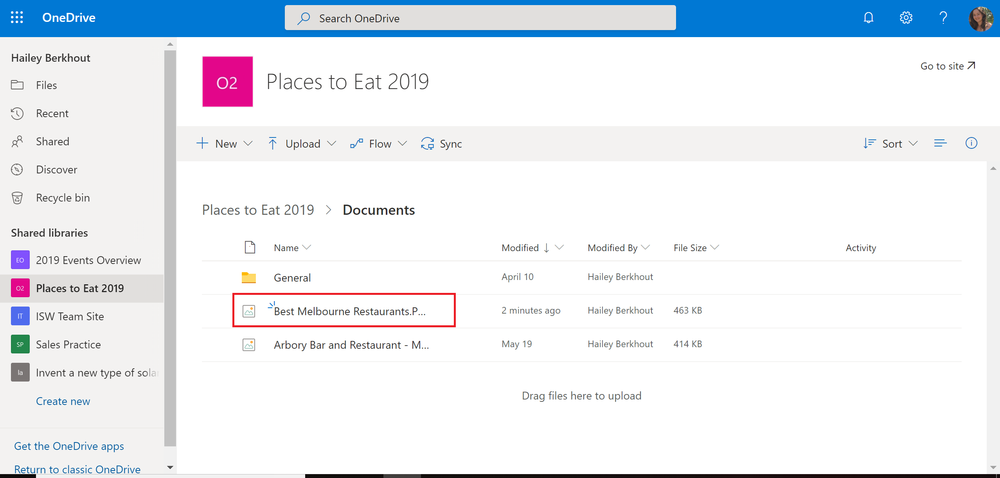

### Huddo Boards and Microsoft OneDrive

The Huddo Boards integration with Microsoft OneDrive allows you to find files that you have added to boards, conveniently located in your OneDrive.

In the example below, a file titled "Best Melbourne Restaurants" has been added to the board, Food Objectives 2019.

  

The file will be added to OneDrive for easy access and location.

  

In the example above, the board is part of a Teams Channel called "Places to Eat 2019", and as a result, a shared library has been created to hold those files.

Files will be added to OneDrive whether they are from private or shared boards.
