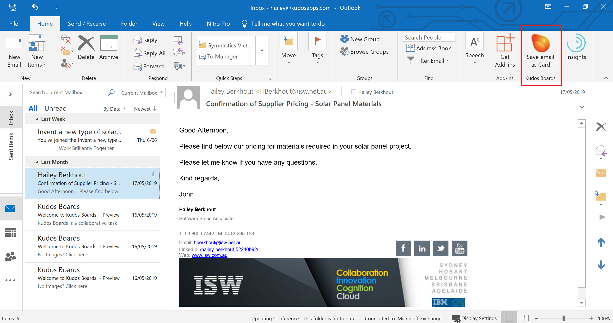
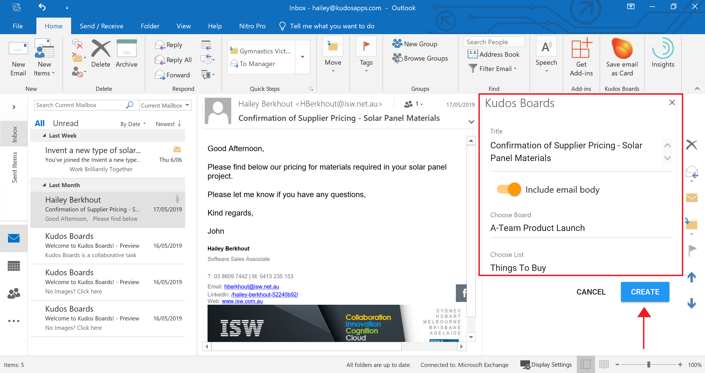
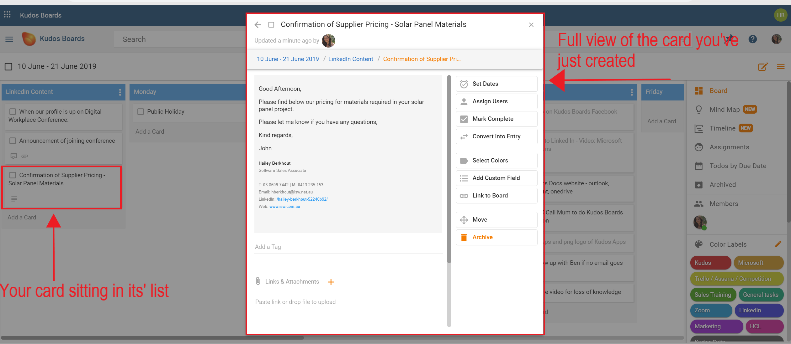
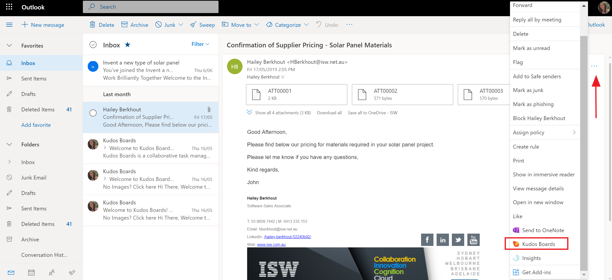
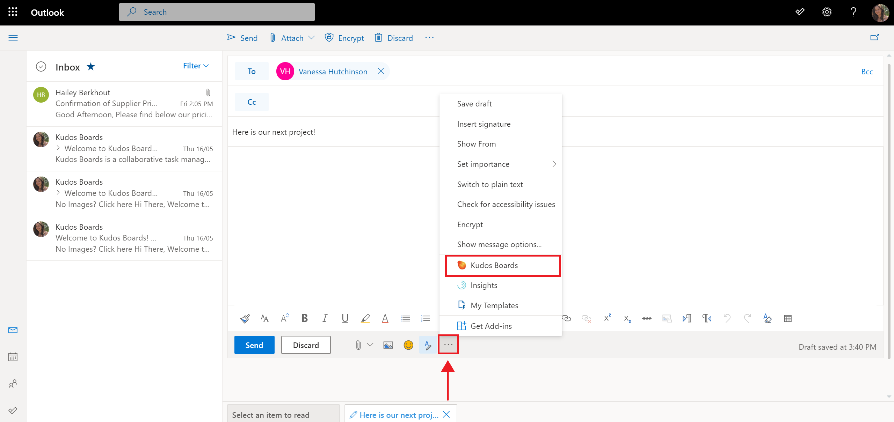
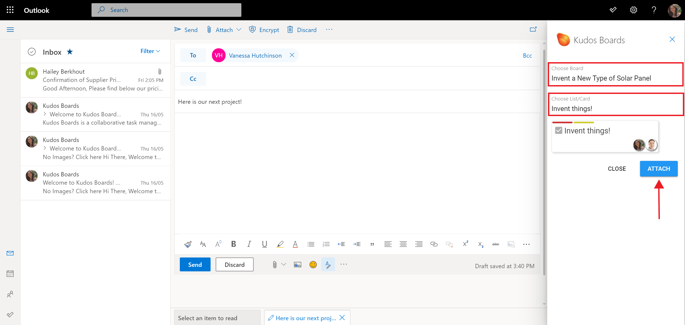

# Huddo Boards in Microsoft Outlook

Huddo Boards' integration with Microsoft Office 365 allows you to create cards on a board directly from an email in your inbox, and share cards, lists, or an entire board, within an email.

## Create a Card From an Email

### Desktop Outlook

Navigate to the email you would like to attach as a card to a board. Click the `Save email as card` button in the `Home` ribbon.

The title of the email will automatically be filled, however you have the opportunity to change this if you wish. Select to `Include email body` so the contents of your email are included in your card. A board and list will automatically be recommended to you however you can change this selection by clicking on the board and list fields and making a new selection.

Click `Create`.

In the next window, click the `Open in Boards` button to be taken to the board and see the card. It will look something like this:

### Web Outlook

Navigate to the email you would like to attach as a card to a board. Click the `...` for more actions and scroll down to select `Huddo Boards`.

The title of the email will automatically be filled, however you have the opportunity to change this if you wish. Select to `Include email body` so the contents of your email are included in your card. A board and list will automatically be recommended to you however you can change this selection by clicking on the board and list fields and making a new selection.

Click `Create`.

In the next window, click the `Open in Boards` button to be taken to the board and see the card. It will look something like this:

## Attach a Card, List or Board to an Email

### Desktop Outlook

To include a card, list, or board, in an email, create a new email, or select reply or forward of an existing email already in your inbox.

On Desktop Outlook, you'll find the `Attach Board/Card` button in the `Message` ribbon.

In the side panel that appears, you'll have the option to select your desired board and the lists or cards you would like to include. You can select an entire board, or simply a card or list (or multiple cards and lists to attach). Click `Attach` when you've made your selection. Continue to add more by repeating the same selection process and attaching to the email.

### Web Outlook

To include a card, list, board, in an email, create a new email, or select reply or forward of an existing email already in your inbox.

Click the `...` at the bottom of the email and select `Huddo Boards`.

In the side panel that appears, you'll have the option to select your desired board and the lists or cards you would like to include. You can select an entire board, or simply a card or list (or multiple cards and lists to attach). Click `Attach` when you've made your selection. Continue to add more by repeating the same selection process and attaching to the email.

