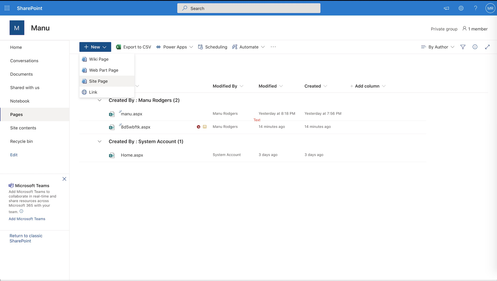
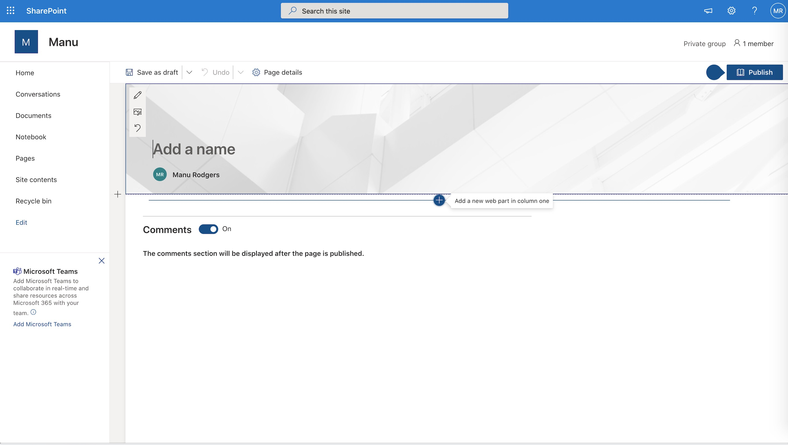
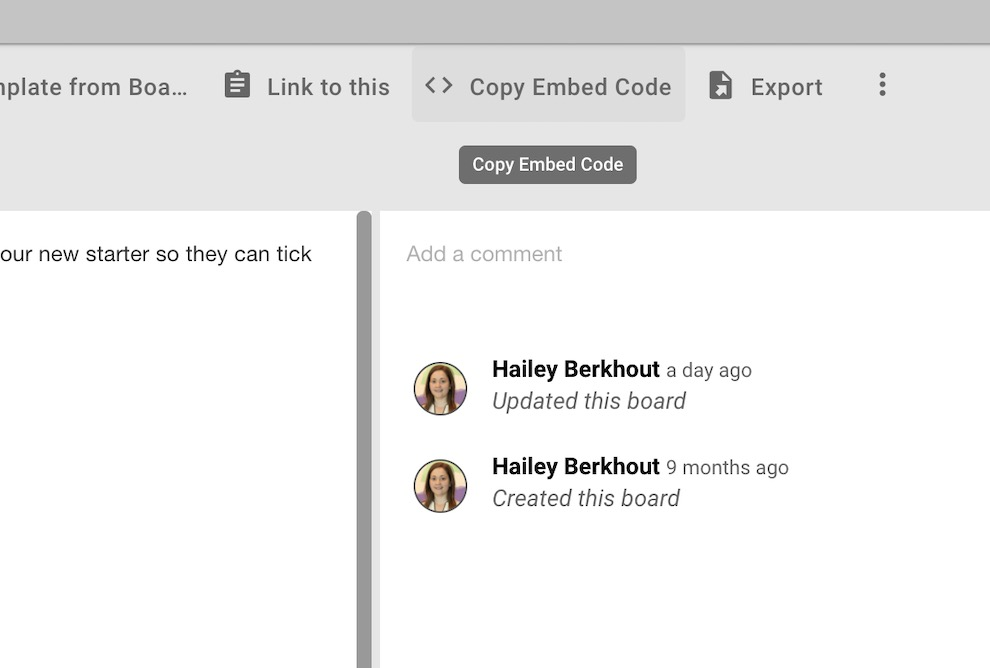
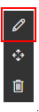
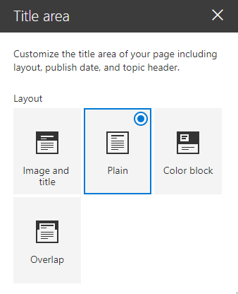
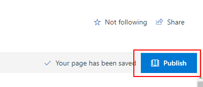
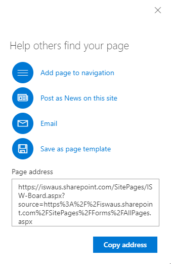

## Embedding Huddo Boards in a SharePoint Site Page

Huddo Boards' integration with Microsoft Office 365 allows you to add Huddo Boards to a SharePoint site page and work directly on the board from the page.

In the example below, we've created a site page called "Where to Eat in Melbourne" and added our Food Objectives 2019 board to it. When added, you and your colleagues can work directly from a site page on a board.

Before proceeding, you will need a site admin to enable security settings as described [here](../../msgraph/sharepoint/admin.md)

1. From Sharepoint main menu, go to `Pages` -> `New` -> `Site Page`

      

1. Give your page a name, then click the `+`

      

1. Choose `Embed` from the drop down menu

      

1. Open [Huddo Boards](https://boards.huddo.com/auth/signin) and select the board you wish to embed in the sharepoint page.  Click the `Board Options` button

      

1. Click `Copy embed code`

      

1. Go back to sharepoint and paste the code you copied in the box provided

      

>  Note, if you don't see the input box above, you can get it back by clicking the embed you added previously and clicking it's edit button.     

1. To make a small amount of extra room on your page, you may wish to edit the title and choose `Plain` as it's layout.

      

1. Once you are happy with the page, click 'Publish' to make it visible to other members of your site.

      

1. Promote your new page by following the recommendations

      
