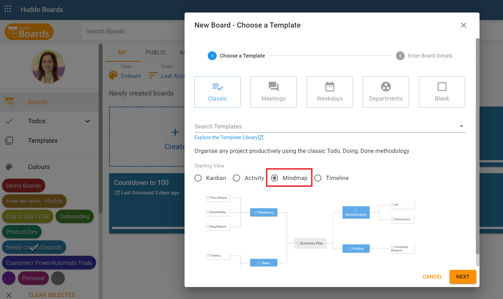
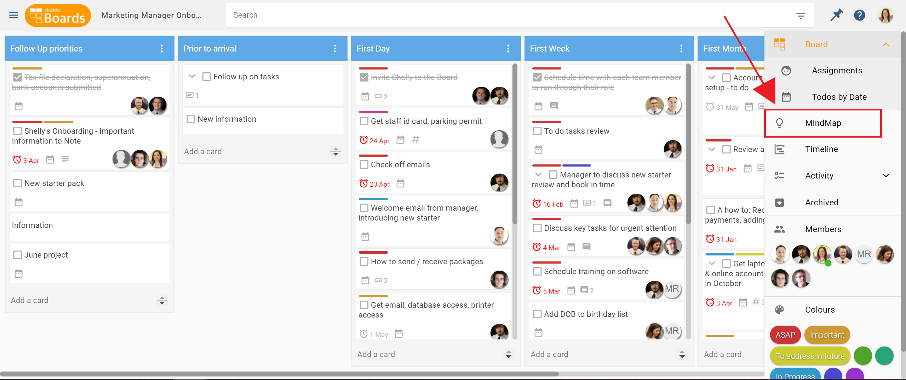
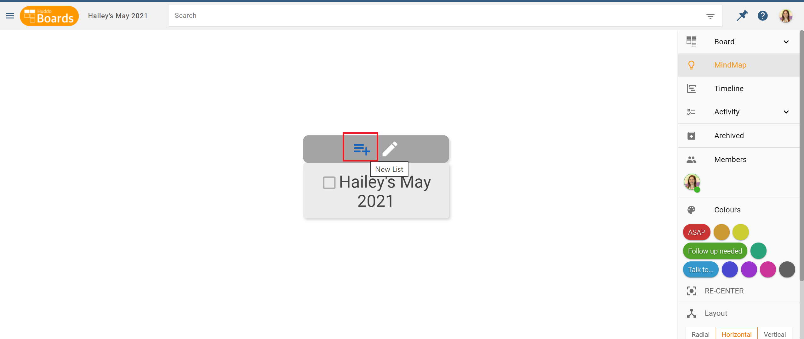
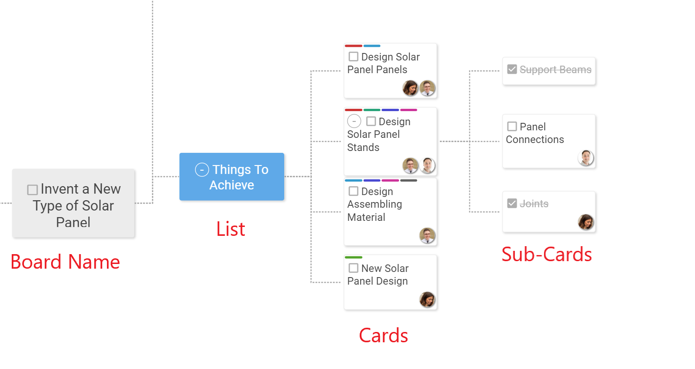
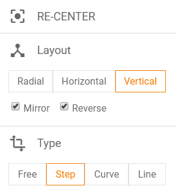
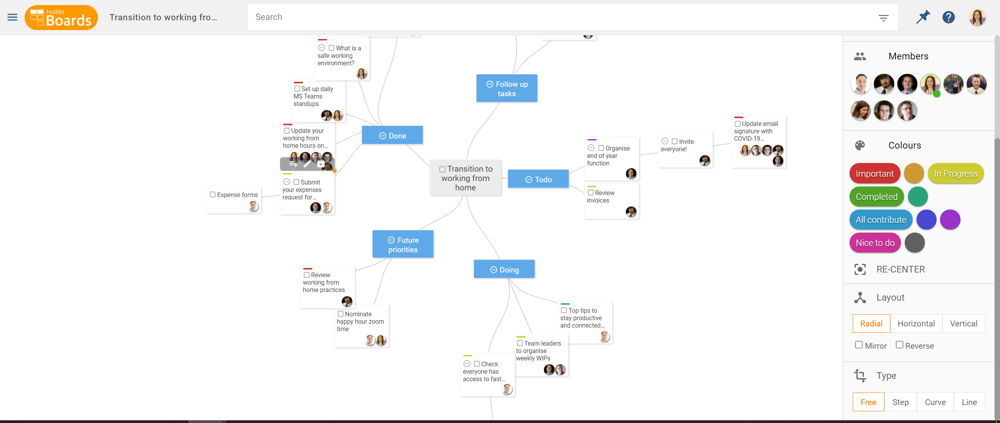
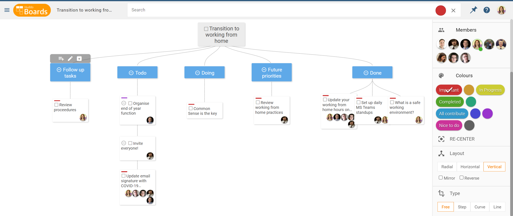
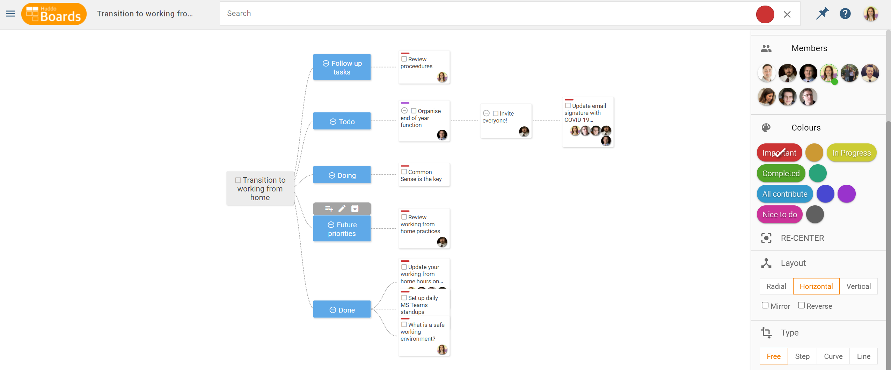
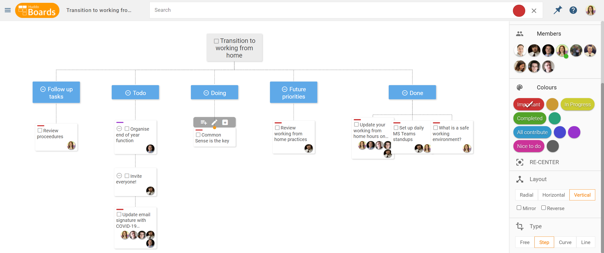
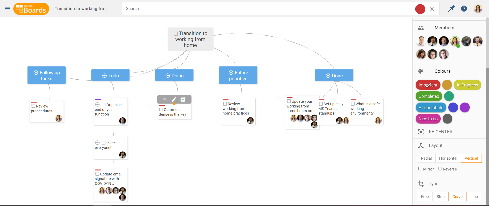

#Mind Map View

The Mind Map layout in Huddo Boards is a unique view that allows you to have a visual overview of all your tasks from one board. Mind Map is ideal for strategic planning, brainstorming, inventing, R&D, marketing, and more.

### Accessing the Mind Map View

The Mind Map view can be set as the *Starting View* when you create a board or it can be switched to at any time during your work on a Board.

In your board creation phase, select `Mind Map` from the `Starting View` drop down.

If your board is already created in either the Timeline or Board view, it is simply a matter of selecting the `Mind Map` view from the right-hand side menu.

### Creating a New Mind Map

In this example, we’ll create a new mind map and select `Blank` as the template, so we can populate it entirely ourselves. Alternatively, you can select one of the preloaded templates like *Classic, Weekdays, Departments, or Meetings.*

When you create a new mind map, you’ll see the title of the board, sitting front and center on the page. You’ll notice that just above the boxed title, there are two icons. The icon on the left creates a new sub-card. Since we’ve just begun our board, this will first create lists.  

You can add as many lists as you like and at any stage of your mind map. Then add cards to your list areas, as you would on the Kanban Board view. Use the `Add a Sub-Card` icon on your desired list to add cards.

You can add as many cards to the blue list titles as you like. Using the `Add a Sub-Card` icon on a card, will create a sub-card.

As with a board and timeline, you can drag and drop colour labels and members on to your mind map.

### Mind Map Views and Layouts

On the right-hand side menu, you have tools that can change the layout of your Mind Map.

***Re-Centre:*** If you’ve focused in one section of your mind map, clicking Re-Centre will bring you back to a big picture view of your map.

---

***Layout: Radial***

---

***Layout: Horizontal***

---

***Layout: Vertical***

---

***Mirror / Reverse:*** Flip the layout of your mind map between mirror and reverse.

***Type:*** Use Type to dictate how your lists, cards, and sub-cards are connected to each other.

***Type: Free***

---

***Type: Step***

---

***Curve***

---

***Type: Line***

---
