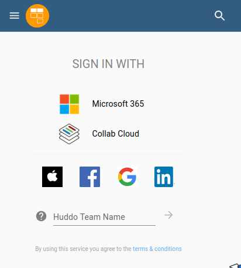

# Mobile app

You can access and work with Huddo Boards Cloud on your mobile device.

## Huddo Boards Cloud

### Download the app to your device

Download the Huddo Boards Cloud App from either Apple App Store or Google Play Store.

### Login to the Huddo Boards App

When you start the app and reach the login screen you have multiple options on how to identify yourself towards Activities Plus and Huddo Boards.

You are in! Now you see all your existing Activities and Boards and can immediately start working!

## Huddo Boards On-Prem

### Install Video

!!! note

    Click the image to go through to the video

