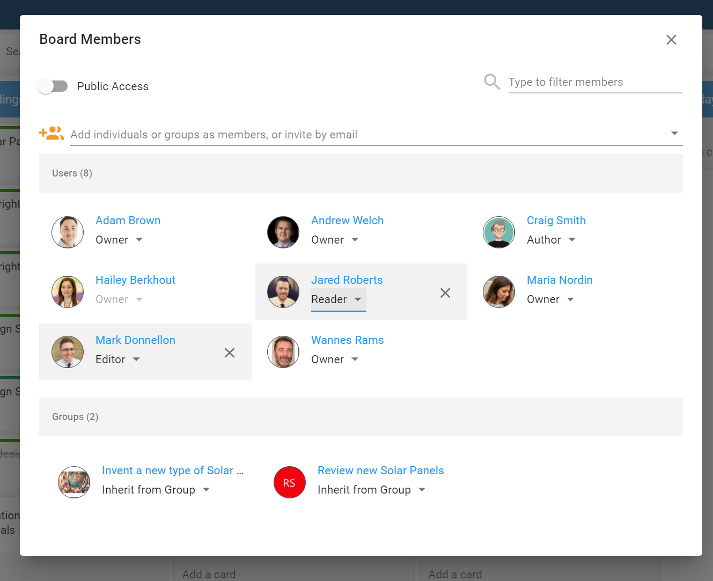

{ style="float: right" width=200 }

# Permissions in Huddo Boards

When you invite colleagues, teams, or external parties to collaborate in your board, you can decide what level of permission to allocate to them. Below, permissions are listed from the highest access to the lowest.

See the [user access permissions table](./#user-access-permissions-table) at the bottom of the page for details on the functions each role has.

### Owner

Owners have full rights to all properties and functions on a board, they can add, edit and delete all other members, lists and cards in the board. They can edit all board options, archive and delete the board.

### Editor

An editor has the ability to create or edit lists and cards within a board. Editors cannot modify board properties or archive/delete a board. They can however add or change the board colour labels.
Editors can invite and manage other members with the roles _reader_, _author_ and _editor_ (they cannot modify *owner*s).

### Author

A member with author permissions has the ability to create new lists and cards. They can edit the lists and cards they created, and can edit and complete any cards assigned to them. Authors can comment on any card.

### Reader

A person allocated reader permission will have read-only access to a board. Readers will not be able to create or edit board content, with the exception of being able to comment on, and complete a task that has been assigned to them.

[Find out more about how to add members to a board.](../adding-members/index.md)

### Making Your Board Public

When you activate `Public Access,` your board will be discoverable by anyone in your organisation. You'll be asked to select Reader, Author, or Editor to decide what level of access your organisation can have to the board. Additionally, updates that you make on your board may be included in linked activity streams such as HCL Connections, or Microsoft Teams.

To give your board public access, navigate to your desired board. Select `Members` and then select `Public Access.` Decide what level of access, Reader, Author or Editor, your organisation will have.

## User access permissions table

| Legend                   |                                                 |
| ------------------------ | ----------------------------------------------- |
| :white_check_mark:\*     | Only applicable if user authored the item       |
| :white_check_mark:\*\*   | Only applicable if user is assigned to the card |
| :white_check_mark:\*\*\* | Add and edit members at editor level or below   |

| Functions                                                                        | Boards user            | Owner              | Editor                   | Author               | Reader                 |
| -------------------------------------------------------------------------------- | ---------------------- | ------------------ | ------------------------ | -------------------- | ---------------------- |
| Create a board                                                                   | :white_check_mark:     |                    |                          |                      |                        |
| Create a template                                                                | :white_check_mark:     |                    |                          |                      |                        |
| Open and view all board content                                                  |                        | :white_check_mark: | :white_check_mark:       | :white_check_mark:   | :white_check_mark:     |
| Edit board settings                                                              |                        | :white_check_mark: |                          |                      |                        |
| Edit board members                                                               |                        | :white_check_mark: | :white_check_mark:\*\*\* |                      |                        |
| Edit board colour categories                                                     |                        | :white_check_mark: | :white_check_mark:       |                      |                        |
| Copy link                                                                        |                        | :white_check_mark: | :white_check_mark:       | :white_check_mark:   | :white_check_mark:     |
| Export                                                                           |                        | :white_check_mark: | :white_check_mark:       | :white_check_mark:   | :white_check_mark:     |
| Copy board                                                                       |                        | :white_check_mark: | :white_check_mark:       | :white_check_mark:   | :white_check_mark:     |
| **List functions**                                                               |                        |                    |                          |                      |                        |
| Add list                                                                         |                        | :white_check_mark: | :white_check_mark:       | :white_check_mark:   |                        |
| Rename list                                                                      |                        | :white_check_mark: | :white_check_mark:       | :white_check_mark:\* |                        |
| Move list                                                                        |                        | :white_check_mark: | :white_check_mark:       | :white_check_mark:   |                        |
| Copy list                                                                        |                        | :white_check_mark: | :white_check_mark:       |                      |                        |
| Archive list                                                                     |                        | :white_check_mark: | :white_check_mark:       | :white_check_mark:\* |                        |
| Restore archived list                                                            |                        | :white_check_mark: | :white_check_mark:       | :white_check_mark:\* |                        |
| **Card functions**                                                               |                        |                    |                          |                      |                        |
| Create a card                                                                    |                        | :white_check_mark: | :white_check_mark:       | :white_check_mark:   |                        |
| Create a private card                                                            |                        | :white_check_mark: | :white_check_mark:       | :white_check_mark:   |                        |
| Edit card you authored                                                           |                        | :white_check_mark: | :white_check_mark:       | :white_check_mark:   |                        |
| Edit card you are assigned to                                                    |                        | :white_check_mark: | :white_check_mark:       | :white_check_mark:   |                        |
| Drag/drop own card between lists                                                 |                        | :white_check_mark: | :white_check_mark:       | :white_check_mark:   |                        |
| Complete card you are assigned to                                                |                        | :white_check_mark: | :white_check_mark:       | :white_check_mark:   | :white_check_mark:     |
| Complete card you authored                                                       |                        | :white_check_mark: | :white_check_mark:       | :white_check_mark:   |                        |
| Archive card you authored                                                        |                        | :white_check_mark: | :white_check_mark:       | :white_check_mark:   |                        |
| Comment on a card                                                                |                        | :white_check_mark: | :white_check_mark:       | :white_check_mark:   | :white_check_mark:\*\* |
| Copy link                                                                        |                        | :white_check_mark: | :white_check_mark:       | :white_check_mark:   | :white_check_mark:     |
| Export                                                                           |                        | :white_check_mark: | :white_check_mark:       | :white_check_mark:   | :white_check_mark:     |
| **Admin functions**                                                              | **Organisation Admin** |
| Manage ownership of all boards in an organisation                                | :white_check_mark:     |                    |                          |                      |                        |
| View membership of all boards in an organisation                                 | :white_check_mark:     |                    |                          |                      |                        |
| Archive boards                                                                   | :white_check_mark:     |                    |                          |                      |                        |
| See basic statistics for all boards (create date, last updated, card count etc.) | :white_check_mark:     |                    |                          |                      |                        |
| Manage org wide settings (allow invite by email, enable file uploads etc.)       | :white_check_mark:     |                    |                          |                      |                        |
| Assign, revoke and manage licences                                               | :white_check_mark:     |                    |                          |                      |                        |
| Create and manage groups for the organisation                                    | :white_check_mark:     |                    |                          |                      |                        |
| Manage members of the organisation                                               | :white_check_mark:     |                    |                          |                      |                        |
