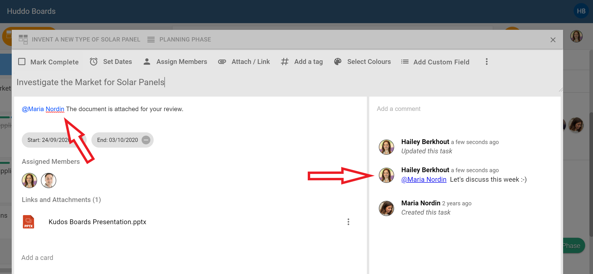
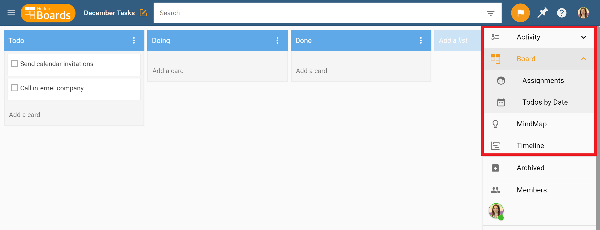
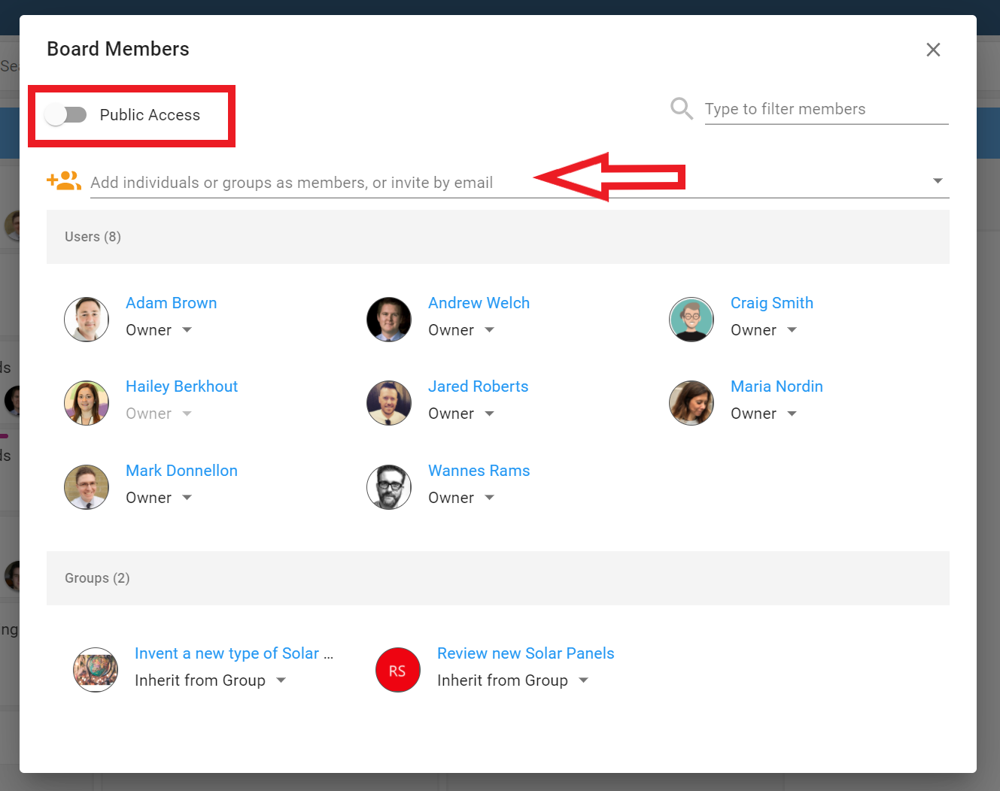
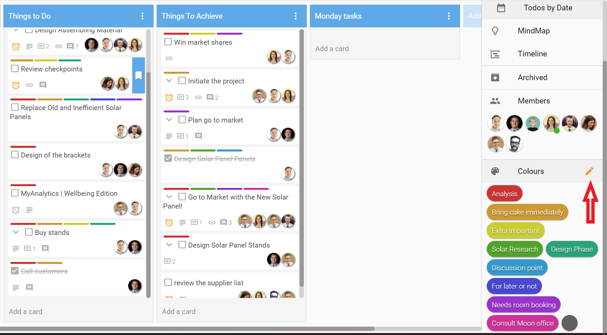
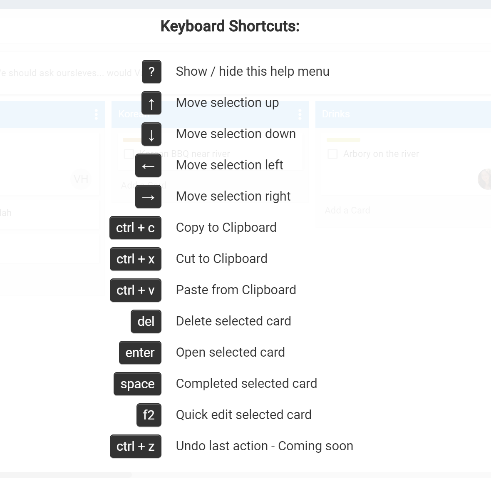

{ style="float: right" width=200 }

#Quick Tips for boards

### @Mentions
You can @mention a team member within the *description* or *comments* area of a card to get their attention. This will send them a notification that they’ve been mentioned and can take action on what you’ve written.  

### Move between Board, Mind Map, and Timeline

Chose the Kanban view setting up your board, but decided a Mind Map would be better for brainstorming ideas? No worries!

Using the right-hand side menu, transform the view of your board between the Kanban Board, Mind Map, and Timeline. Information in your board remains the same, only your view will change. Change as often as you like or depending on your needs.

### Add Members to a Board

When you start a new board, you can choose to invite members to participate. But if you’ve got a board you’re already working on, you can also invite members at any point of your work on the board.

Use the right-hand menu and select `Members`.

Start typing an individual, group name, or email address to bring up people in your organisation.

To invite people external to your organisation, type in their email address.  Don’t forget to click `Add Members` before closing the screen.

This screen allows you to choose the type of rights your members will have: Owner, Editor, Author, Reader.

You can also decide if you want the board to be Public Access, which will enable anyone from your organisation to see it.  

### Use Colour Labels to Categorise and Filter

You can use the Colour Labels on the right-hand side menu to help categorise your board.

Click the pencil to the right of Colour Labels, then update the colours with your desired label names.

Drag and drop the colour labels on to a card. Do the same action to remove the colour from the card.

You can also click on a colour or multiple colours to filter the cards.

<!-- ### Key Board Shortcuts
Find shortcuts by holding `SHIFT` and pressing `?`

-->