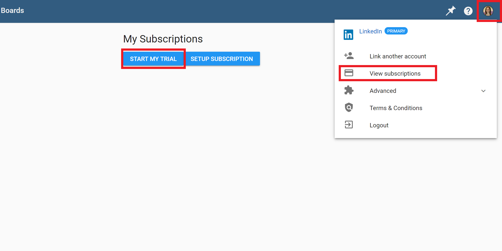
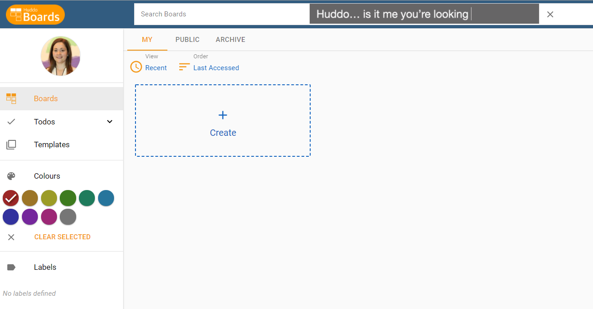
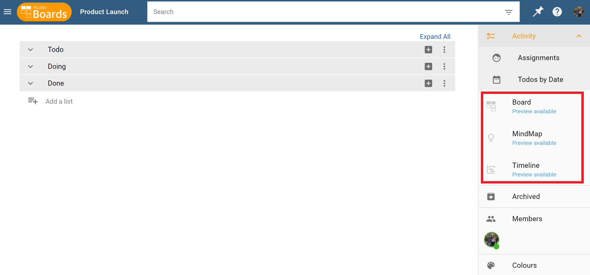

#Starting a trial of Huddo Boards Cloud 

You can use your O365, LinkedIn, Facebook, AppleID or HCL Connections Collab Cloud to access Huddo Boards Cloud.

The first time you log in to Huddo Boards Cloud as an individual user, you will not have access to the Huddo Boards Premium Views (Kanban Board, MindMap, and Timeline), only the free Activity View (simple drop down list). 

There are two ways to activate a free 30 day trial in order to access the premium views. 

### Activate free trial via MyBoards Dashboard:
1. Login to [boards.huddo.com](https://boards.huddo.com) to enter the MyBoards Dashboard.
2. In the top right corner, click the profile icon to open `User Options` and then select `View Subscriptions`. 
3. Then select `Start My Trial` to activate your free 30 day trial. 

You can return to  `View Subscription` at any point to purchase a licence for Huddo Boards for yourself or for a number of people in your organisation.     

### Activate free trial when you create a board:
1. Login to [boards.huddo.com](https://boards.huddo.com) to enter the MyBoards Dashboard.
2. Use the `Create` button to start a new board.

3. Follow the steps to creating a board, including selecting a template, adding a name, and more information like a description and members (these can also be added to your board later.) Click `Save` when you are done. 
4. When your new board opens, `Board` `MindMap` and `Timeline` in the right hand menu will be greyed out with the words `Preview Available` under each. Select any of these and follow prompts to start your free trial. 

