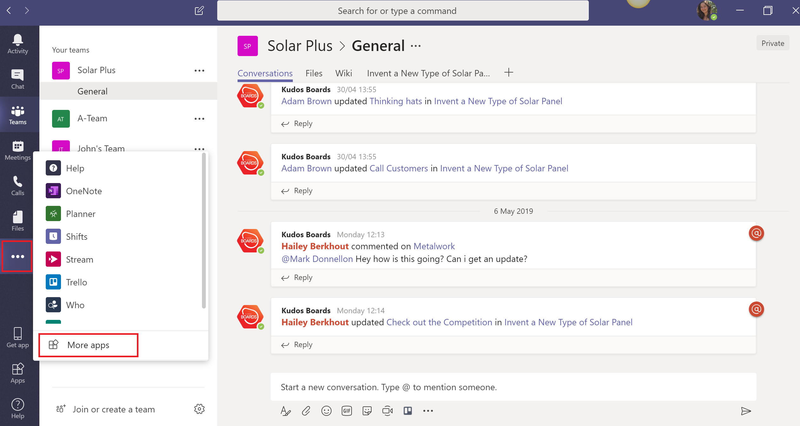
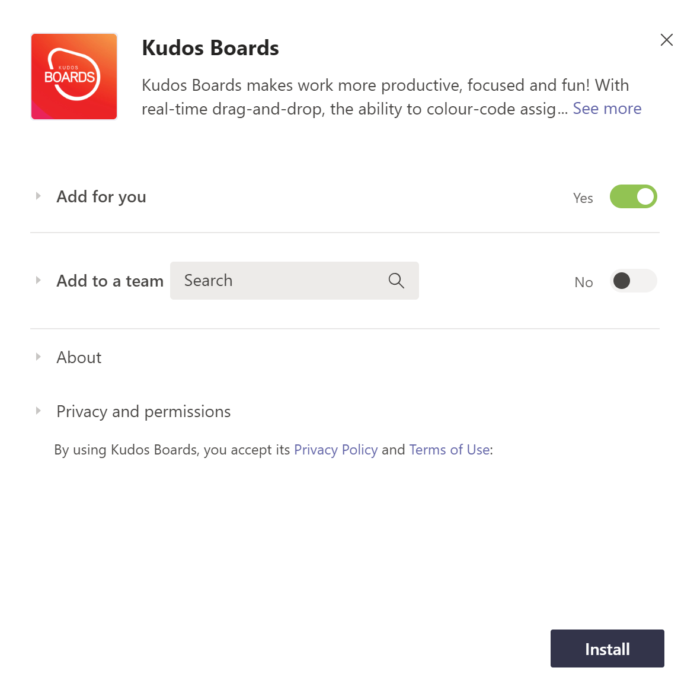
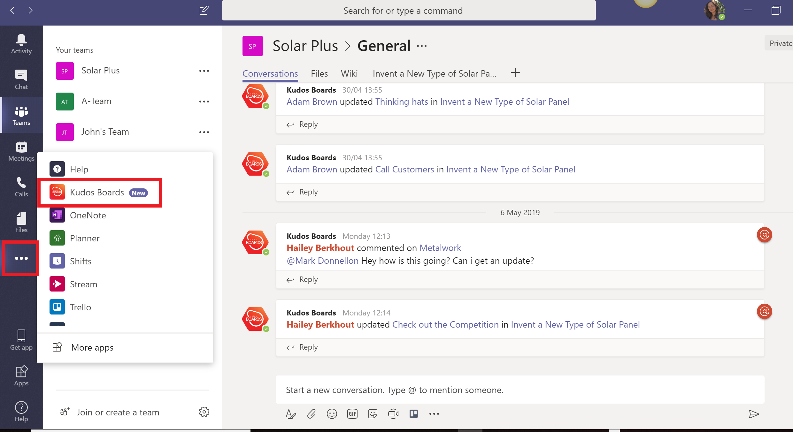
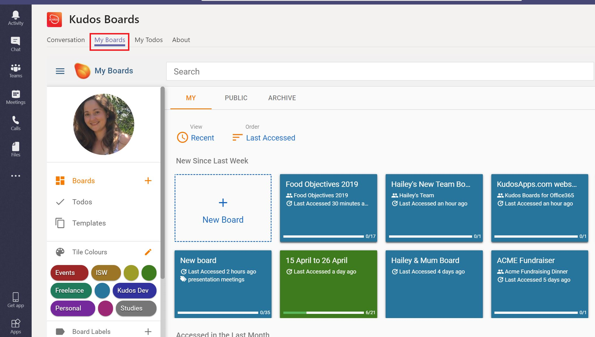
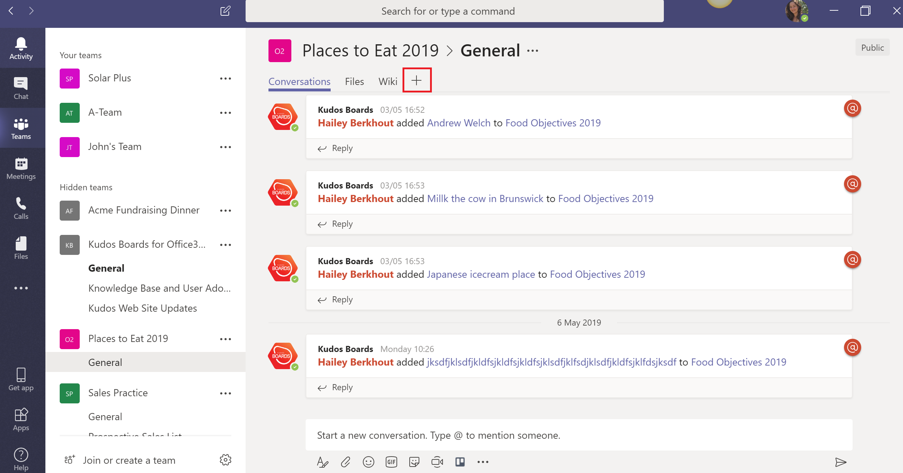
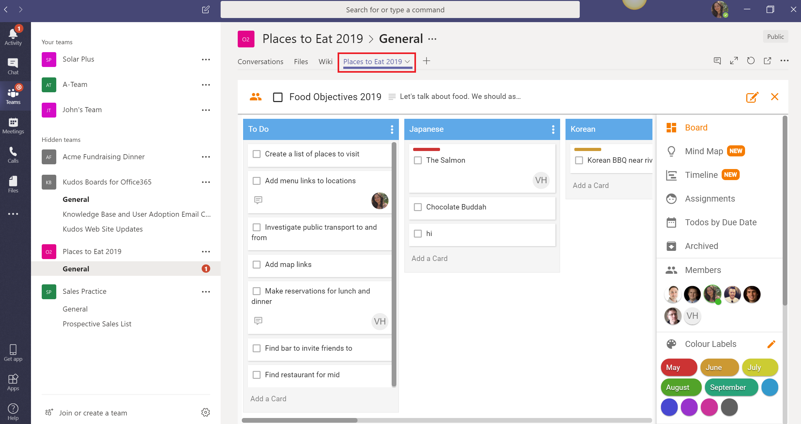

{ style="float: right" width=200 }

# Adding Boards to Microsoft Teams

Boards has integrated seamlessly with Microsoft 365 Teams so you can supercharge your existing collaboration environments.

[Add boards to Microsoft Teams as an administrator.](../../msgraph/teams/index.md)

###Accessing all of your Boards in Microsoft Teams

When you open Microsoft Teams, click the `…` icon in the left-hand side menu and select `Add More Apps.`

In the Store search bar, type in Huddo Boards. Click the Huddo Boards icon. The following window will appear:

You can choose if you wish to add to a specific team, but for the moment, we want to have all of our Boards accessible in one place. So keep the options as represented here. Click `Install`.

Press the `X` in the next window as installation has now been completed.

You can now access all your Boards in one place, by navigating to the `…` on the left-hand side, and selecting `Huddo Boards`.

From here, select the `My Boards` tab, next to Conversation. You will have access to all your Boards via the My Boards dashboard as normal, but conveniently located within Microsoft Teams.

### Adding Boards to a Channel

You can work on Boards from within Channels. To add a Board to a channel, click on the `+` sign in the top menu next to Wiki.

You can select the Huddo Boards icon or search it if it doesn’t appear directly.

In the next window, select your preferences, to either

-   Display an existing board (type in one that you’ve already created)
-   Create a new board
-   Show all Boards for this team

Enter the board information and click `Save`.

Your Board will now appear in its own tab alongside Wiki. Add multiple boards by repeating the same process.

