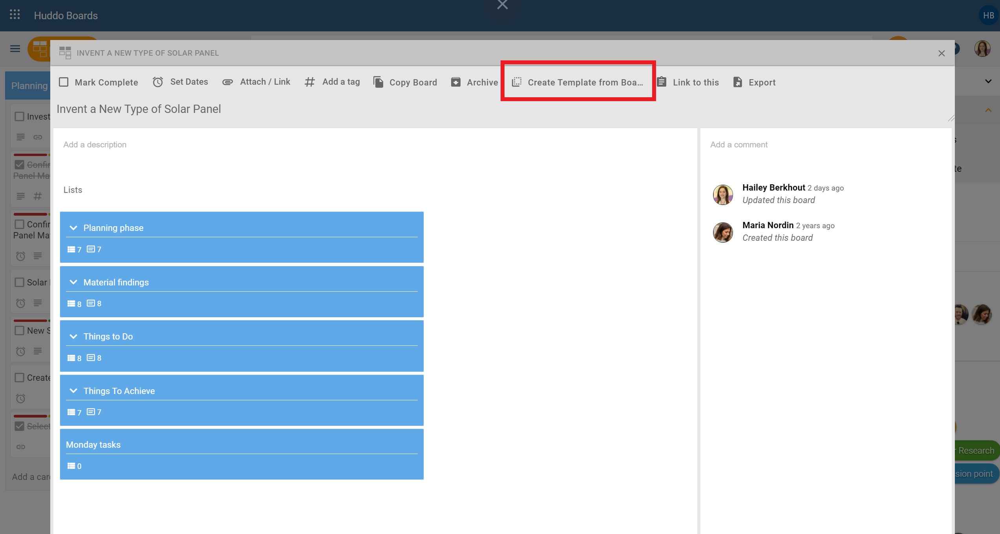
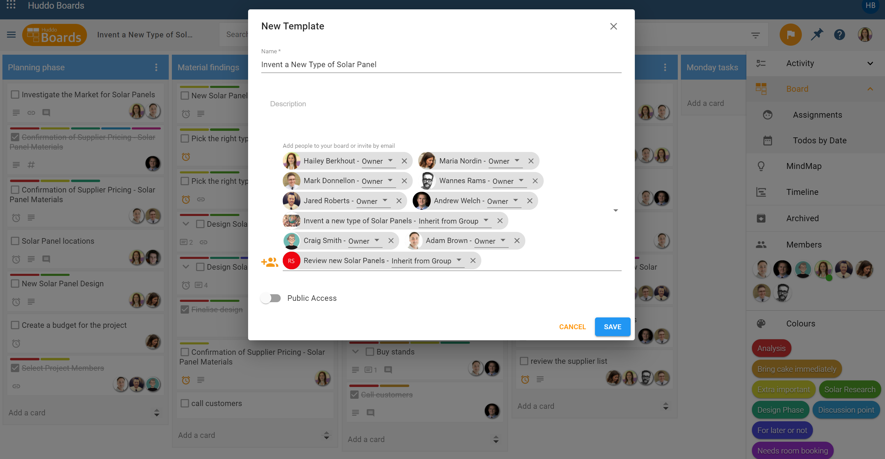
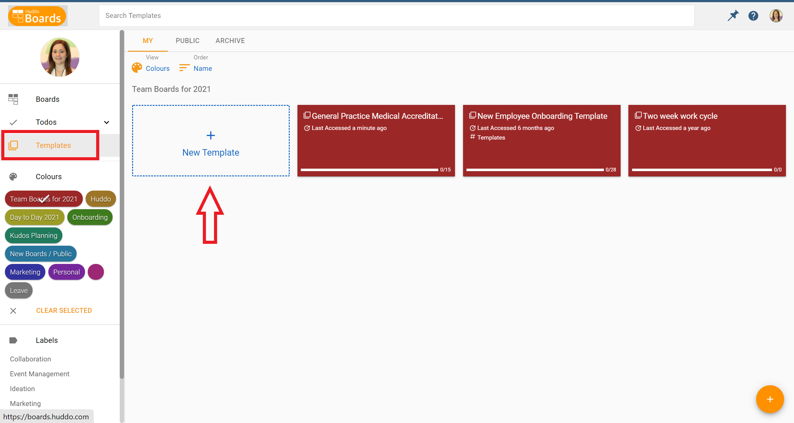
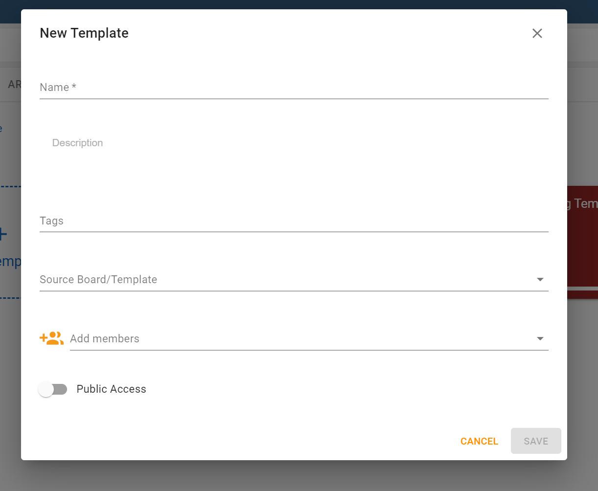

# Creating Templates

Made a fantastic board and want to keep a copy for future use? Save time and brain power by creating a template of your board.

### Create a Template From an Existing Board
Within your board, click the title of your board to `Open Board Options.` Find this located between the Huddo Boards logo and the search bar. Next, click, `Create Template from Board.`

In the next window, you can update the name, description, and choose to keep Board Members as is, remove or add Board Members. Click `Save.` The template will open in a new screen.

You’ll be able to locate your template in your template library via the MyBoards Dashboard or when you create a new board and search the name.

**Important**: When the template opens in a new screen, any editing you do will apply to the template. Click in to the `Open Board Options` icon as you did above and select, `Create Board from Template.` When the new window opens, you’ll start a new board instead of editing the template you’ve just created.

### Create a New Template from Scratch

From your main *MyBoards* dashboard, navigate to `Templates` via the left-hand side menu.
You’ll land on the My Templates page and see templates you have created.

Click the `+ New Template` button to start your creation. You have the option to select `Source Board / Template` in the creation process, meaning you can make a template from another template that already exists. Leave this blank if you prefer to build your template from scratch in the board. 

**Public Template Access:** Making a template in the public area, will not automatically make it public. Within the template you create, you’ll be able to select if you wish for it to be public. You can do this in the template creation window or later when it is created by finding `Public` in the `Members` section on the right-hand side menu.

Complete the required information for your template, then click `Create`.  

Your new template will open as a blank board template or with lists and cards if you selected from a Source Board/Template. From here, customise your template by editing or adding required lists, cards, colour labels, tags and more.

In future, when creating a new board, type in the template name in the `Search All Templates` field, during the New Board creation phase.

**Note:** Opening a board via the template library will mean you are editing the template. You can create a new board from the template by:

*	Entering the template, clicking the pencil icon for `Open Board Options`, then selecting, `Create Board from Template`; or
*	Creating a new board via your My Boards dashboard, and typing in the template name in the `Search All Templates` search bar.
*	Find out more about [Accessing Global Templates](global.md)
