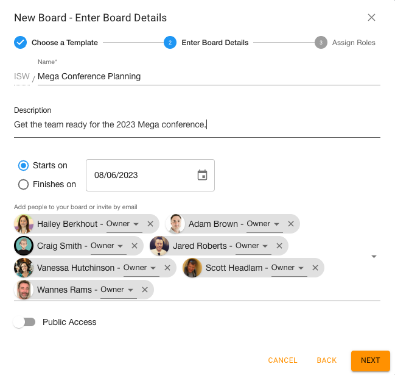

{ style="float: right" width=200 }

## Select a Template

You can access a library of global templates already available from Huddo Boards to use as inspiration for your own work.

When you start a New Board, click `Explore the Template Library`.

This will open a new window with available templates.

Feel free to click in to different templates to see what they contain.

When you’ve found the template you’re looking for, return to your original New Board screen and start typing in the template name. It will appear and you can select it.

You still have the option to select the Starting View, from Kanban, MindMap, Timeline or Activty.

Click `Next` to give your board a name and then `Save` and you will be taken to your new Board.

## Template Scheduling

When creating a Board from a template that contains dates (due, start or end dates), you have the option move all of the dates so that the first or last date is on a particular day. For example, if you have a template for preparing for a business trip, you can reschedule your template so that all of your tasks are due before your date of departure.

On the My Boards page, click the `+ Create` button. The `New Board` window will open. Search templates by name and select your template that contains dates.

Click `Next`.

You'll see an option to choose a `Starts on` or `Finishes on` date. Select the one that makes sense for your template. (This won't appear if there are no dates in your template.) Use the date picker to choose which day you'd like your dates to start or finish.

Click `Save`. Your new Board will be created.

-   If the dates in your template included Start and End dates on tasks, you can see these rescheduled items in the `Timeline` view.
-   If your tasks included Due dates, you can see these rescheduled items in the `Board -> Todos by Date` view.

## Assign to Roles

Instead of people assigned to tasks, templates can have _roles_ assigned to tasks. When creating a board from this template, you can assign the members of this new board to these roles and they will be responsible for completing the tasks the role had been assigned. For how to create templates like this, see [Create a Template with Assignment Roles](../assignment-roles/assignment-roles.md#create-a-template-with-assignment-roles).

After you've selected a template and chosen some members to add to your board, you'll see the _Assign Roles_ step if your template includes Assignment Roles assigned to tasks.

Drag and drop members on to the roles to assign them to the role. You can assign multiple members to a role and a member to multiple roles.

<video autoplay muted loop playsinline preload style="border: 1px lightgrey solid;">
  <source src="/boards/howto/assignment-roles/assign-to-role.webm" type="video/webm">
</video>

Once you've created the board, you will see members assigned to the tasks that had roles assigned.

