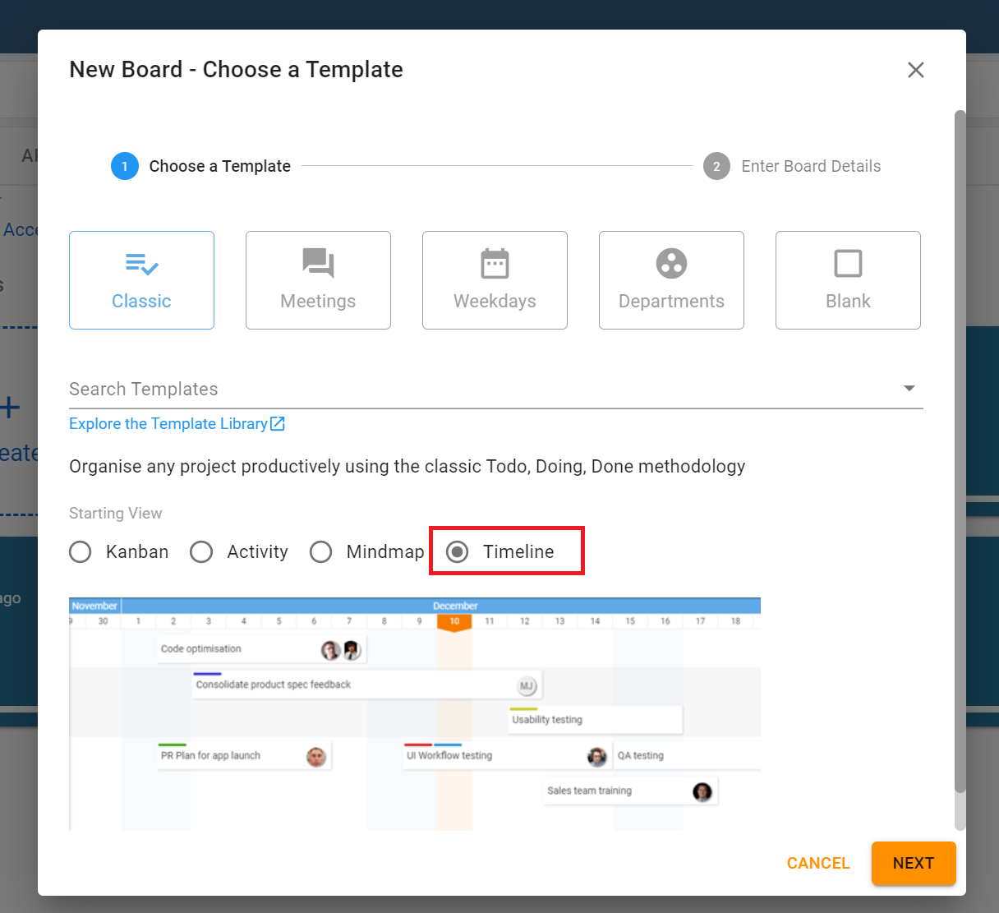
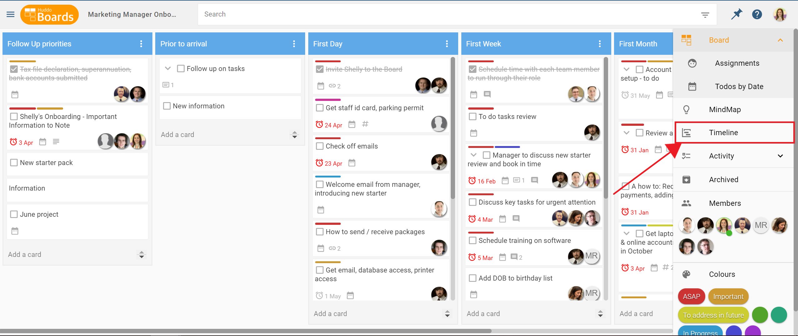
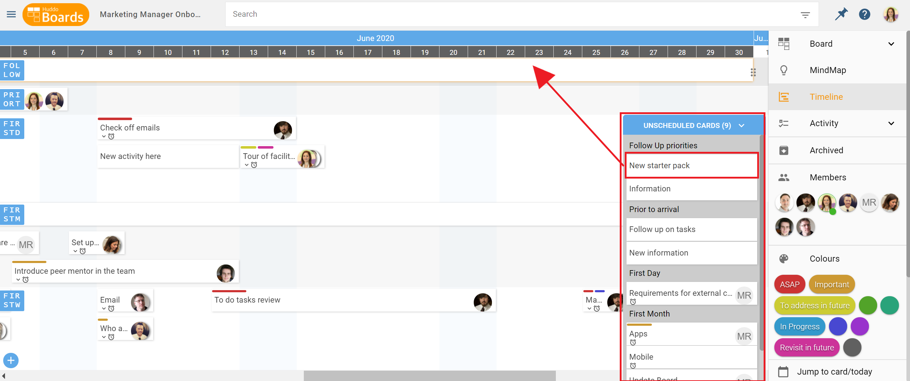
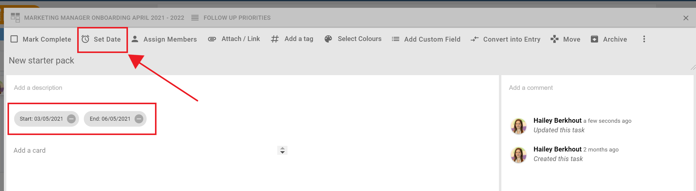
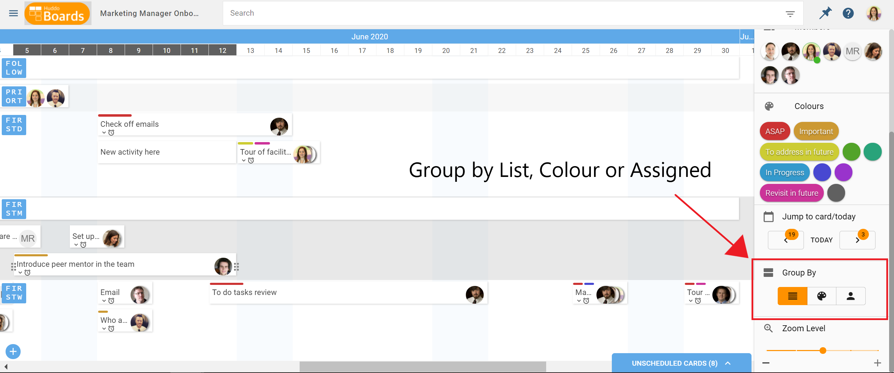

{ style="float: right" width=200 }

Huddo Boards has multiple views to help you get your tasks done, whether you’re working individually, as a team or as an organisation. The Timeline view is a unique component of Boards and we’ll explore it here, to demonstrate how it can help you stay on track to meet your deadlines.

### Accessing the Timeline View

The Timeline view can be set as the *Starting View* when you create a new board or it can be switched to at any time during your work on a board.

In your board creation phase, select` Timeline` from the Starting View drop down.

If your board is already created in either the Mind Map or the Kanban Board view, it is simply a matter of selecting the `Timeline` view from the right-hand side menu.

### How to use the Timeline

Whether you’re starting a new board, or using an existing board, for cards to appear on the timeline, they’ll need to have a start and finish date. From the Timeline view, these dates can be added in two ways:

* Drag and Drop Unscheduled Cards

If you have cards that are sitting in the Unscheduled Cards area on the bottom right-hand side, you can drag and drop them on to the timeline. To begin, cards can only be dropped in to the list they have been created in and will by default, be allocated to three days from start to finish.

Once you’ve dropped a card in to its list, you can move it along the timeline in either direction, shorten or lengthen its start and finish dates, or move to a different list.

* Add Start and Finish Dates to a Card

Cards sitting in the Unscheduled Cards area can be clicked on to bring up the detailed card view. From here, select `Set Dates`, from the right-hand side menu. Add in a start and finish date under the card title for it to appear on the Timeline. The finish date will automatically fill to three days after start date, but this can be edited.  

Note: In the Kanban Board view or Mind Map view, you also have the option to add dates to cards, by clicking in to the detailed card view, selecting `Set Dates,` and adding a Start Date and End Date.  If you then switch over to the Timeline view, your cards will automatically fall on the timeline to the dates you have selected.

### Choose how you view your Timeline

The default view of Timeline is to group by Lists. But you have the option to view the cards on the board by *Colour, Label,* and by *Assigned.* Use the drop-down menu in the top left corner next to Group By to select from `List,` `Colour,` or `Assigned.`

### Helpful Hints for Using the Timeline
* Cards can run parallel and overlap other cards on the timeline
*	Due dates will appear with a little clock icon on the card, and will show the date when hovered over with the mouse
*	You can allocate members and colour labels to cards on a timeline as normal, using drag and drop
*	You can create new lists on the left-hand side of the screen, using the Add a list button
*	You can create new cards directly on the timeline by clicking on your preferred start date
*	Not every card has to be appear on the timeline. Its normal to have cards that are unallocated, as they might not have specific start or finish dates. Use timelines in a way that works best   for you and your project.
