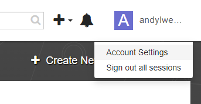
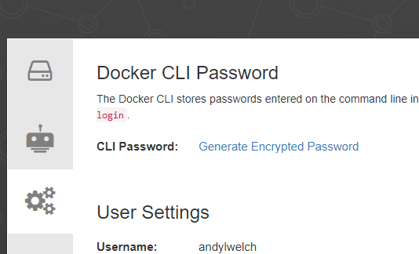
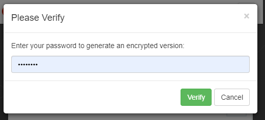
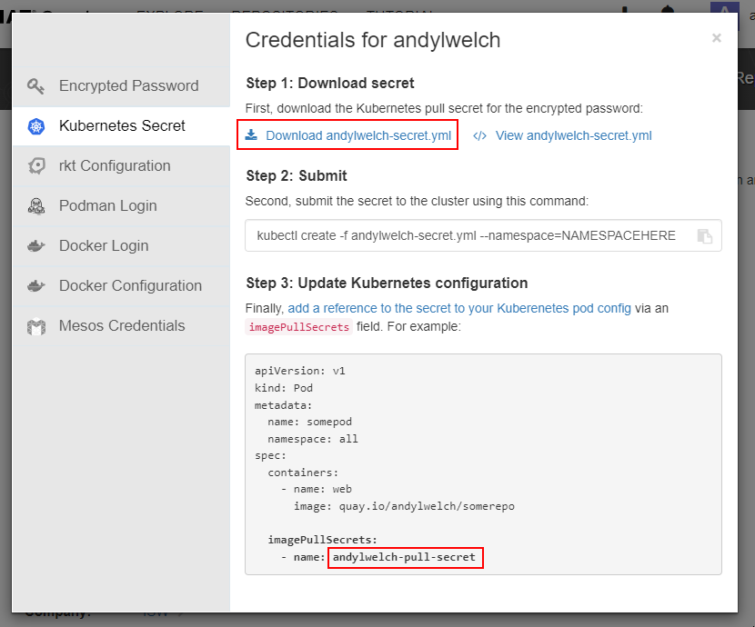

# Using latest releases directly from Huddo

You can get the latest versions of Huddo Boards Docker by subscribing to our own repository in [Quay.io](https://quay.io/organization/huddo) as follows:

1. Create a [Quay.io - Red Hat](https://quay.io/signin/) account if you do not already have one.

1. Email [support@huddo.com](mailto:support@huddo.com) requesting access to Huddo Boards Docker repository, include your Quay.io account name in the email. We will reply when this is configured on our end.

1. Get secret to use in Kubernetes

    1. Open [Quay.io](https://quay.io/), In the user menu, click on 'Account Settings'

        

    1. Click `Generate Encrypted Password`

        

    1. Enter your password and click `Verify`

        

    1. Download the secret.yml file. Take note of the name of the secret for later use

        

1. Use the file downloaded to create the secret (in the required namespace). For example:

        # for CP installs
        kubectl create -f username-secret.yml --namespace=connections
        
        # for other Kubernetes installs
        kubectl create -f username-secret.yml --namespace=boards
