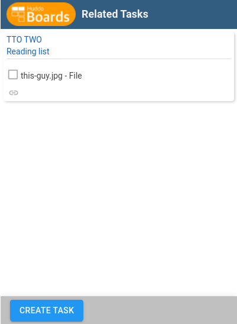

# Use Huddo Boards Related Task Microapp

To display this use the following pattern to load and use the microapp

`<boardsURL>/app/linkedcards?title=<boardsCardTitle>&url=<boardsPrimaryLink>`

where 
- `<boardsURL>` is the URL of your Huddo Boards installation (boards.huddo.com for Boards Cloud)
- `<boardsCardTitle>` is the default title for the task when created which users can change, fully escaped
- `<boardsPrimaryLink>` is the URL of the page you want to show tasks related to, fully escaped

e.g. `https://boards.huddo.com/app/linkedcards?title=Card%20Name&url=https%3A%2F%2Fexample.com`

There is also a message sent with the current number of related tasks if you wish to display this.

The event data is in the format `huddo-task-count=0` 

Example for JavaScript: 

    window.addEventListener("message", (event) => {
        
        if(event.origin !== <boardsURL>)
            return;

        let eventData = event.data;
        
        //huddo-task-count=0
        if(typeof eventData === "string" && eventData.includes("huddo-task-count"))
        {
            boardsNumTasks = event.data.split('=')[1];
        }
    }