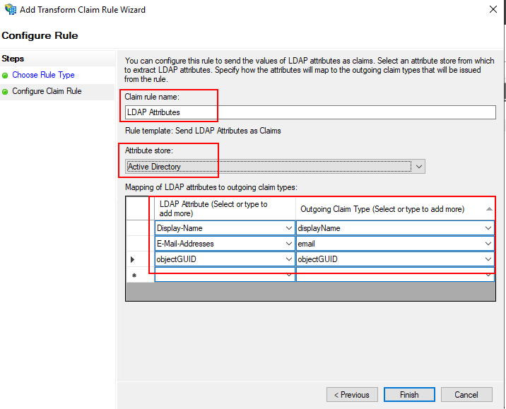
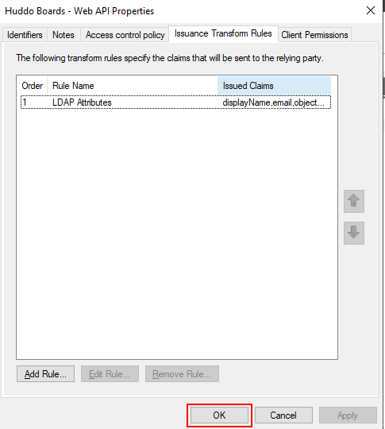

# Application Group Configuration

To use Microsoft AD FS as an authentication provider for Huddo Boards, you will need to configure an Application Group.

1.  Open ADFS Management Console

    Click `Add Application Group`

    

1.  Enter a name for the Application Group

    Name: `Huddo Boards`

    Template: `Server application accessing a web API`

    Click `Next`

    

1.  Server application

    !!! tip

        Copy the `Client Identifier`

        This will be used as the `MSADFS_CLIENT_ID` in the Boards configuration and the `Identifier` set in the Web API configuration later

    Set the redirect URI to `https://<BOARDS_URL>/auth/msadfs/callback`

    For example, if your Boards URL is `https://boards.example.com`, the redirect URI would be `https://boards.example.com/auth/msadfs/callback`

    

1.  Enable `Generate a shared secret`

    !!! warning

        Copy the newly generated client secret - this will not be shown again

        This will be used as the `MSADFS_CLIENT_SECRET` in the Boards configuration

    Click `Next`

    

1.  Web API - add the Identifier

    Identifier: `<MSADFS_CLIENT_ID>` (from step 3)

    !!! note

        This must match the Client Identifier set previously in order for the `id_token` generated at login to have additional claims and access the user name and email.

    Click `Add`, then `Next`

    

1.  Access Control Policy

    Click `Next`

    

1.  Select the following scopes:

    -   `allatclaims` - this must be set to include all claims in the `id_token`
    -   `openid` - required for authentication
    -   `email` - required for the user's email
    -   `profile` - required for the user's name

    Click `Next`

    

1.  Review the configration and click `Next`

    

1.  Click `Close`

    

1.  Right click the newly created Application Group and select `Properties`

    

1.  Select the `Web API`

    Click `Edit`

    

1.  Click the `Issuance Transform Rules` tab

    Click `Add Rule`

    

1.  Select the `Send LDAP Attributes as Claims` template

    Click `Next`

    

1.  Configure claim rule

    Name: `LDAP Attributes`

    Select the attribute store - `Active Directory`

    Map the LDAP attributes to outgoing claim types (type these in manually)

    | LDAP Attribute     | Outgoing Claim Type |
    | ------------------ | ------------------- |
    | `Display-Name`     | `displayName`       |
    | `E-Mail-Addresses` | `email`             |
    | `objectGUID`       | `objectGUID`        |

    !!! warning

        The Outgoing Claim Type must be typed exactly as shown for Boards to use these values.

    Click `Finish`

    

1.  Click `OK` to save the changes

    

1.  Click `OK` to close the Application Group properties

    
