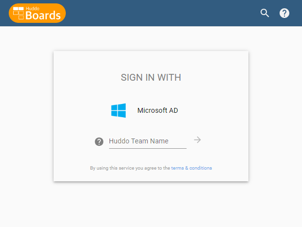

# Microsoft Active Directory Federation Service

Microsoft AD can be used as an authentication provider for Huddo Boards when configured with the [AD Federation Service (FS)](https://learn.microsoft.com/en-us/windows-server/identity/ad-fs/ad-fs-overview).

## Prerequisites

1. Microsoft AD server/domain with user accounts
1. [Microsoft AD FS deployment](https://learn.microsoft.com/en-us/windows-server/identity/ad-fs/ad-fs-deployment) accessible from the server running Boards and the users accessing Boards

## Outcome

Once configured, users will be able to login to Boards using their Microsoft AD credentials.

## Steps

1. Setup [Relying Party Trust](./relying-party-trust/index.md)
1. Setup [Application Group Configuration](./application-group/index.md)

## Configuration

The steps above will provide you with the following information that you will need to configure Boards:

| Environment Variable   | Description                         | Example / Default          |
| ---------------------- | ----------------------------------- | -------------------------- |
| `MSADFS_URL`           | URL of ADFS server                  | `https://adfs.example.com` |
| `MSADFS_NAME`          | Name on the login button            | `Microsoft AD`             |
| `MSADFS_CLIENT_ID`     | Client Identifier from Step 3 above |                            |
| `MSADFS_CLIENT_SECRET` | Client Secret from Step 3 above     |                            |
