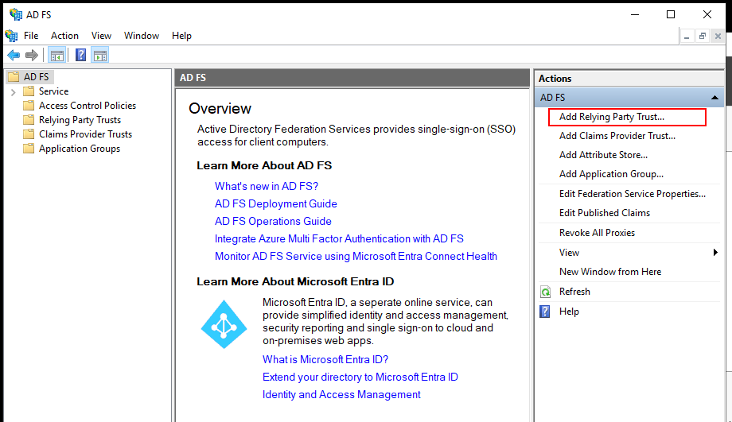
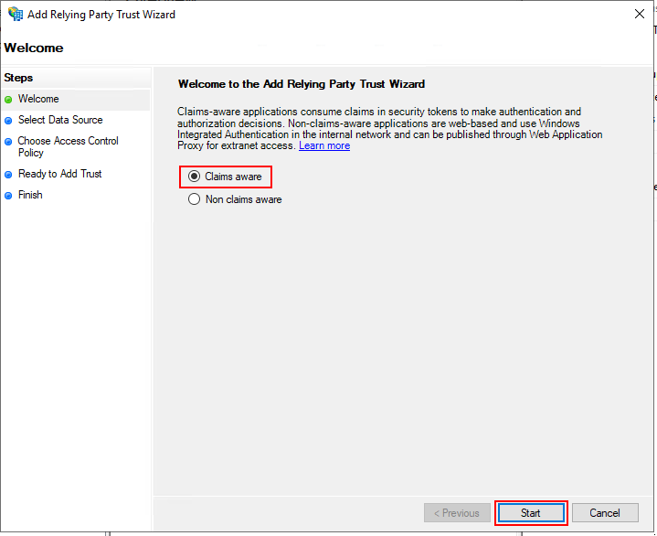
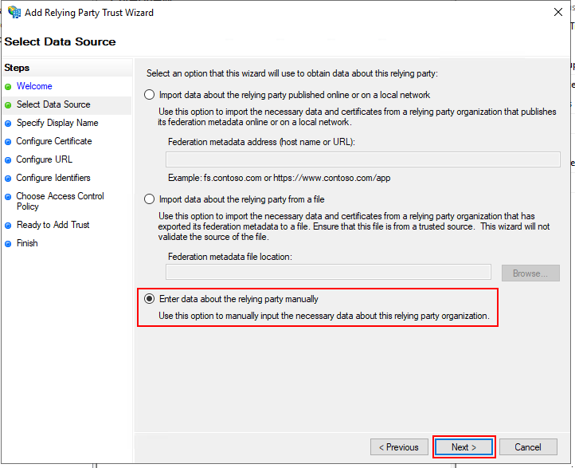
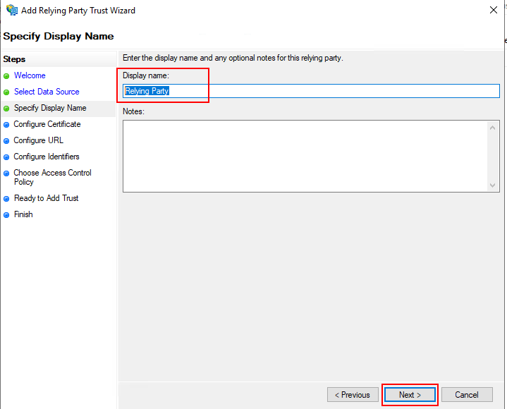
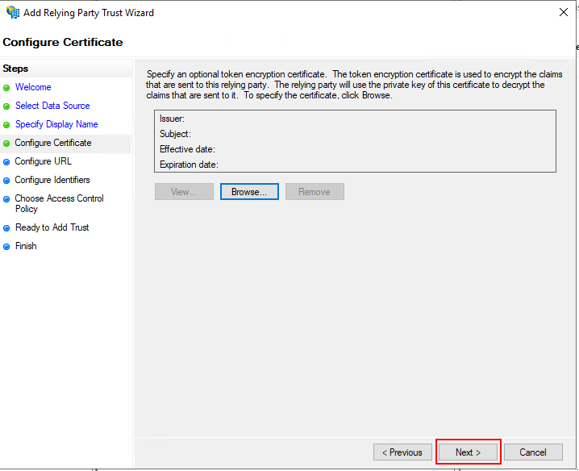
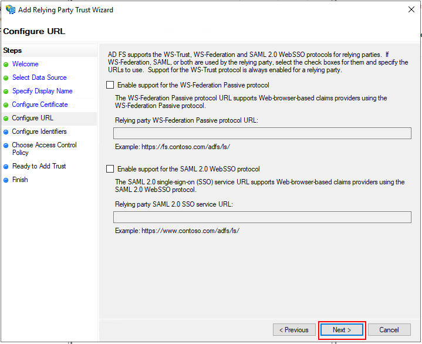
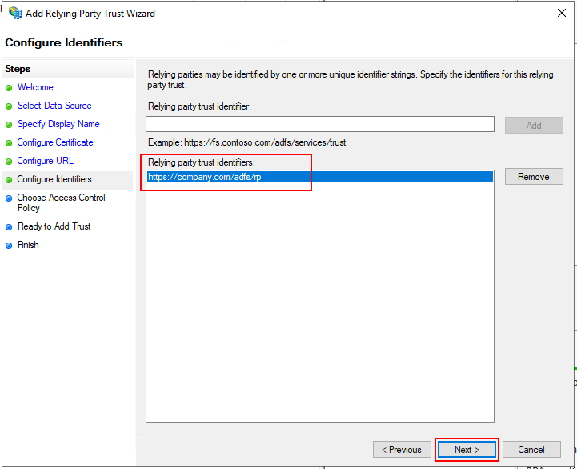
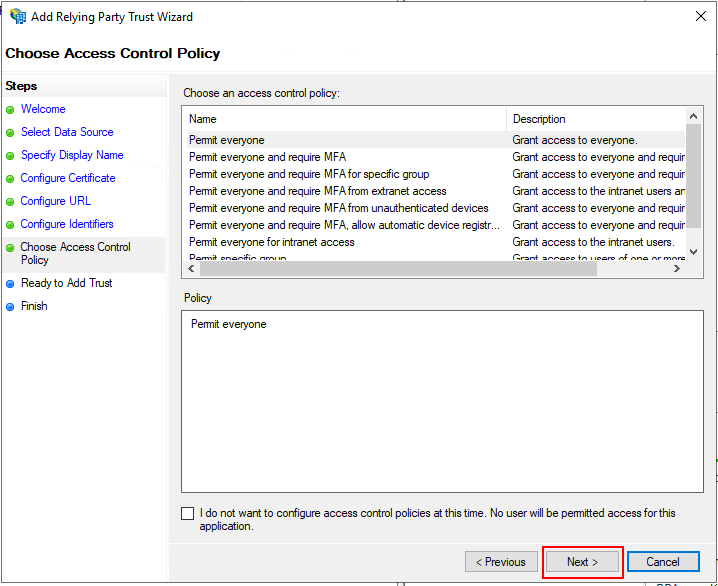
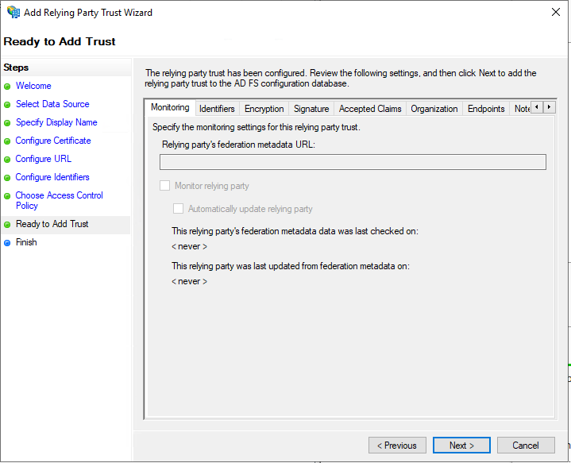
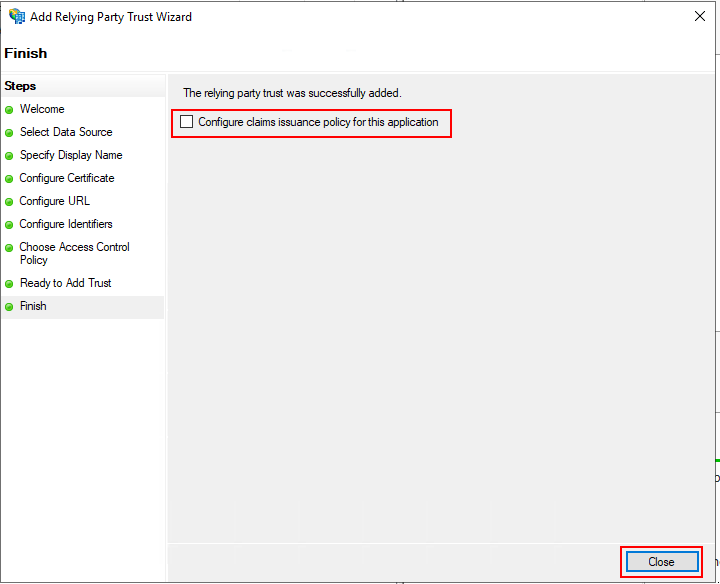

# Relying Party Trust Configuration

To use Microsoft AD FS as an authentication provider for Huddo Boards, you will need to configure a Relying Party Trust.

1. Open ADFS Management Console

    Select `Relying Party Trusts`

    Click `Add Relying Party Trust`

    

1. Select `Claims Aware`

    Click `Start`

    

1. Select `Enter data about the relying party manually`

    Click `Next`

    

1. Enter a name for the relying party trust

    Name: `Relying Party`

    Click `Next`

    

1. If you have an **optional** token encryption certificate, select it here

    Click `Next`

    

1. Configure URL - neither of these protocols are required for Huddo Boards

    Click `Next`

    

1. Configure Identifiers - add any unique identifier for this instance. This is required by AD FS.

    For example: `https://company.com/adfs/rp`

    Click `Add`, then `Next`

    

1. Access Control Policy

    The default option is `Permit everyone`

    Click `Next`

    

1. Ready to Add Trust

    Click `Next`

    

1. Finish

    Untick `Configure claims issuance policy for this application`

    Click `Close`

    
