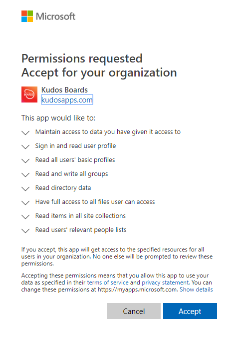

# Authenticating Huddo Boards with Office 365

This document details the process to enable login to your private instance of Huddo Boards with your private Office 365 tenant.

---

## Register OAuth Application

You must configure an OAuth Application in your Office 365 Tenant in order to use Huddo Boards with O365. To access this configuration you must be logged in as a Microsoft tenant admin

### Open the [Azure App Portal](https://portal.azure.com/#blade/Microsoft_AAD_RegisteredApps/ApplicationsListBlade)

  Click `New Registration`

  

### Configure Redirect

Enter the values below and click `Register`

    Huddo Boards
    https://[BOARDS_URL]/auth/msgraph/callback

  Where BOARDS_URL is the URL to access your main Huddo Boards page. For example:

  - `https://connections.example.com/boards/auth/msgraph/callback` OR
  - `https://boards.example.com/auth/msgraph/callback`

  Click `Register`

### Configure Required Scopes

1. Open the `Manifest` section

1. Replace the `requiredResourceAccess` section as per below

    

        "requiredResourceAccess": [
          {
            "resourceAppId": "00000003-0000-0000-c000-000000000000",
            "resourceAccess": [
              {
                "id": "06da0dbc-49e2-44d2-8312-53f166ab848a",
                "type": "Scope"
              },
              {
                "id": "64a6cdd6-aab1-4aaf-94b8-3cc8405e90d0",
                "type": "Scope"
              },
              {
                "id": "863451e7-0667-486c-a5d6-d135439485f0",
                "type": "Scope"
              },
              {
                "id": "4e46008b-f24c-477d-8fff-7bb4ec7aafe0",
                "type": "Scope"
              },
              {
                "id": "7427e0e9-2fba-42fe-b0c0-848c9e6a8182",
                "type": "Scope"
              },
              {
                "id": "37f7f235-527c-4136-accd-4a02d197296e",
                "type": "Scope"
              },
              {
                "id": "ba47897c-39ec-4d83-8086-ee8256fa737d",
                "type": "Scope"
              },
              {
                "id": "14dad69e-099b-42c9-810b-d002981feec1",
                "type": "Scope"
              },
              {
                "id": "205e70e5-aba6-4c52-a976-6d2d46c48043",
                "type": "Scope"
              },
              {
                "id": "e1fe6dd8-ba31-4d61-89e7-88639da4683d",
                "type": "Scope"
              },
              {
                "id": "b340eb25-3456-403f-be2f-af7a0d370277",
                "type": "Scope"
              }
            ]
          }
        ],

    Click `Save`

### Check Permissions

Open the `API permissions` section. Notice that all the scopes are now pre-filled.

Click `Grant admin consent for kudosdev`

Click `Yes`

## Configure OAuth in Boards

1. Open the `Overview` section

      Copy `Application (client) ID` & `Directory (tenant) ID`

      

1. Open the `Certificates & secrets` section

    Click `New client secret`

    

    Select `Never` expire and click `Add`

    

    Copy the secret value shown

    

1. Add OAuth and Tenant values to YAML config (ie `boards.yaml` or `boards-cp.yaml`)

        global:
          env:
            MSGRAPH_CLIENT_ID: "<your-application-id>"
            MSGRAPH_CLIENT_SECRET: "<your-application-secret>"
            MSGRAPH_LOGIN_TENANT: "<your-tenant-id>"

1. Redeploy Boards Helm Chart as per command for Huddo Boards:

    [HCL Component Pack](/boards/cp/#deploy-boards-helm-chart)

        helm upgrade kudos-boards-cp https://docs.huddo.com/assets/config/kubernetes/kudos-boards-cp-2.0.1.tgz -i -f ./boards-cp.yaml --namespace connections

    [for Docker - Kubernetes](/boards/kubernetes/#deploy-boards-chart)

        helm upgrade boards https://docs.huddo.com/assets/config/kubernetes/kudos-boards-4.0.0.tgz -i -f ./boards.yaml --namespace boards

    > **Note:** `--recreate-pods` is not required this time as this is only an env variable change

## Approve Permissions

1. Open your Huddo Boards environment.

    Click the `Office 365` option and login with a Tenant Administrator account

    

1. Once logged in, a prompt will appear in Huddo Boards. Click `Approve`

    

1. Click `Accept` on the following popup to grant the required permissions for Huddo Boards

    

    Congratulations! All users in your tenant can now login to Huddo Boards via Office 365!

    
