# Authenticating Huddo Boards with Microsoft 365

This document details the process to enable login to your private instance of Huddo Boards with your private Microsoft 365 tenant.

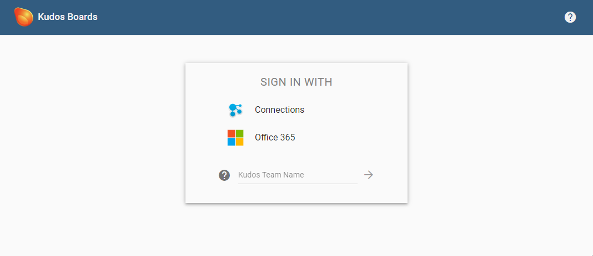

---

## Register OAuth Application

You must configure an OAuth Application in your Microsoft 365 Tenant in order to use Huddo Boards with O365. To access this configuration you must be logged in as a Microsoft tenant admin

### Open the [Azure App Portal](https://portal.azure.com/#blade/Microsoft_AAD_RegisteredApps/ApplicationsListBlade)

Click `New Registration`

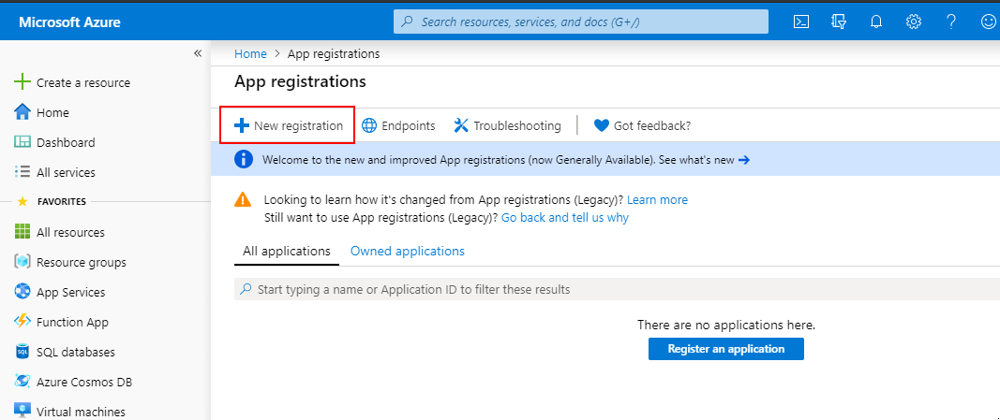

### Configure Redirect

Enter the values below and click `Register`

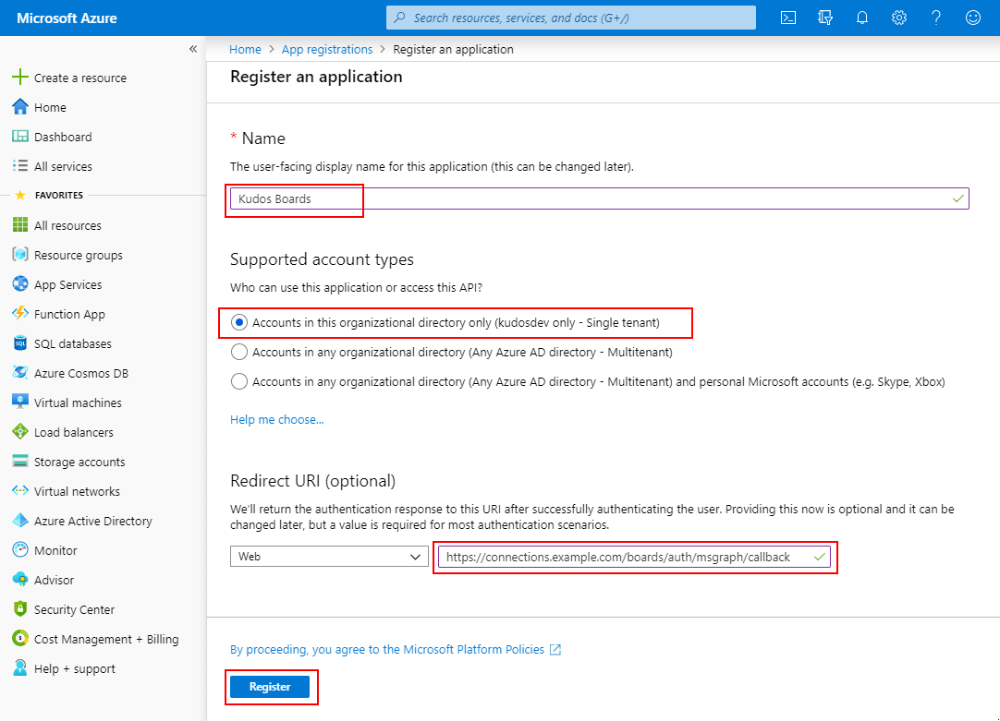

    Huddo Boards
    https://[BOARDS_URL]/auth/msgraph/callback

Where BOARDS_URL is the URL to access your main Huddo Boards page. For example:

-   `https://connections.example.com/boards/auth/msgraph/callback` OR
-   `https://boards.example.com/auth/msgraph/callback`

Click `Register`

### Configure Required Scopes

1.  Open the `Manifest` section

1.  Replace the `requiredResourceAccess` section as per below

    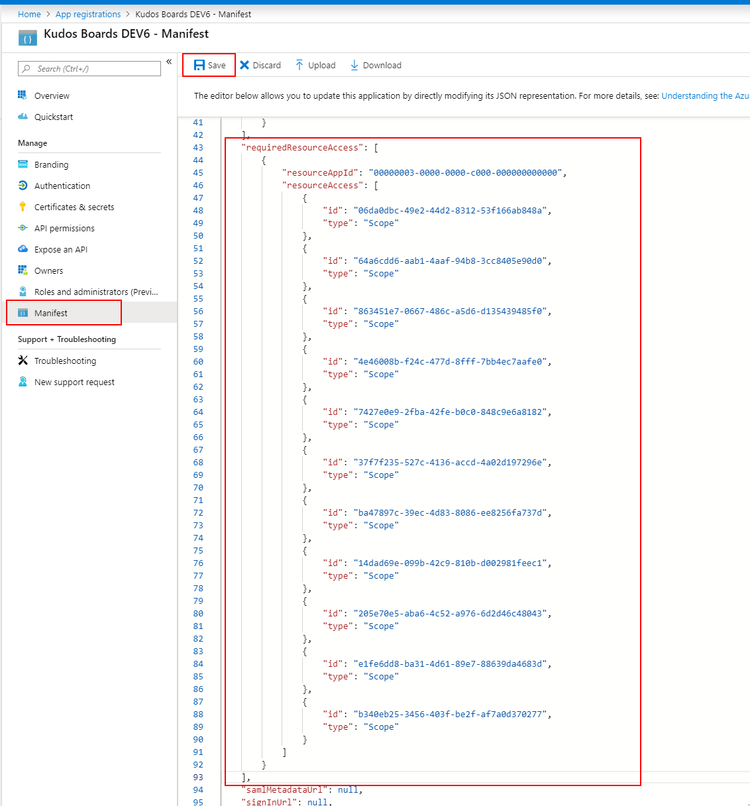

        "requiredResourceAccess": [
          {
            "resourceAppId": "00000003-0000-0000-c000-000000000000",
            "resourceAccess": [
              {
                "id": "06da0dbc-49e2-44d2-8312-53f166ab848a",
                "type": "Scope"
              },
              {
                "id": "64a6cdd6-aab1-4aaf-94b8-3cc8405e90d0",
                "type": "Scope"
              },
              {
                "id": "863451e7-0667-486c-a5d6-d135439485f0",
                "type": "Scope"
              },
              {
                "id": "4e46008b-f24c-477d-8fff-7bb4ec7aafe0",
                "type": "Scope"
              },
              {
                "id": "7427e0e9-2fba-42fe-b0c0-848c9e6a8182",
                "type": "Scope"
              },
              {
                "id": "37f7f235-527c-4136-accd-4a02d197296e",
                "type": "Scope"
              },
              {
                "id": "ba47897c-39ec-4d83-8086-ee8256fa737d",
                "type": "Scope"
              },
              {
                "id": "14dad69e-099b-42c9-810b-d002981feec1",
                "type": "Scope"
              },
              {
                "id": "205e70e5-aba6-4c52-a976-6d2d46c48043",
                "type": "Scope"
              },
              {
                "id": "e1fe6dd8-ba31-4d61-89e7-88639da4683d",
                "type": "Scope"
              },
              {
                "id": "b340eb25-3456-403f-be2f-af7a0d370277",
                "type": "Scope"
              },
              {
                "id": "59a6b24b-4225-4393-8165-ebaec5f55d7a",
                "type": "Role"
              },
              {
                "id": "3b55498e-47ec-484f-8136-9013221c06a9",
                "type": "Role"
              }
            ]
          }
        ],

    Click `Save`

### Check Permissions

Open the `API permissions` section. Notice that all the scopes are now pre-filled.

Click `Grant admin consent for kudosdev`

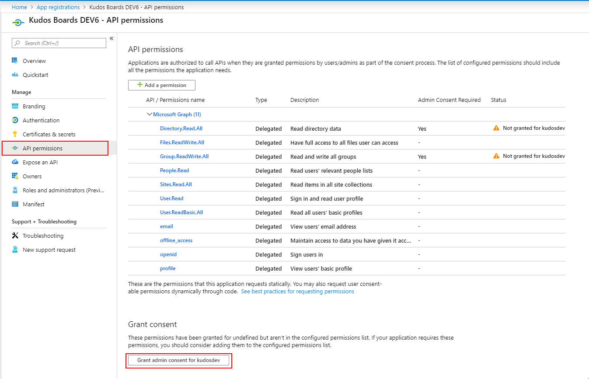

Click `Yes`

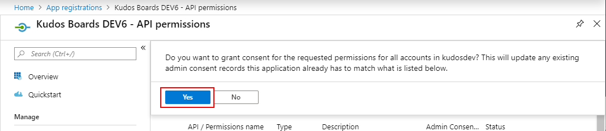

### Configure SSO in Teams

> Note: These steps are extracted from the [official Microsoft guide: steps 5-12](https://docs.microsoft.com/en-gb/microsoftteams/platform/tabs/how-to/authentication/auth-aad-sso?WT.mc_id=m365-43962-cxa&tabs=dotnet#develop-an-sso-microsoft-teams-tab)

> Note: This step is optional, but recommended to remove the `Sign in with` page when accessing Huddo Boards.

At the end of this step you should have the following:

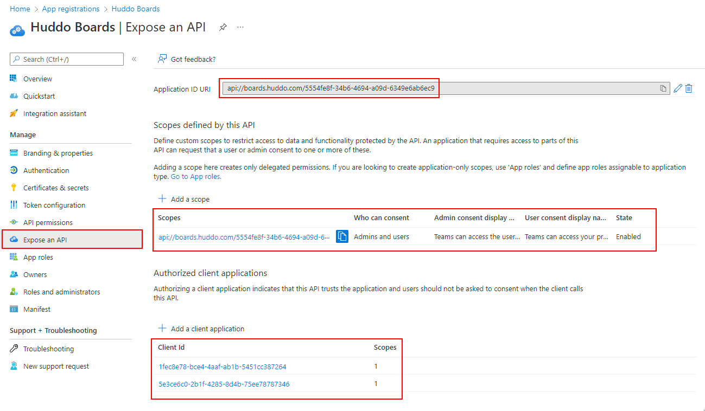

1. Click `Expose an API`

1. Set the Application ID URI as per:

    `api://<DOMAIN_HOSTING_BOARDS>/<CLIENT_ID>`

    where :

    - `DOMAIN_HOSTING_BOARDS` is the domain hosting boards, e.g. `boards.company.com` or `company.com`
    - `CLIENT_ID` is the `Application (client) ID`, shown on the `Overview` page

    For example:

    `api://boards.huddo.com/5554fe8f-34b6-4694-a09d-6349e6ab6ec9`

    > Note: this requires the domain name to be added & verified in the [Azure Portal](https://portal.azure.com/#blade/Microsoft_AAD_IAM/ActiveDirectoryMenuBlade/Domains) under `Azure Active Directory` -> `Custom domain names`. See read the [official Microsoft documentation](https://docs.microsoft.com/en-us/azure/active-directory/fundamentals/add-custom-domain) for more information.

1. Click `Add a scope`

    Set the following values:

    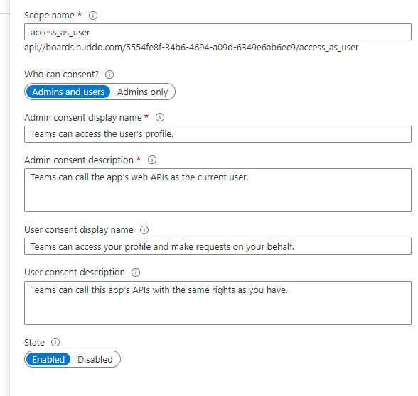

    - Scope name: `access_as_user`
    - Who can consent: `Admins and users`
    - Admin consent display name: `Teams can access the user’s profile.`
    - Admin consent description: `Teams can call the app’s web APIs as the current user.`
    - User consent display name: `Teams can access your profile and make requests on your behalf.`
    - User consent description: `Teams can call this app’s APIs with the same rights as you have.`
    - State: `Enabled`

    Click `Save`

1. Add the following Authorized client applications

    - `1fec8e78-bce4-4aaf-ab1b-5451cc387264` for Teams mobile or desktop application.
    - `5e3ce6c0-2b1f-4285-8d4b-75ee78787346` for Teams web application.

## Configure OAuth in Boards

1.  Open the `Overview` section

    Copy `Application (client) ID` & `Directory (tenant) ID`

    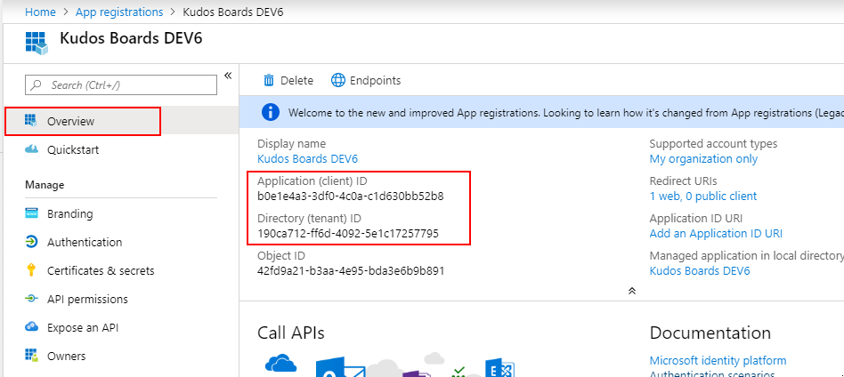

1.  Open the `Certificates & secrets` section

    Click `New client secret`

    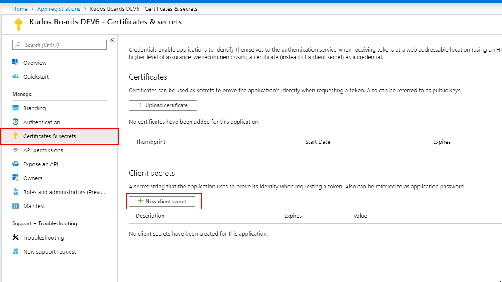

    Select `Never` expire and click `Add`

    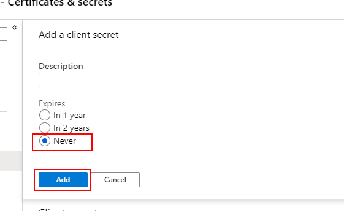

    Copy the secret value shown

    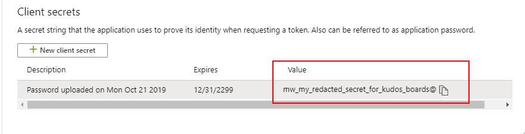

1.  Add OAuth and Tenant values to YAML config (ie `boards.yaml` or `boards-cp.yaml`)

    ```yaml
    global:
        env:
            MSGRAPH_CLIENT_ID: "<your-application-id>"
            MSGRAPH_CLIENT_SECRET: "<your-application-secret>"
            MSGRAPH_LOGIN_TENANT: "<your-tenant-id>"
    ```

1.  Redeploy Boards Helm Chart as per command for Huddo Boards:

    [HCL Component Pack](../../cp/index.md#install-boards-helm-chart)

        helm upgrade huddo-boards-cp https://docs.huddo.com/assets/config/kubernetes/huddo-boards-cp-1.2.0.tgz -i -f ./boards-cp.yaml --namespace connections

    [for Docker - Kubernetes](../../kubernetes/index.md#deploy-boards-chart)

        helm upgrade huddo-boards https://docs.huddo.com/assets/config/kubernetes/huddo-boards-1.0.0.tgz -i -f ./boards.yaml --namespace boards

    > **Note:** `--recreate-pods` is not required this time as this is only an env variable change

## Approve Permissions

1. Open your Huddo Boards environment.

    Click the `Microsoft 365` option and login with a Tenant Administrator account

    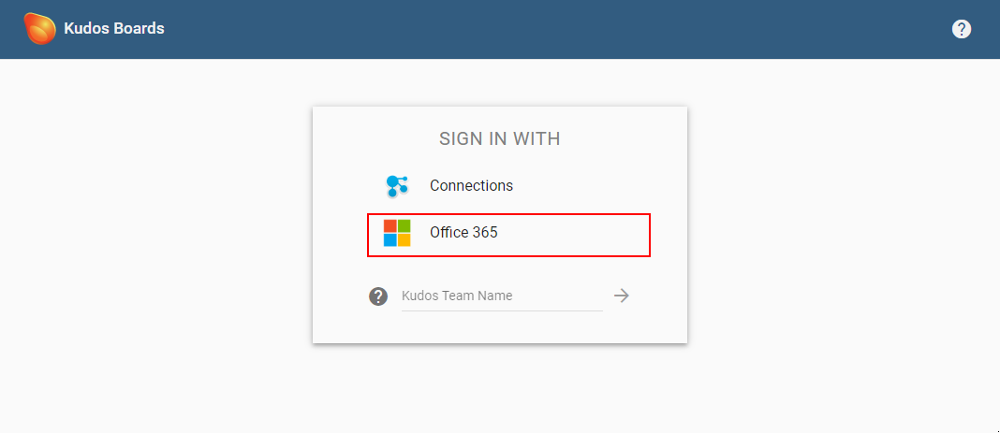

1. Once logged in, a prompt will appear in Huddo Boards. Click `Approve`

    

1. Click `Accept` on the following popup to grant the required permissions for Huddo Boards

    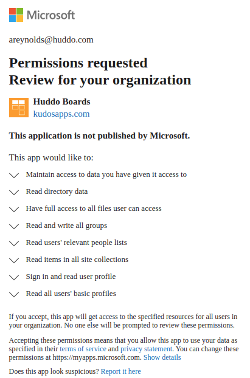

    Congratulations! All users in your tenant can now login to Huddo Boards via Microsoft 365!

    
