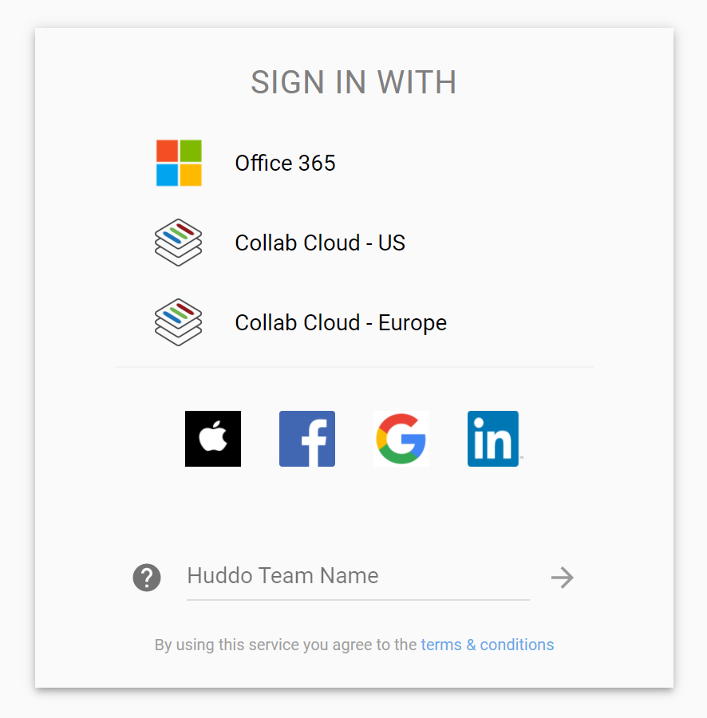
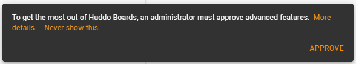
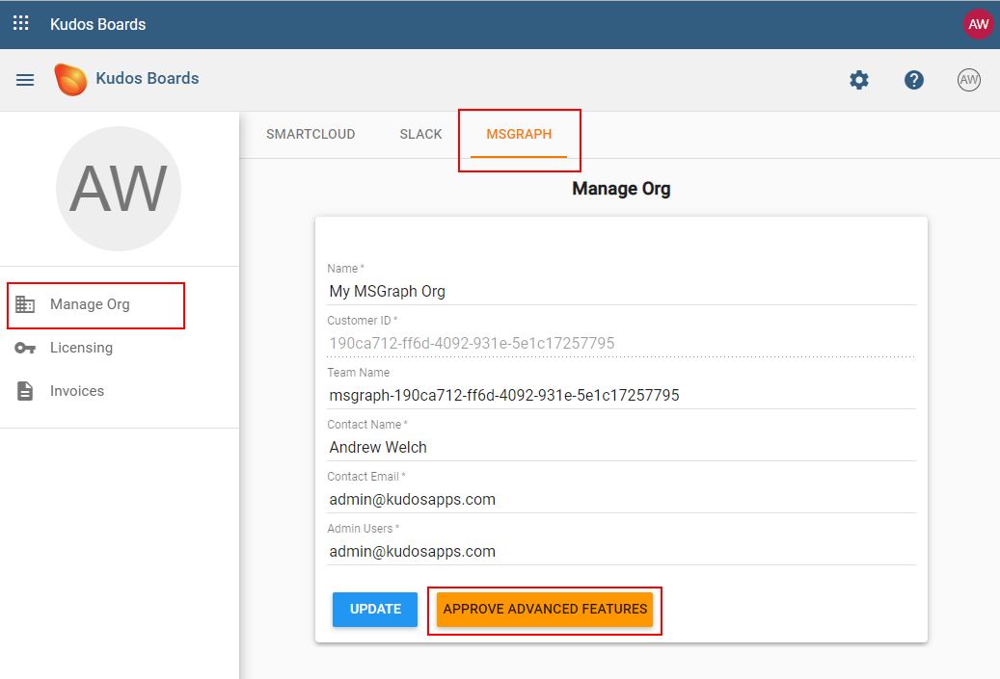
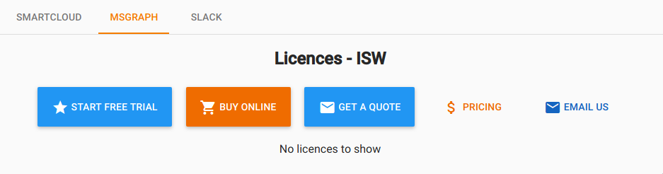

# Getting Started with Huddo Boards for Microsoft 365

To get the most out of Huddo Boards in your Microsoft 365 tenant, there are a few steps to take to make the experience seamless for your users.

> The Steps on this page (other than just logging in) require that you are an admin in your Microsoft 365 tenant. If you are not an admin, please refer this page to your Administrator, Manager or IT department.

---

# Login

Huddo Boards uses OAuth for login and user access. This means your users can just click the Microsoft 365 logo at [boards.huddo.com](https://boards.huddo.com) and use their existing Microsoft credentials.

> If you would like to link to Huddo Boards from another site, you can use [https://boards.huddo.com/auth/msgraph ](https://boards.huddo.com/auth/msgraph) which will skip the list of login options.

{ style="height: 300px" }

---

# Microsoft Graph API Permissions
Huddo Boards requires permissions to be granted to access your Microsoft 365 data. 

- Some of these permission can normally be granted by a user, enabling most functionality of Huddo Boards.
- Some permission always require administrator consent, which may make some functionality unavailable until an administrator grants consent.
- Microsoft tenants may also be configured to require administrator consent for all permissions. 

<!-- THIS IS LINKED EXTERNALLY. Changing file name or header will break link -->
## Admin Approval

Providing administrator consent gives Huddo Boards the Microsoft Graph permissions required to enable all functionality and allows users to skip a consent prompt when logging in.

### Via Microsoft Entra
You can view the your currently granted permissions, grant admin consent and manage/revoke permissions on your [Microsoft Entra | Huddo Boards | Permissions](https://entra.microsoft.com/#view/Microsoft_AAD_IAM/ManagedAppMenuBlade/~/Permissions/objectId/a35c4802-1c55-49a8-87ce-90aa6641484b/appId/5554fe8f-34b6-4694-a09d-6349e6ab6ec9/) page. 

### Via Huddo Boards
*If admin consent has not been provided*, you will be prompted within the Huddo Boards app:
 

After clicking Approve, you may be asked to login to Microsoft 365 again, then you will be prompted to approve Huddo Boards access on behalf of your organisation.

You can revoke this approval at any stage via your [Microsoft Entra | Huddo Boards | Permissions](https://entra.microsoft.com/#view/Microsoft_AAD_IAM/ManagedAppMenuBlade/~/Permissions/objectId/a35c4802-1c55-49a8-87ce-90aa6641484b/appId/5554fe8f-34b6-4694-a09d-6349e6ab6ec9/) page. 

## Permissions Used by Huddo Boards

These are the permissions what Huddo Boards uses. These will change as we implement new features and optimise the permissions we use. When permission requirements change, permissions must be granted by users/admins again. 

| Permission Name        | Permission Type | Microsoft Description                               | Admin consent required | Boards Usage                                                                                                                                                                                              |
| ---------------------- | --------------- | --------------------------------------------------- | ---------------------- | --------------------------------------------------------------------------------------------------------------------------------------------------------------------------------------------------------- |
| email                  | delegated       | View users' email address                           | false                  | Basic permission that allows you to log in to Huddo Boards with your Microsoft account                                                                                                                    |
| Files.Read.All         | delegated       | Read all files that user can access                 | false                  | Allows you to browse and share links to your files in Huddo Boards.                                                                                                                                       |
| Files.ReadWrite.All    | delegated       | Have full access to all files user can access       | false                  | Allows you to store new files in OneDrive via the Huddo Boards app.                                                                                                                                       |
| offline_access         | delegated       | Maintain access to data you have given it access to | false                  | Allows us to remember who you are logged in as, so you don't have to login every time you use Huddo Boards                                                                                                |
| openid                 | delegated       | Sign users in                                       | false                  | Basic permission that allows you to log in to Huddo Boards with your Microsoft account                                                                                                                    |
| People.Read            | delegated       | Read users' relevant people lists                   | false                  | Basic permission that allows Huddo Boards to search for people in your tenant on your behalf.                                                                                                             |
| profile                | delegated       | View users' basic profile                           | false                  | Basic permission that allows you to log in to Huddo Boards with your Microsoft account - Allows Huddo Boards to read your profile                                                                         |
| Sites.Read.All         | delegated       | Read items in all site collections                  | false                  | Allows Huddo Boards to read the basic information about Sharepoint Sites you can access.                                                                                                                  |
| Team.ReadBasic.All     | delegated       | Read the names and descriptions of teams            | false                  | Allows Huddo Boards to read the basic information about Teams you can access.                                                                                                                             |
| TeamsActivity.Send     | delegated       | Send a teamwork activity as the user                | false                  | Allows Huddo Boards to send Activity Notifications to other Microsoft users on your behalf.                                                                                                               |
| User.Read              | delegated       | Sign in and read user profile                       | false                  | Basic permission that allows you to log in to Huddo Boards with your Microsoft account - Allows Huddo Boards to read your profile                                                                         |
| User.ReadBasic.All     | delegated       | Read all users' basic profiles                      | false                  | Allows Huddo Boards to read basic profile information of others in your tenant that you can access.                                                                                                       |
| Channel.ReadBasic.All  | application     | Read the names and descriptions of all channels     | true                   | Allows Huddo Boards to read private channel details.                                                                                                                                                      |
| ChannelMember.Read.All | application     | Read the members of all channels                    | true                   | Allows Huddo Boards to read members of and function in private channels.                                                                                                                                  |
| Directory.Read.All     | delegated       | Read directory data                                 | true                   | Allows Huddo Boards to read data in your organisation's directory, such as users, groups and apps. We intend to remove this permission in the future in favour of multiple more fine-grained permissions. |
| Group.Read.All         | delegated       | Read all groups                                     | true                   | Allows Huddo Boards to search the groups you have access to, read group details (image, description, installed apps,  etc)                                                                                |
| Group.ReadWrite.All    | delegated       | Read and write all groups                           | true                   | DEPRECATED: To be removed. Allows Huddo Boards to add  new team channel tabs without interaction with the Teams client.                                                                                   |

---

# Start a free trial
<!-- TODO FIX LINKS -->
After logging in, you will also be prompted to start a free (30 day) trial. Enabling this will allow other users in your Microsoft 365 tenant to login and use Huddo Boards.

> You may also go to [Your Admin Page](https://boards.huddo.com/admin/licences/manage) to Start Your free trial, get a Quote or Purchase licences online.

---

# Enable Integrations between Huddo Boards and Microsoft 365

These guides also require admin access and enable some advanced features of Huddo Boards in your Microsoft 365 environment.

> These are also in the side menu of this page

- [Office Menu App Tile](../custom-tiles/index.md)
- [Teams integration](../teams/index.md)
- [Outlook plugin](../outlook/index.md)
- [Sharepoint](../sharepoint/index.md)
