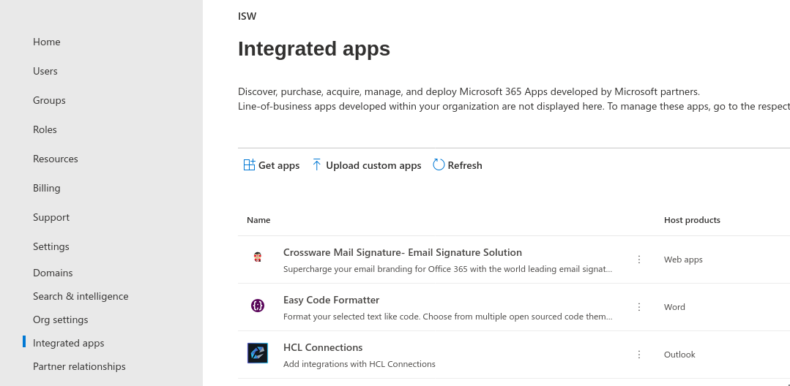
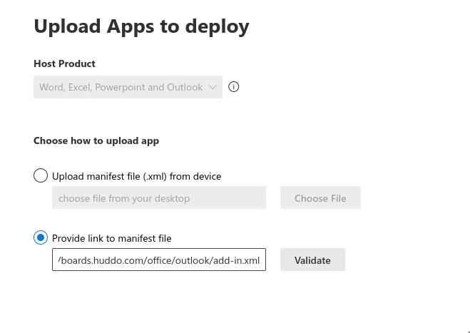
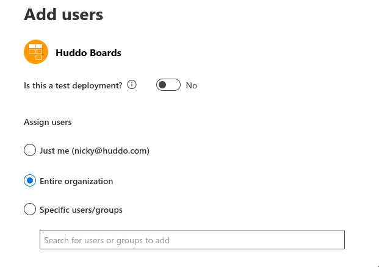
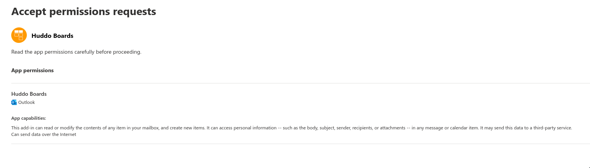
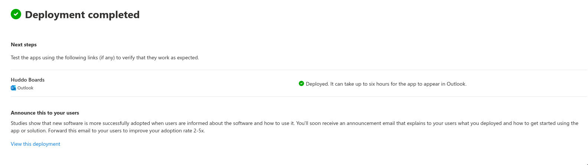
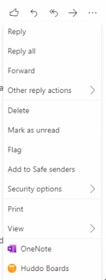

## Add Huddo Boards plugin

!!! note

      Desktop Outlook requires the [Microsoft Edge WebView2 Runtime](https://developer.microsoft.com/en-us/microsoft-edge/webview2/).

1. Open [365 Admin Centre](https://admin.microsoft.com/AdminPortal/Home#/Settings/IntegratedApps)

      Click `Settings` -> `Integrated apps` -> `Upload custom apps`

      

1. Select `Provide link to manifest file`

        https://boards.huddo.com/office/outlook/add-in.xml

      Click `Validate` then click `Next`

      

1. Specify who has access and click `Next`

      

      1. Click `Finish Deployment`

      

1. Click `Done`

      

1. Open [Outlook](https://outlook.office365.com/mail/)

      You should now see the `Huddo Boards` option in the menu of an email

      