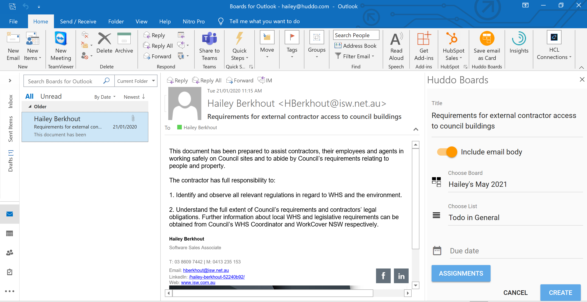
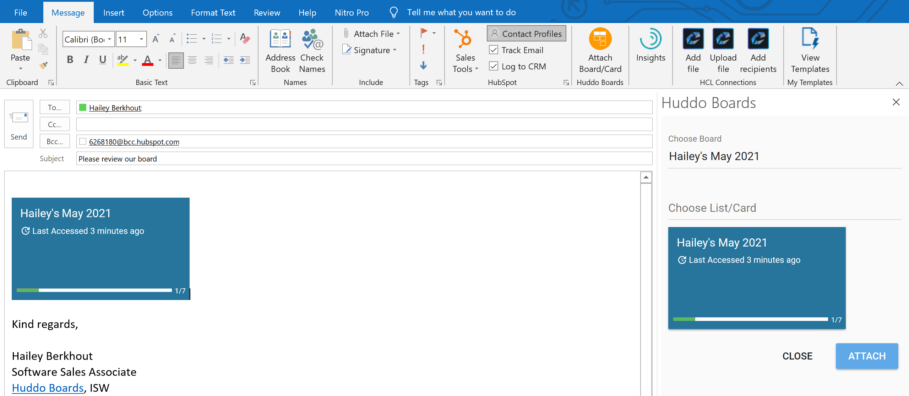

## Huddo Boards plugin (for single users)

> The instructions on this page use 'The new Outlook' however you can also add and use this plugin from 'classic Outlook' or Outlook desktop.

> Microsoft 365 admins can add this for all users in their tenant, [instructions here](index.md)

1. Open Outlook and click `New Message`

      

1. Click the `...` menu -> `Get Add-ins`

      

1. Click `My Add-ins` then `Add a custom add-in` -> `Add from URL`

      

1. Provide the url: `https://boards.huddo.com/office/outlook/add-in.xml` and click OK.

      

1. Click `Install` then close the add-in dialogue.

      

1. Verify the add-in is installed by clicking the `...` menu again.

      

1. You will now be able to:

    Save emails from Outlook as a card in your board

    

    Attach boards, lists and cards to an email.

    
