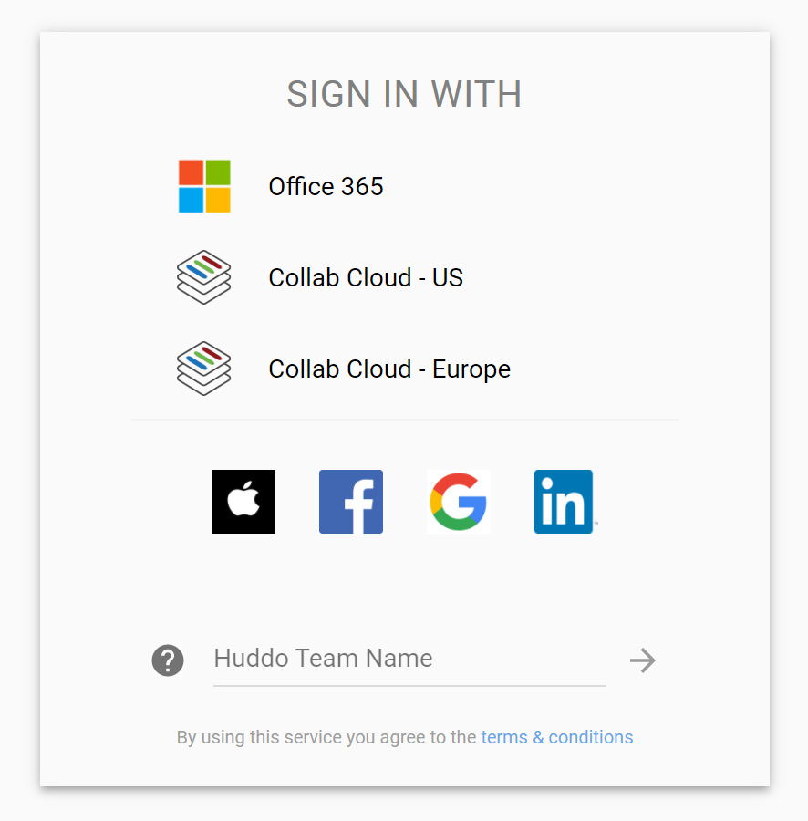
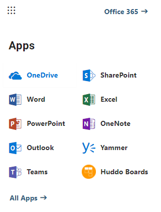

Huddo Boards is tailored for working with Microsoft 365 in the following ways:

### Login

Use your existing Microsoft credentials

---

### Collaboration

Share and collaborate with individuals and groups in your office tenant

---

### Easy Access

Access Boards from your Office menu, and access other Office apps from the menu in Boards

[Admin setup guide](custom-tiles/index.md)

---

### OneDrive

Share files and folders from Onedrive within the context of a Board

---

### Teams

[Teams integration admin guide](teams/index.md)

Add boards tabs to Microsoft Teams

See all of the boards your team is working on.

Access Huddo Boards directly from Teams as a personal app

Receive notifications as the board updates

---

### Outlook

> You can add the Outlook add-in just for yourself ([Outlook plugin user guide](outlook/personal.md))  Or for your whole Microsoft 365 tenant ([Outlook plugin admin guide](outlook/index.md))

Save emails from Outlook as a card in your board

Attach boards, lists and cards to an email.

 
---

### Sharepoint

Embed boards as pages in Sharepoint.

[Sharepoint pages setup guide](sharepoint/index.md)

