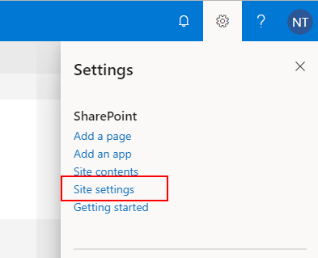
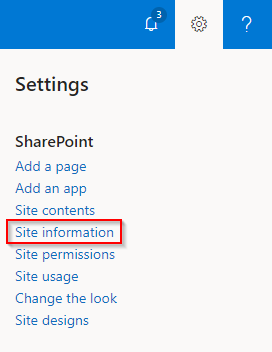
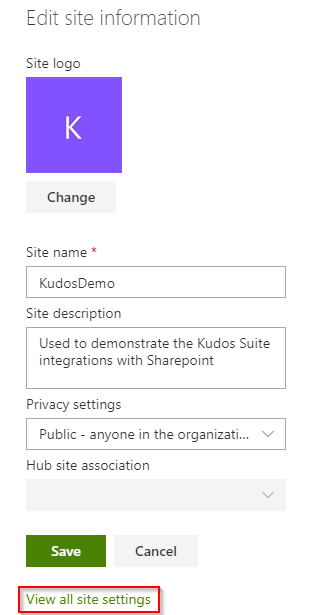
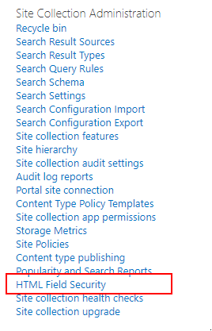
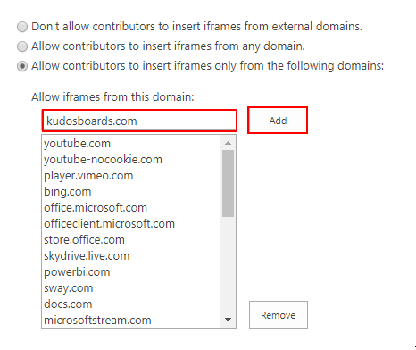

## Enable embedding Huddo Boards pages in Sharepoint.

Embedding Huddo Boards in sharepoint requires iframe permissions for users, it is common (default) for the permitted domains to be limited, if this is the case, you can add Huddo Boards to the restricted list as below.

> Admin access is required for these steps

1. Browse to the root of the sharepoint site, click the settings cog and choose `Site Settings`

  

  OR choose `Site information` then `View all site settings`

  
  

1. Click `HTML Field Security`

  

1. Type in boards.huddo.com and click `Add`

  

1. Click `OK`

  

1. To add Site Pages for sharing Huddo Boards, follow the instructions [here](index.md)
