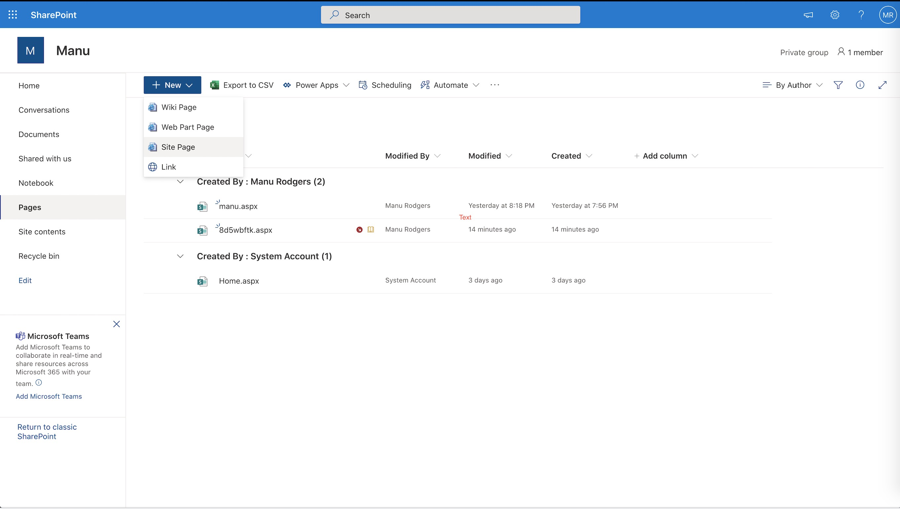
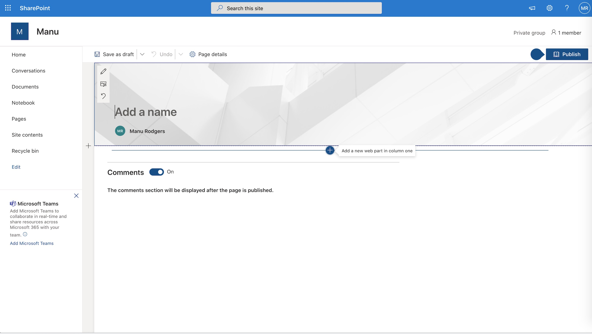
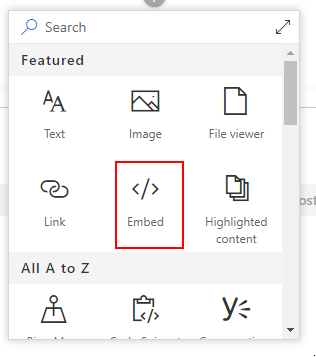
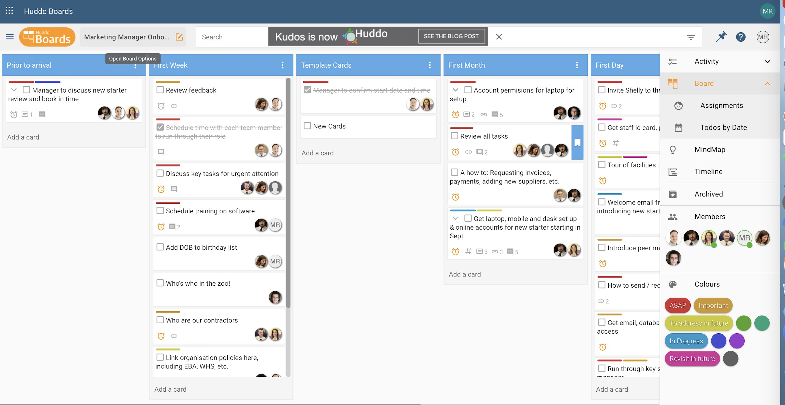
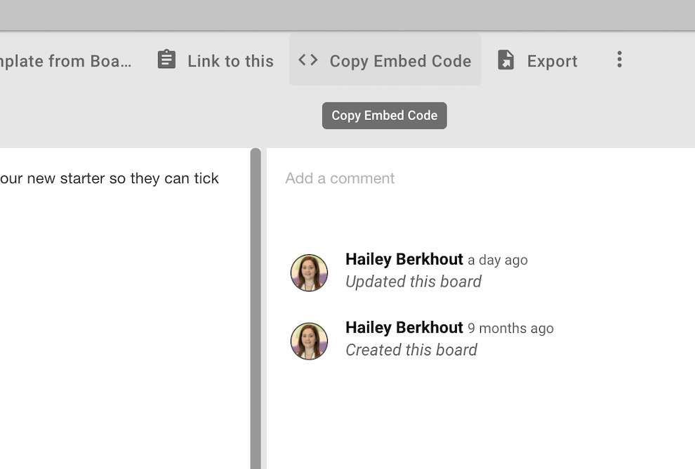
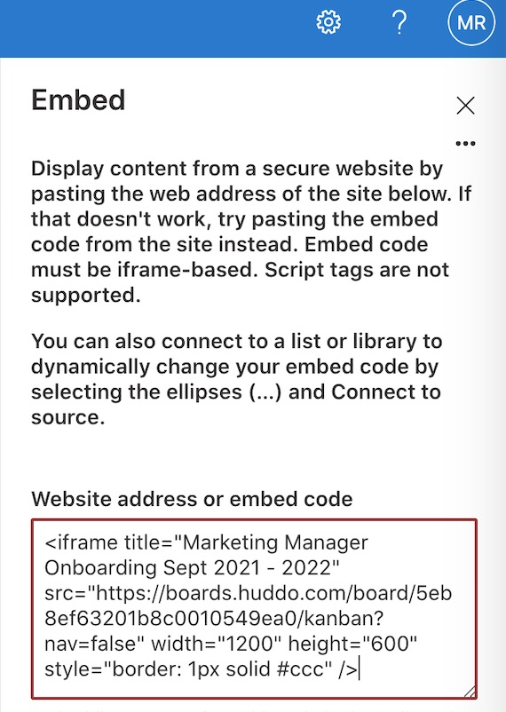
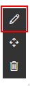
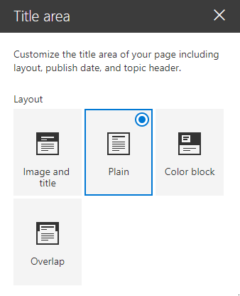
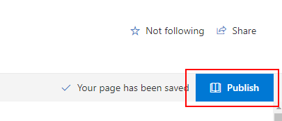
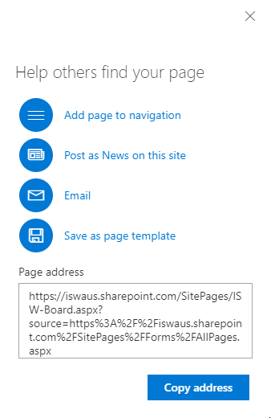

## Embedding Huddo Boards pages in Sharepoint.

Before proceeding, you will need a site admin to enable security settings as described [here](admin.md)

1. From Sharepoint main menu, go to `Pages` -> `New` -> `Site Page`

    

1. Give your page a name, then click the `+`

    

1. Choose `Embed` from the drop down menu

    

1. Open [Huddo Boards](https://boards.huddo.com/) and select the board you wish to embed in the sharepoint page.  Click the `Board Options` button

    

1. Click `Copy embed code`

    

1. Go back to sharepoint and paste the code you copied in the box provided

    

    !!! tip
      { align=left }
      If you don't see the input box above, you can get it back by clicking the embed you added previously and clicking it's edit button.

1. To make a small amount of extra room on your page, you may wish to edit the title and choose `Plain` as it's layout.

    

1. Once you are happy with the page, click 'Publish' to make it visible to other members of your site.

    

1. Promote your new page by following the recommendations

    
