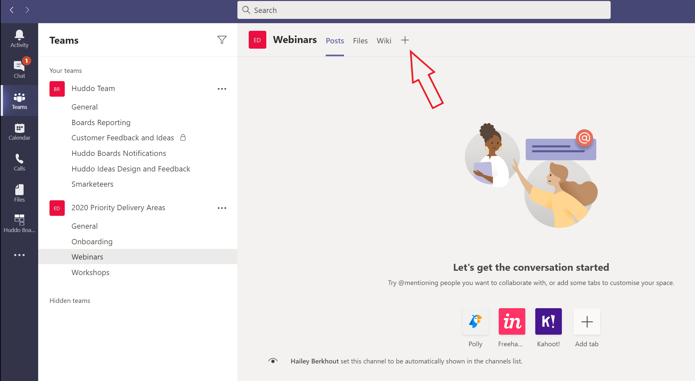
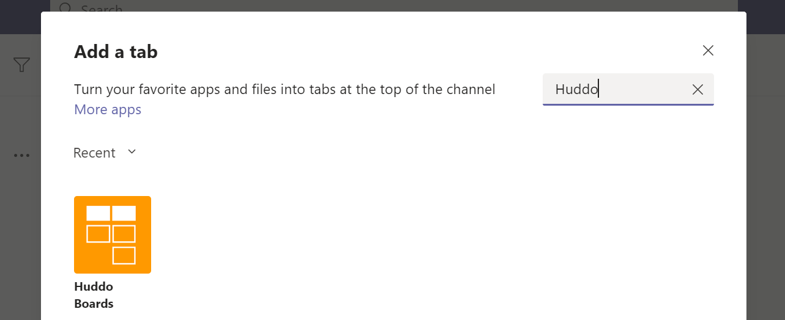
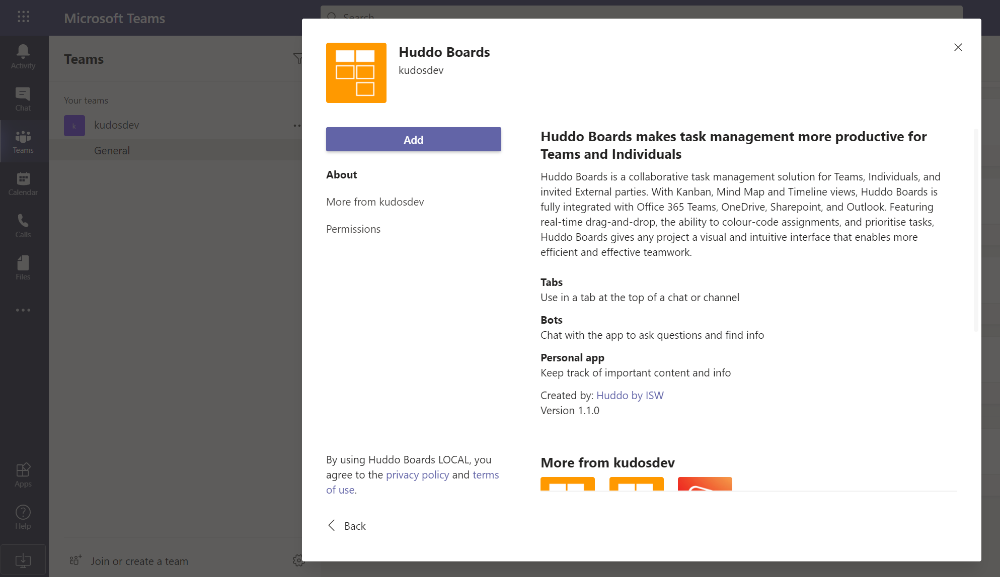
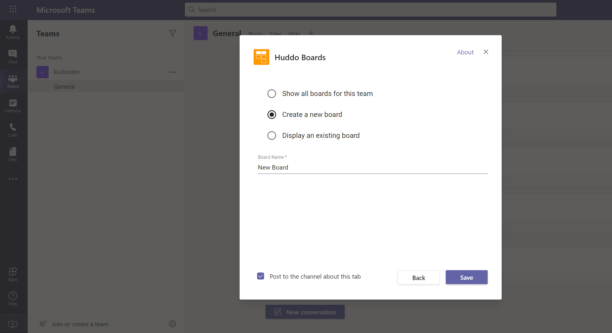
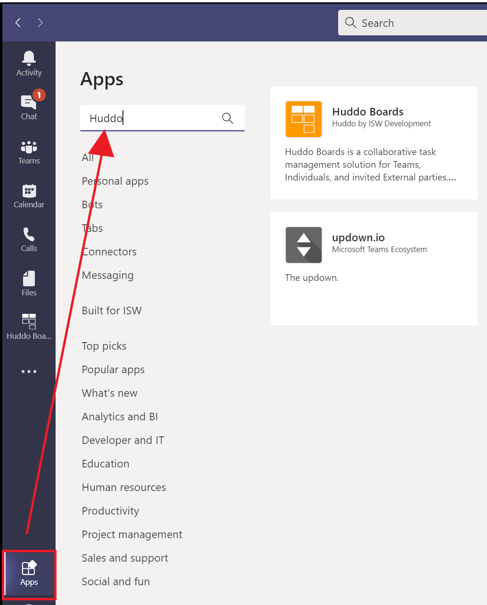

## Add Huddo Boards App

Huddo Boards is available freely in the Microsoft Teams App Store to add as either a personal app or to a team.

### Add to a Team

You can add Huddo Boards to MS Teams in two ways. Follow these steps to Huddo Boards as a tab in a Team Channel. 

1.  Open the [Teams App](https://teams.microsoft.com) and go to the team you wish to add Huddo Boards to.

1.  Click the `+` (add a tab) button

    

1.  Search for `huddo` to find Huddo Boards

    

    Note that if Huddo Boards cannot be found, it has not yet been added before in your organisation and needs to be added by finding it within the Teams App Store.
    Click `More Apps` in this case:

    

    Again, search for `huddo` to find the Huddo Boards App in the entire store.

1.  Once you have located and clicked on the Huddo Boards App, click the `Add` button to add it to the team:

    

1.  The Huddo Boards app will now be added to the team, and you will be given the ability to add a new tab:

    

### Add as a personal app to the `more added apps` area.

To add Huddo Boards as a personal app follow these steps:

1.  Open Teams and click the Apps button. Type `huddo` to find the Huddo Boards app:

    

1.  Click `Huddo Boards` then click `Add` to add it as a personal app:

    
