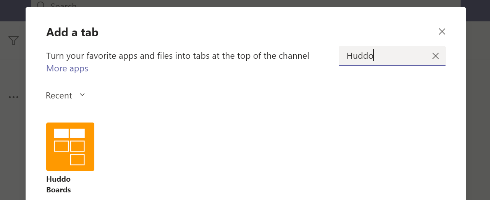
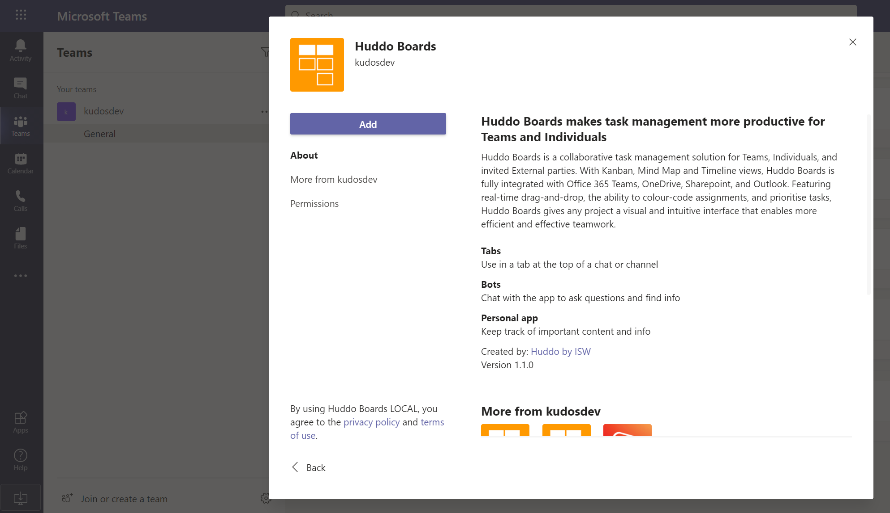
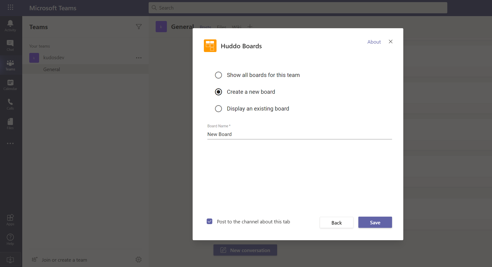

<!-- # Grant Permissions to Huddo Boards -->

  [{ style="width:30%" }](../store-slides/1%20EN%20UK.png)
  [{ style="width:30%" }](../store-slides/2%20EN%20UK.png)
  [{ style="width:30%" }](../store-slides/3%20EN%20UK.png)
  [{ style="width:30%" }](../store-slides/4%20EN%20UK.png)
  [{ style="width:30%" }](../store-slides/5%20EN%20UK.png)

# Add Huddo Boards to Microsoft Teams

!!!note
    If you're a Microsoft 365 administrator, please see the section on [providing admin consent](../../getting-started/#admin-approval).

Huddo Boards is available in the Microsoft Teams App Store. 
[Click here to open in Teams.](https://teams.microsoft.com/l/app/1c69a9da-d385-43e3-93c8-297f88c4a5a9?source=app-details-dialog){ target="_blank" }

  - Select **Add** to add Huddo Boards as a personal app.
  - Select **Add to a team** to add a Huddo Boards tab to a team channel.

# Accept Updates to Huddo Boards in Microsoft Teams

Some updates to Huddo Boards' Teams app need your approval within the Teams client.

For detailed instructions, see [Microsoft's support article for updating apps in Teams](https://support.microsoft.com/en-au/office/update-an-app-in-microsoft-teams-3d53d136-5c5d-4dfa-9602-01e6fdd8015b)

Here's a sample from Microsoft's article:

1. Select **Apps** on the left side of Teams.

2. Near the bottom left of your screen, you'll see a little red bubble next to **Manage your apps** that shows the number of app updates waiting to resolve. Select that bubble.

3. On the **Manage your apps** page, you'll see that your apps have been sorted so that the ones that need updates are at the top. Select **Update** for each app you want to update.

4. When you select **Update** for an app, a dialog with that app's details will appear, including a **What's new** tab describing how the latest updates change the app. If necessary, the **What's new** tab will also include a list of permissions for you to accept.

5. Select **Update now** to accept the permissions and update the app!
[Install Dialog - Update Now](./install-dialog-update-now.png)

# Within the Teams Client
You can also find add Huddo Boards app for Teams within the Teams client by following the walkthroughs below. 

## Add Huddo Boards to a Team

1.  Open the [Teams App](https://teams.microsoft.com) and go to the team you wish to add Huddo Boards to.

2.  Click the `+` (add a tab) button

    

3.  Search for `huddo` to find Huddo Boards

    

    Note that if Huddo Boards cannot be found, it has not yet been added before in your organisation and needs to be added by finding it within the Teams App Store.
    Click `More Apps` in this case:

    

    Again, search for `huddo` to find the Huddo Boards App in the entire store.

4.  Once you have located and clicked on the Huddo Boards App, click the `Add` button to add it to the team:

    

5.  The Huddo Boards app will now be added to the team, and you will be given the ability to add a new tab:

    

## Add the Huddo Boards personal app

1.  Open Teams and click the Apps button. Type `huddo` to find the Huddo Boards app:

    

2.  Click `Huddo Boards` then click `Add` to add it as a personal app:

    
