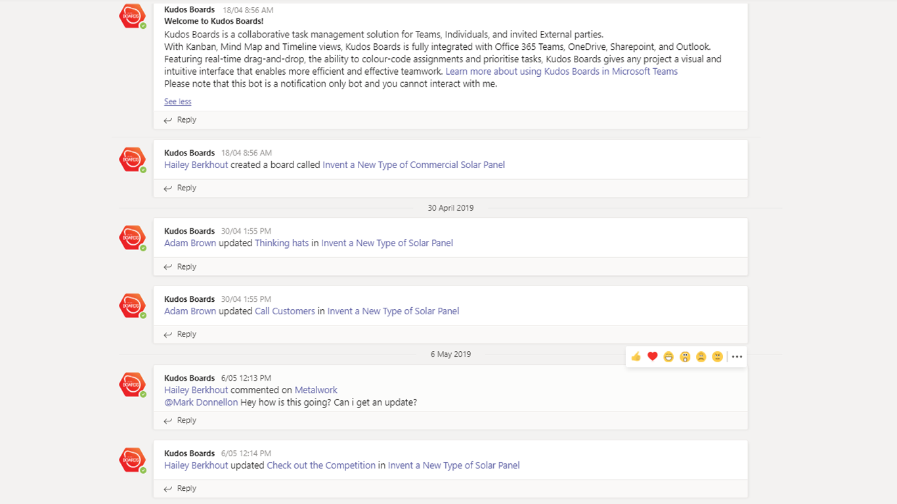
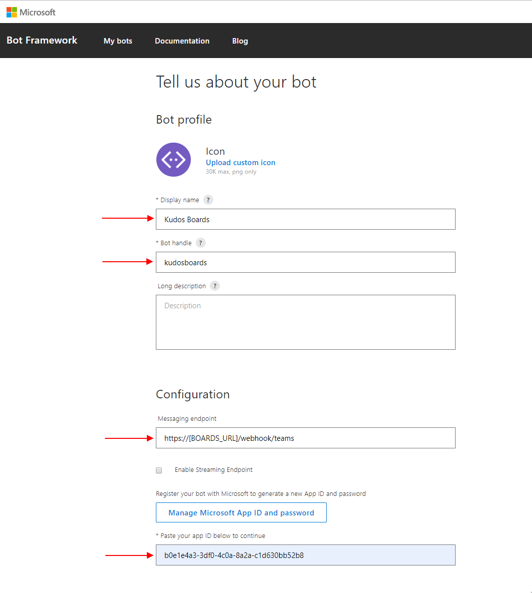
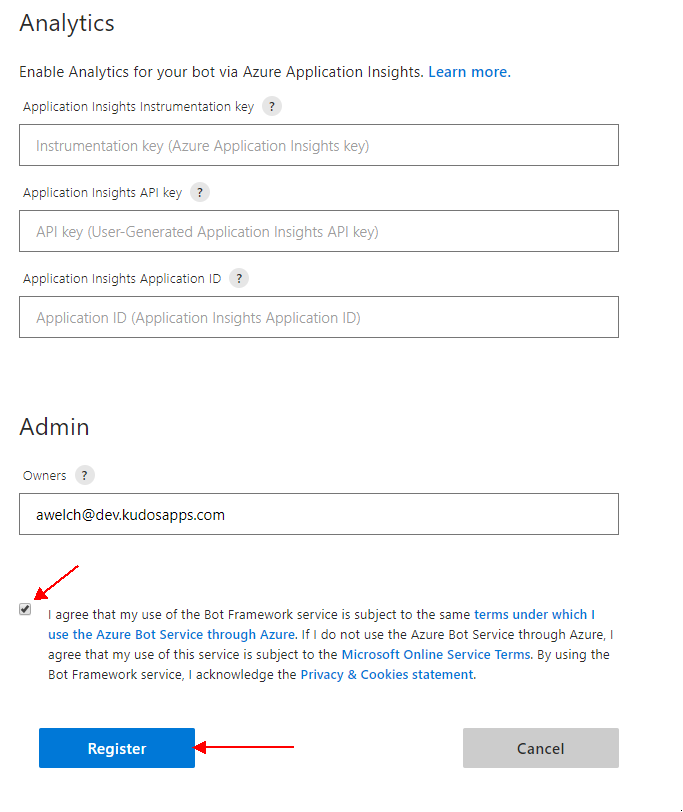
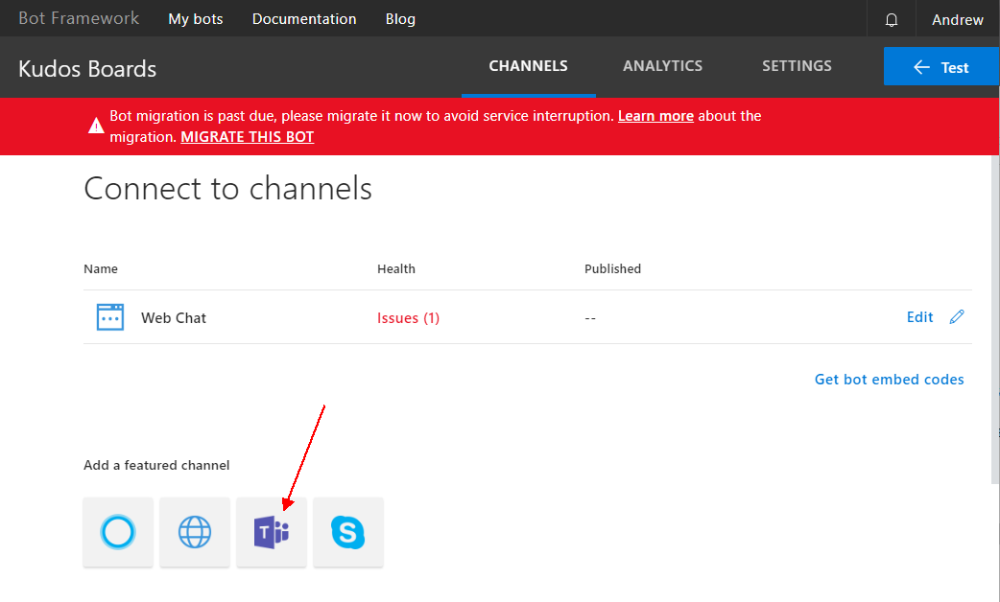
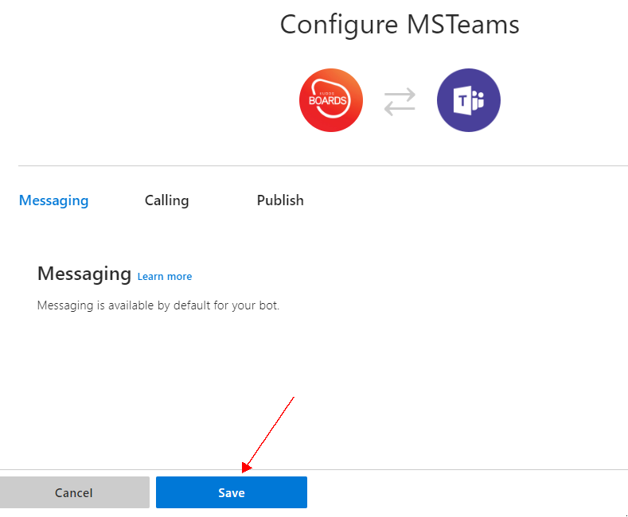
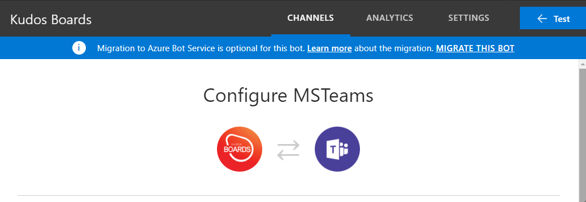

# Microsoft Teams Notification Bot

This bot will be used to post notification to Microsoft Teams triggered by actions performed in Huddo Boards.

> Note: this step is optional and cannot be achieved if you do not meet the prerequisites.

---

## Prerequisites

- **Boards deployment is accessible from the web (no VPN)**

  > Note: Microsoft Teams notifications requires 2-way web communication.

  > For example, the following URL must be accessible by Microsoft's servers: `https://[BOARDS_URL]/webhook/teams`

---

## Configure Bot

### Create Bot

1.  Open [Bot Registration](https://dev.botframework.com/bots/new) and sign-in with a Microsoft Tenant admin

1.  Enter the following values

        Huddo Boards
        huddoboards
        https://[BOARDS_URL]/webhook/teams
        [MSGRAPH_CLIENT_ID]

    Where:

    - `[BOARDS_URL]` is the URL to your Huddo Boards installation

        > i.e. `https://connections.example.com/boards/webhook/teams` or `https://boards.company.example.com/webhook/teams`

    - `[MSGRAPH_CLIENT_ID]` is the OAuth Client ID from [Auth setup](../auth/index.md)

    For example:

        Huddo Boards
        huddoboards
        https://connections.example.com/boards/webhook/teams
        b0e1e4a3-3df0-4c0a-8a2a-c1d630bb52b8

    

1. Scroll down, read/agree to the terms and click `Register`

   

---

### Connect Bot to Teams

1. Click the `Teams` icon

    

1. Click `Save`

    

1. The bot setup is complete

    

---

## Next Steps

See [Installing the Huddo Boards Teams App](on-prem.md)
