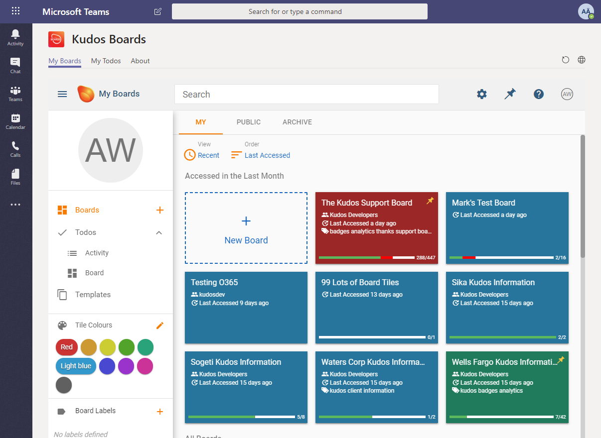
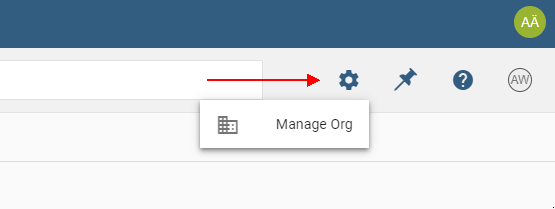
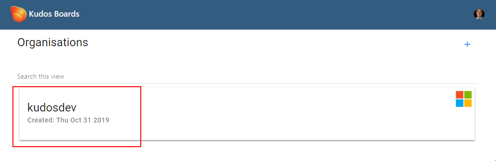
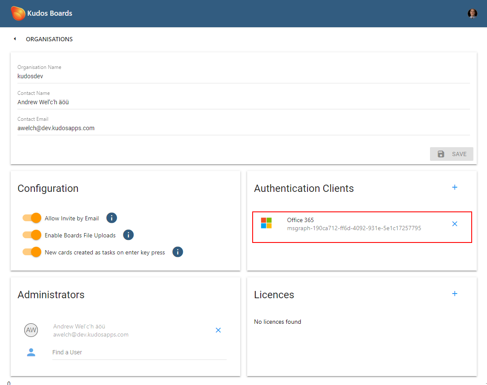
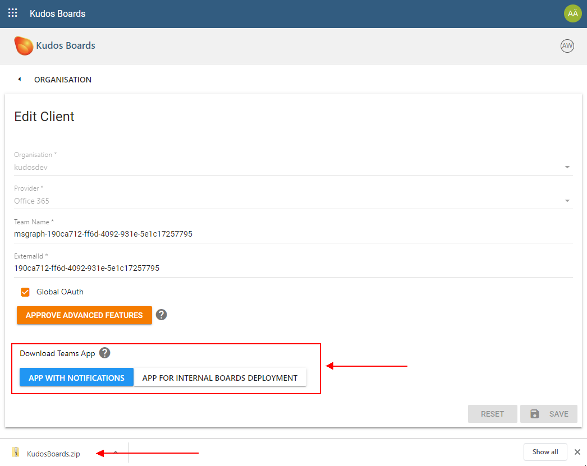
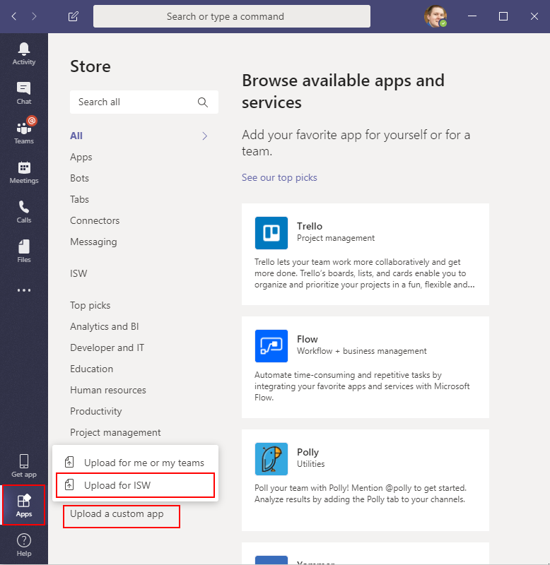
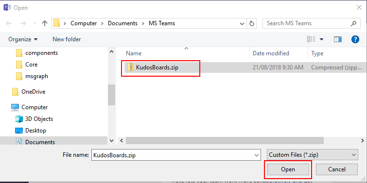
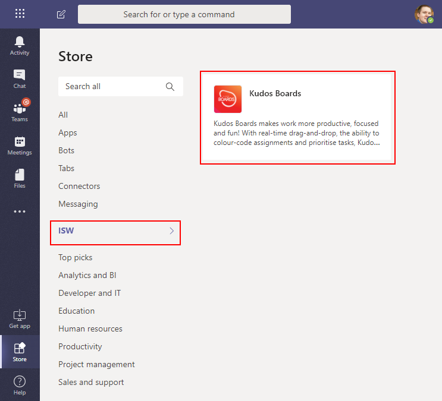
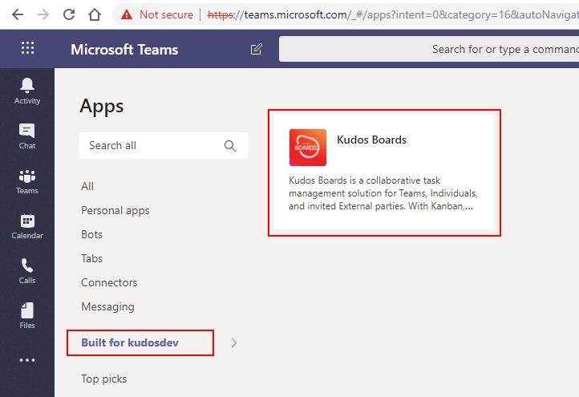
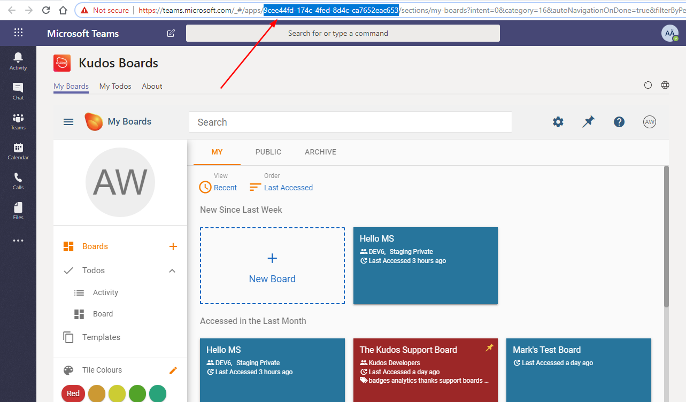

# Huddo Boards On-Premise in Microsoft Teams



---

## Prerequisites

1. Office 365 Tenant admin account.

1. Office 365 OAuth client. [See instructions](../auth/index.md)

1. Notification bot (optional). [See instructions](notification-bot.md)

    > **Note:** notifications are **optional** as the bot cannot be configured for internal Huddo Boards deployments

---

## Configure Application

### Download from Boards

1. Login to Huddo Boards with your Microsoft Tenant Admin account

1. Click the `Configuration` icon and then `Manage Org`

    

1. Click on your Organisation

    

1. Click on your Microsoft client

    

1. Click the download button for your configuration

    - `App with Notifications` (if you can and have enabled the [notification bot](notification-bot.md))

    - `App for Internal Boards Deployment` (if you do not want notifications)

    

### Install in Teams

1. Open the [Teams App](https://teams.microsoft.com)

    Click `Apps` -> `Upload a custom app` -> `Upload for [COMPANY_NAME]`

    > where `[COMPANY_NAME]` is the name of your company

    

1. Upload the Zip file you downloaded above

    

1. The Huddo Boards app will now appear under the section `Built for [COMPANY_NAME]`

    

---

### Configure App ID

1.  Open [Team Apps](https://teams.microsoft.com/_#/apps?intent=0&category=16&autoNavigationOnDone=true&filterByPersonal=false&storeLaunchFromChat=false&addAppDialogEntryPoint=7) in your web browser

    Click on `Built for [COMPANY_NAME]` => `Huddo Boards`

    

1.  Click `Add`

    

1.  Huddo Boards personal will now open

    Copy the App ID from the URL. We will use this shortly.

    

1.  Open the Boards Helm Chart config used for deployment

    Add the following environment variable to `provider` (uncomment or add the section as required):

    ```yaml
    provider:
        env:
            MSGRAPH_TEAMS_APP_ID: "<your_app_id>"
    ```

1.  Redeploy Boards helm chart as per command for Huddo Boards:

    [HCL Component Pack](../../cp/index.md#deploy-boards-helm-chart)

        helm upgrade huddo-boards-cp https://docs.huddo.com/assets/config/kubernetes/huddo-boards-cp-1.2.0.tgz -i -f ./boards-cp.yaml --namespace connections

    [for Docker - Kubernetes](../../kubernetes/index.md#deploy-boards-chart)

        helm upgrade huddo-boards https://docs.huddo.com/assets/config/kubernetes/huddo-boards-1.0.0.tgz -i -f ./boards.yaml --namespace boards

    > **Note:** `--recreate-pods` is not required this time as this is only an env variable change

---

## How To Use

For a full guide on using Huddo Boards in Microsoft Teams, please see [our documentation](index.md).
