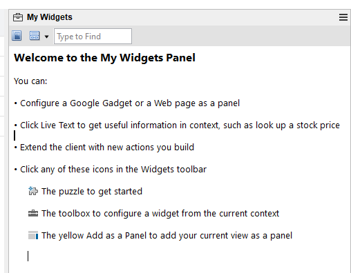

# Huddo Boards Cloud widget for HCL Notes

Drag and drop your Notes emails directly in Huddo Boards with the new sidebar widget!

## Prerequisites

-   HCL Notes 14.5 or later (support for XPages in sidebar)

## Outcome

## Installation

### Boards Cloud

1. Please [drag this xml file](./boards-cloud-widget.xml) into the "My Widgets" sidebar application of your HCL Notes widget library.

    

### On-Premise

To install for a custom Boards deployment you must do the following:

1. Download the [xpage iframe nsf file](./boards-cloud.nsf)
1. Modify the nsf file (in Domino Designer) to point to your own Huddo Boards instance URL
1. Place the modified nsf file into your HCL Notes server - copy the `notes://` URL to this file
1. Download the [widget xml file](./boards-cloud-widget.xml)
1. Open the xml file, modify the `palleteItem` url field to the path of your hosted nsf file

    

1. Place this file somewhere your users can access it from (optional)
1. Drag and drop the modified widget xml file into the "My Widgets" sidebar application of your HCL Notes widget library to install

    

1. Open the newly imported widget in a Panel (if it is not already open)
