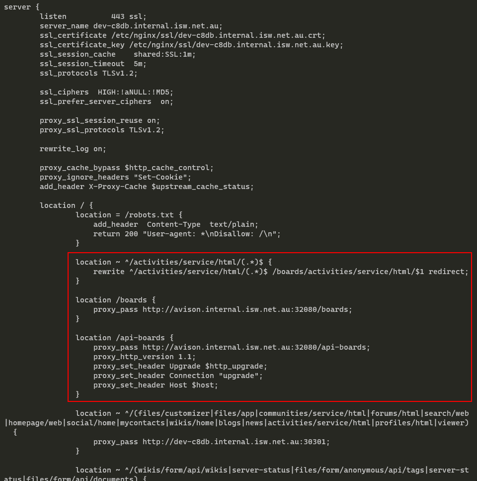

# Proxy (NGINX)

If you are running an NGINX proxy (e.g. customizer) then you can pass Boards traffic directly to your Kubernetes deployment.

Please add the following location blocks to your `server` -> `listen 443` blocks:

```nginx
# Redirect from HCL Connections Activities -> Boards
location ~ ^/activities/service/html/(.*)$ {
  rewrite ^/activities/service/html/(.*)$ /boards/activities/service/html/$1 redirect;
}

# Optional if you have a legacy Kudos Boards Websphere URLs
location ~ ^/kudosboards/(.*)$ {
  rewrite ^/kudosboards/(.*)$ /boards/legacy/$1 redirect;
}

# Boards UI
location /boards {
    proxy_pass http://[KUBERNETES_NAME]:[KUBERNETES_PORT]/boards;
}

# Boards API (including WebSocket support)
location /api-boards {
    proxy_pass http://[KUBERNETES_NAME]:[KUBERNETES_PORT]/api-boards;
    proxy_http_version 1.1;
    proxy_set_header Upgrade $http_upgrade;
    proxy_set_header Connection "upgrade";
    proxy_set_header Host $host;
}
```

Where:

-   `[KUBERNETES_NAME]` is the hostname/IP of the master in your cluster</br>
-   `[KUBERNETES_PORT]` is the port of your Ingress Controller (ie 32080)</br>

For example:


