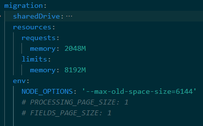

# Activity Migration

## Pod will not start - Port in use

Sometimes the pod fails to start with an error `listen EACCES: permission denied`. For example:

```
checkActitiviesFileStore: found valid content store
checkOrg: Found 1 OrgId: [ 'a' ]
checkTenant: Found 1 Tenant: [ '00000000-0000-0000-0000-040508202233' ]
Please open the UI at 'https://company.example.com/boards/admin/migration' or set env.IMMEDIATELY_PROCESS_ALL='true' to migrate all of your Activities without UI
events.js:377
throw er; // Unhandled 'error' event
^
Error: listen EACCES: permission denied tcp://10.100.200.104:2641
at Server.setupListenHandle [as _listen2] (net.js:1314:21)
at listenInCluster (net.js:1379:12)
at Server.listen (net.js:1476:5)
at listen (/usr/src/app/dist/index.js:62:10)
at /usr/src/app/dist/index.js:106:3
at processTicksAndRejections (internal/process/task_queues.js:95:5)
Emitted 'error' event on Server instance at:
at emitErrorNT (net.js:1358:8)
at processTicksAndRejections (internal/process/task_queues.js:82:21) {
code: 'EACCES',
errno: -13,
syscall: 'listen',
address: 'tcp://10.240.27.7:2641',
port: -1
}
error Command failed with exit code 1.
info Visit https://yarnpkg.com/en/docs/cli/run for documentation about this command.
```


This is because the port is already in use. We must change the default port which 

### Resolution

1. Open your Boards yaml file

1. Set the new port as per below (merging into existing)

    ```yaml
    global:
      env:
        ACTIVITY_MIGRATION_PORT: '2651'

    migration:
      balancer:
        port: 2651
        targetPort: 2651
    ```

1. Redeploy both the Boards helm chart and the Activity Migration charts with the updated yaml

1. Confirm the pod start successfully or change to another random higher port if conflicts still occur.

---

## Missing Long Descriptions

This process will find and fix cards with long descriptions which were not imported correctly due to an incorrect HTTP 404 response from the HCL Connections API

> Note: this requires Boards images with date tags on or after 2021-03-22

### Process Overview

This service will:

1. mount the Connections Shared drive
1. find any migrated cards which have a link to the old "Long Description" (with `/downloadExtended/` in the URL)
1. use the Connections database to locate the files' path on the NFS drive
1. retrieve the file contents from the file path
1. save this full content into the card and overwrite the short summary version which previously was used
1. remove the link on the card to the Long Description
1. log statistics on how many cards were fixed

> Note: any changes made to the description (rich text area) by users since the migration will be over-written by the loaded content. If there are any cards which you want to keep the existing, simply delete the link to "Long Description" before running this process.

### Steps

1. Add the volume, volume mount & `FILE_PATH_ACTIVITIES_CONTENT_STORE` to the boards yaml config. For example:

    ```yaml
    migration:
      # configure access to the Connections Shared mount
      sharedDrive:
        # Replace with IP address for the NFS server
        server: 192.168.10.56
        # for example "/opt/HCL/Connections/data/shared" or "/nfs/data/shared"
        path: /nfs/data/shared
      env:
        # the extension after /data can be found from the WebSphere ACTIVITIES_CONTENT_DIR variable
        FILE_PATH_ACTIVITIES_CONTENT_STORE: /data/activities/content
    ```

1. Replace the `sharedDrive.server` IP and the `sharedDrive.path` to the shared drive (e.g. `/nfs/data/shared` or `/opt/HCL/data/shared` etc)
1. Deploy the Activity Migration chart applicable for your deployment ([CP v3](../cp/migration/index.md) or [standalone Kubernetes v5](../connections/migration.md))
1. Review the pod logs for the status of how many long description were replaced

---

## JVM Heap Size OoM

When migrating very large activities sometimes you may encounter an OutOfMemory error.

### Resolution

Ensure you are on `v1.2.0`+ of the Migration chart, e.g.

```
helm upgrade huddo-boards-cp-activity-migration https://docs.huddo.com/assets/config/kubernetes/huddo-boards-cp-activity-migration-1.2.0.tgz -i -f ./boards-cp.yaml --namespace connections --recreate-pods
```

In the migration YAML chart you can set following to increase the amount of memory available to NodeJS by adding the environment variables in the migration YAML:

```yaml
migration:
  resources:
    requests:
      memory: 2048M
    limits:
      memory: 8192M
  env:
    NODE_OPTIONS: '--max-old-space-size=6144'
```

For example:



Once these values are set you need to deploy the chart again to make them take effect.

If the Memory issues persist, you can also reduce the amount of concurrent data accessed in memory by setting the following environment variables:

```yaml
migration:
  env:
    # number of activities to process simultaneously (keep low)
    PROCESSING_PAGE_SIZE: 1
    # number of fields in an activity to process (file attachments, etc)
    FIELDS_PAGE_SIZE: 1
    # number of items (tasks/entries/comments)  in each activity to process simultaneously
    NODES_PAGE_SIZE: 50
```

Once these values are set you need to deploy the chart again to make them take effect.

---

## Activity stuck in pending migration

If the migration service crashes while migrating an activity some activiites can be in a 'stuck' state where they cannot be tasked to be migrated again. In the migration YAML chart you can set PURGE_INCOMPLETE to remove the flags.

    migration.env.PURGE_INCOMPLETE: "true"

You are also able to delete already migrated activities by setting PURGE_MIGRATED_ACTIVITY_IDS so they can be migrated again.

    migration.env.PURGE_MIGRATED_ACTIVITY_IDS: "acitivityId,activityId2,activityId3,...,activityIdN"

Once these values are set you need to deploy the chart again to make them take effect. Please be aware to remove the "PURGE_MIGRATED_ACTIVITY_IDS" after it is done or any subsequent deployments/restarts will delete them again!

If you want to purge all activities from the database, you can get the list of all activity ids from the [database](./mongo.md#connect-to-mongo) and set the PURGE_MIGRATED_ACTIVITY_IDS from this data.

    use boards-app
    db.nodes.distinct('providerID', { type: 'board' }).toString()

## Oracle broken connection

When migrating from Oracle to MongoDB, you may encounter the following error:

```
Error: NJS-500: connection to the Oracle Database was broken
NJS-521: connection to host *************** port **** received end-of-file on communication channel
```

### Resolution

As of `2024-02-14` we have moved to the `node-oracledb` in `thin client` mode which does not support Native Network Encryption (NNE). Please temporarily disable NNE in the Oracle server configuration to run the migration service.

For more information, please see the [node-oracledb documentation](https://node-oracledb.readthedocs.io/en/latest/user_guide/connection_handling.html#native-network-encryption) and [this issue](https://github.com/oracle/node-oracledb/issues/1567).
