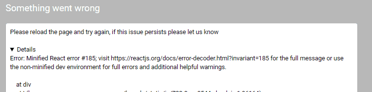
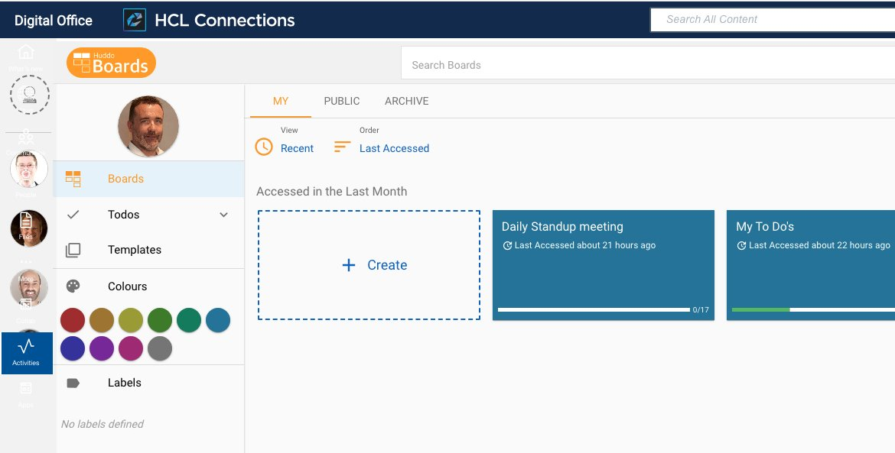

# Huddo Boards Docker

## Authentication

### Logging-in doesn't work

Please revoke your OAuth access to Huddo Boards Cloud within HCL Connections.
Go to `https://<YOUR_CONNECTIONS_URL>/connections/oauth/apps` (replacing `<YOUR_CONNECTIONS_URL>`) and press 'Revoke'


---

## Kubernetes Ingress Controller Version

To check the version of the ingress controller run this command

    kubectl get pods --all-namespaces | grep ingress-controller
    kubectl exec -it <POD_NAME> -n <NAMESPACE> -- /nginx-ingress-controller --version

where

-   `<POD_NAME>` is the name of the Ingress controller pod
-   `<NAMESPACE>` is the namespace of the Ingress controller pod. e.g. `kube-system` or `connections`

For example

    kubectl get pods --all-namespaces | grep ingress
    kubectl exec -it nginx-ingress-controller-84d4dfc9b-7gv4m -n kube-system -- /nginx-ingress-controller --version

Example

    -------------------------------------------------------------------------------
    NGINX Ingress controller
      Release:    0.23.0
      Build:      git-be1329b22
      Repository: https://github.com/kubernetes/ingress-nginx
    -------------------------------------------------------------------------------

As of 0.22.0 the Ingress controller rewrite-target definition changed. If Boards is installed at a context root, the format must include a regular expression which is now set as the default as of the helm chart v2.0.1. We recommend using the latest `huddo-boards-cp-1.2.1.tgz` which includes all required annotations (including socket.io cookie fix).

If you have an older Ingress controller version (i.e. 0.20) you will need to apply the following customisations to fix the ingress with charts as of v2.0.1

```yaml
webfront:
    ingress:
        path: /boards
        annotations:
            nginx.ingress.kubernetes.io/rewrite-target: /

core:
    ingress:
        path: /api-boards
        annotations:
            nginx.ingress.kubernetes.io/rewrite-target: /
            nginx.ingress.kubernetes.io/affinity: cookie
            nginx.ingress.kubernetes.io/session-cookie-path: /api-boards; Secure
            nginx.ingress.kubernetes.io/session-cookie-samesite: None
            nginx.ingress.kubernetes.io/proxy-body-size: 50m
            nginx.ingress.kubernetes.io/proxy-read-timeout: "3600"
            nginx.ingress.kubernetes.io/proxy-send-timeout: "3600"
```

---

## Customizing Boards Context Root

If you wish to deploy boards at a path other than `/boards` & `/api-boards` please see [this example file](../../assets/config/kubernetes/custom-context-root.yaml) of all the variables to merge into your YAML config file.

> Note: If you are using an older version of the Ingress controller (< 0.22) you will need to use example above

> Note: please see this example again if you encounter the error

    Ignoring ingress because of error while validating ingress class" ingress="connections/kudos-boards-cp-webfront" error="ingress does not contain a valid IngressClass"

---

## No real time updates (eg Rich Text not editable)

Some deployments may encounter an issue where you are unable to see any real time updates. If this is the case, it is likely that the socket is unable to connect or authenticate. Please update to the [latest Boards helm chart](../helm-charts.md) which includes annotations for increased browser cookie security requirements.

> Note: if you have a `core.annotations` section in your yaml configuration our updates will be overwritten. Custom annotations should only be required when customizing the context root as per above. Please remove the `annotations` section otherwise.

### Additional for WebSphere IHS

If you are using WebSphere IHS as your reverse proxy in front of Boards, please set the following environment variables to force polling instead of sockets

```yaml
webfront:
    env:
        FORCE_POLLING: true
```

---

## Minio pods fail to start in Boards CP

If the Minio service fails to start with the following error:

    ERROR Unable to initialize backend: found backend fs, expected xl

Please update to [kudos-boards-cp-3.1.4.tgz](../../assets/config/kubernetes/kudos-boards-cp-3.1.4.tgz) which includes a different image of Minio which supports your existing 'fs' file system.

## React Minified Issue



This has been successfully fixed in all reported cases by clearing the local storage of the user's browser. There is also a change to handle this better in [the 2022-12-15 release](../releases-archive.md#2022-12-15)

## ITM Render Issue



Connections 8 CR1/2 changes how the ITM bar is displayed. This causes an issue in Boards where is loads to the left and not the right.

You can add this to your custom css in the header/customiser (which is then injected into Boards).

    .gt-sm.cnx8-ui.itm-bar-open .itm-section {
      position: absolute;
      right: 0;
    }
