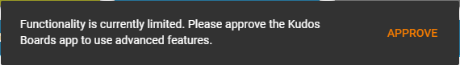
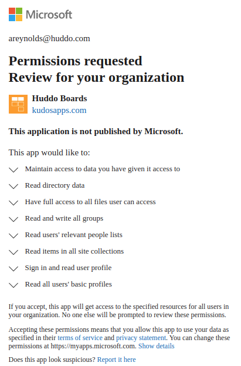

# Boards in Microsoft 365 for Business

## Microsoft Teams

### Administrator approval required to add Huddo Boards as a Teams Tab

You may find that as a non-administrator Microsoft 365 user, you cannot add Huddo Boards as a Teams Tab. In this case, after signing in to Huddo Boards in the tab configuration dialog view, the view will look like the screenshot below and all actions will be disabled.

Note that Huddo Boards can still be used as a Microsoft Teams personal app whilst in this state

#### Resolution

A user that has administrative capabilities within your Microsoft 365 organisation will need to sign in to Huddo Boards (either inside the Microsoft Teams configuration view or by going directly to [boards.huddo.com](https://boards.huddo.com)). They will then be presented with the following prompt:

After clicking `Approve`, the administrator will be directed to an approval screen that will allow them to accept all of the required permissions that Huddo Boards requires, on behalf of the entire organisation:

Once these permissions have been accepted on behalf of the organisation, all users in the organisation will now be able to add Huddo Boards as a Microsoft Teams Tab.

##### Force Administrative Approval for Organisation

Administrative users for your Microsoft 365 organisation can also force an approval of all permissions for the organisation from within the Org Administration screen by following these steps:

Access the [Configuration Page](../../admin/org-config.md) and click through your Microsoft 365 client under 'Authentication Clients'.

Click the `Approve Advanced Features` button:

This will direct you to the Microsoft 365 **Permissions requested - Accept for your organisation** page, allowing you to force the consent of all permissions that Huddo Boards needs for your organisation:

### Huddo Boards App not showing in Teams store

If you search for Huddo Boards but you cannot see it in the Teams Store, it is likely that third-party apps are blocked in your tenant.

#### Resolution

You will need to go to the [Admin Dashboard](https://admin.teams.microsoft.com/policies/app-permission) to view the settings.

Under 'Third-party apps' you can see the settings for your tenant. Here you can set your users to be able to access Huddo Boards through the Teams Store.

