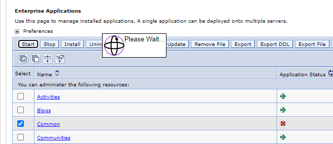

# Apps Menu / Navigation

## HCL Connections 8.0

There are a few ways to achieve this in HCL Connections 8.0 with the new theme.

| Top Level                               | More                            |
| --------------------------------------- | ------------------------------- |
|  |  |

### Customizer

The [HCL documentation](https://opensource.hcltechsw.com/connections-doc/v8/admin/customize/customizing-side-navigation.html) also highlights how to add `customEntries` to the side navigation.

#### Ideas

```json
 {
  "id": "ideas-menu-nav",
  "name": "Ideas",
  "action": "add",
  "link": "https://[CONNECTIONS_URL]/huddo/auth/connections?redirect_to=/huddo/ideas",
  "icon": "https://[CONNECTIONS_URL]/huddo/ideas/favicon.ico",
  "order": 1600,
  "submenu": [],
  "location": "main"
},
```

#### Wikis

```json
{
  "id": "wikis-menu-nav",
  "name": "Wikis",
  "action": "add",
  "link": "https://[CONNECTIONS_URL]/huddo/auth/connections?redirect_to=/huddo/wikis",
  "icon": "https://[CONNECTIONS_URL]/huddo/wikis/favicon.ico",
  "order": 1700,
  "submenu": [],
  "location": "main"
  },
```

### Customise nav json file

!!! tip

    This is the recommended approach for environments that do not have Customizer installed.

The side navigation is customisable as per the [official documentation](https://github.com/HCL-TECH-SOFTWARE/connections-ui-docs/blob/master/main-areas/side-navigation/README.md).

1.  Download the default [react-nav.json](https://github.com/HCL-TECH-SOFTWARE/connections-ui-docs/blob/master/main-areas/side-navigation/resources/react-nav.json) file.

1.  Rename this file to `react-nav-entries.json`

1.  Edit this file to add `Ideas` and `Wikis`

    Huddo Collab can be added in any place in the navigation. Typically this would either be at the top level in the `navbarmenus.main_menus` array between Communities and People. Simply add the following JSON object in the corresponding section of the file:

    ```json
    {
      "id": "ideas-menu-nav",
      "name": "Ideas",
      "action": "add",
      "link": "https://[CONNECTIONS_URL]/huddo/auth/connections?redirect_to=/huddo/ideas",
      "icon": "https://[CONNECTIONS_URL]/huddo/ideas/favicon.ico",
      "order": 1600,
      "submenu": [],
      "location": "main"
    },
    ```

    ```json
    {
      "id": "wikis-menu-nav",
      "name": "Wikis",
      "action": "add",
      "link": "https://[CONNECTIONS_URL]/huddo/auth/connections?redirect_to=/huddo/wikis",
      "icon": "https://[CONNECTIONS_URL]/huddo/wikis/favicon.ico",
      "order": 1700,
      "submenu": [],
      "location": "main"
    },
    ```

1.  Place this customised file on your Shared Drive at this location:

        <SHARED_DRIVE>/customization/common/ui/cnx8-react/react-nav-entries.json

    For example:

        /nfs/data/shared/customization/common/ui/cnx8-react/react-nav-entries.json

1.  Restart the `Common` application via the ISC to apply the changes

    