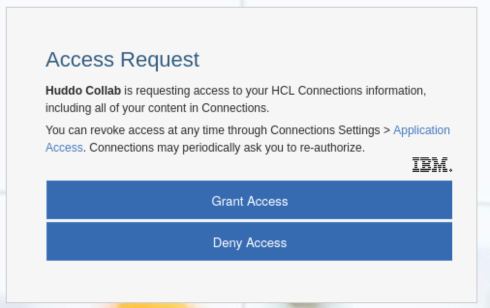

# HCL Connections OAuth

## Register OAuth

In order for Huddo Collab to authenticate with your Connections environment, you must define a new OAuth widget.

---

1.  SSH to the HCL Connections Deployment Manager (substitute the alias)

        ssh root@[DEPLOY_MANAGER_ALIAS]

1.  Start `wsadmin` (substitute your credentials)

        cd /opt/IBM/WebSphere/AppServer/profiles/Dmgr01/bin/
        ./wsadmin.sh -lang jython -username connectionsadmin -password passw0rd

1.  Register the new application definition

        execfile('oauthAdmin.py')
        OAuthApplicationRegistrationService.addApplication('collab', 'Huddo Collab', 'https://[COLLAB_URL]/auth/connections/callback')

    Where `[COLLAB_URL]` is the URL of the Collab installation specified previously

1.  To view the uniquely created client clientSecret

        OAuthApplicationRegistrationService.getApplicationById('collab')

    These commands will print the definition. Please take note of the `clientSecret`. We will use this later on as

        CONNECTIONS_URL=https://connections.example.com
        CONNECTIONS_CLIENT_ID=collab
        CONNECTIONS_CLIENT_SECRET=[VALUE_PRINTED]

## Configure Auto Auth

Steps to configure the Huddo Collab application for auto-authorize (also [documented here](https://help.hcltechsw.com/connections/v65/admin/admin/t_admin_registeroauthclientwprovider.html))

!!! tip

    this step is optional but recommended and can be done at any time.

1.  Add the new line to the following section in `[cellname]/oauth20/connectionsProvider.xml`

    > Note: keep any existing values and add the new line for `collab`

        <parameter name="oauth20.autoauthorize.clients" type="ws" customizable="true">
            <value>collab</value>
        </parameter>

1.  Recreate the provider via this command:

    > Note: update the wsadmin credentials and the `[PATH_TO_CONFIG_FILE]`

        ./wsadmin.sh -lang jython -conntype SOAP -c "print AdminTask.createOAuthProvider('[-providerName connectionsProvider -fileName  [PATH_TO_CONFIG_FILE]/oauth20/connectionsProvider.xml]')" -user connectionsadmin -password passw0rd

1.  Restart the WebSphere servers
