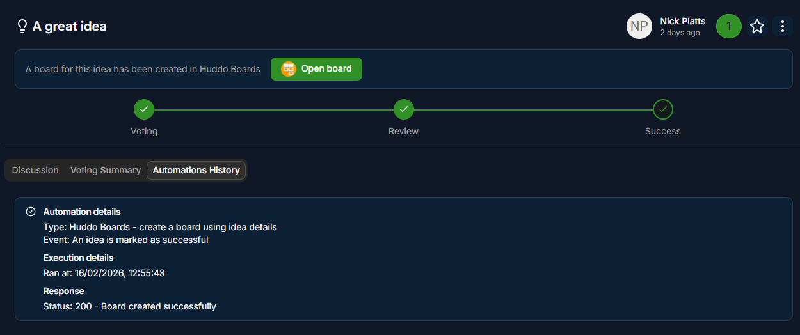

# Huddo Ideas - Automations

## Introduction

Automations are a way to trigger actions based on events in the Ideas app. For example, you could create a board within Huddo Boards or trigger a Zapier or Power Automate workflow via a webhook call when an idea is promoted as successful.


## Automation Events/Triggers

There is currently one automation event/trigger available:

- Idea approved as successful

This event is triggered when an idea is promoted as successful.

More events will be added in the future.

## Automation Types

### Huddo Boards - create a board using idea details

Enabling the Huddo Boards integration will automate the creation of a board in Huddo Boards.

When an idea is promoted as successful, Ideas will make a webhook call to Boards, passing the details of the successful idea, and the members of the idea lab that the idea was created in.
Huddo Boards will then create a board using the title and description of the idea, and add the members of the lab as members of the board.

A URL to the board will be saved to the idea and will be shown on both the idea page and idea card in the lab view.



The response from Huddo Boards is saved and shown under Automations History on the idea page.

### Call a webhook to trigger automation

You can also trigger a webhook call when an idea is promoted as successful. This is useful if you want to trigger an action in another system, such as a Zapier or Power Automate workflow.

When an idea is promoted as successful, the webhook integration will call the URL you provide with the details of the successful idea.

The response from the webhook is saved and shown under Automations History on the idea page.

#### Webhook data sent

The webhook call will be made to the URL you provide with the following JSON body:

```json
{
    "type": "object",
    "properties": {
        "ideaId": {
            "type": "string",
            "description": "The ID of the idea that was promoted as successful"
        },
        "title": {
            "type": "string",
            "description": "The title of the idea"
        },
        "description": {
            "type": "string",
            "description": "The description of the idea"
        },
        "creator": {
            "type": "string",
            "description": "The name of the creator of the idea"
        },
        "labId": {
            "type": "string",
            "description": "The ID of the lab that the idea was created in"
        },
        "labQuestion": {
            "type": "string",
            "description": "The question of the lab that the idea was created in"
        },
        "labCreator": {
            "type": "string",
            "description": "The name of the creator of the lab that the idea was created in"
        }
    }
}
```
