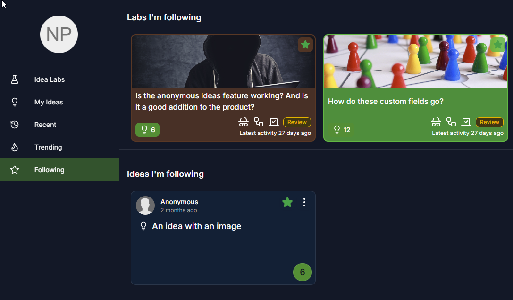
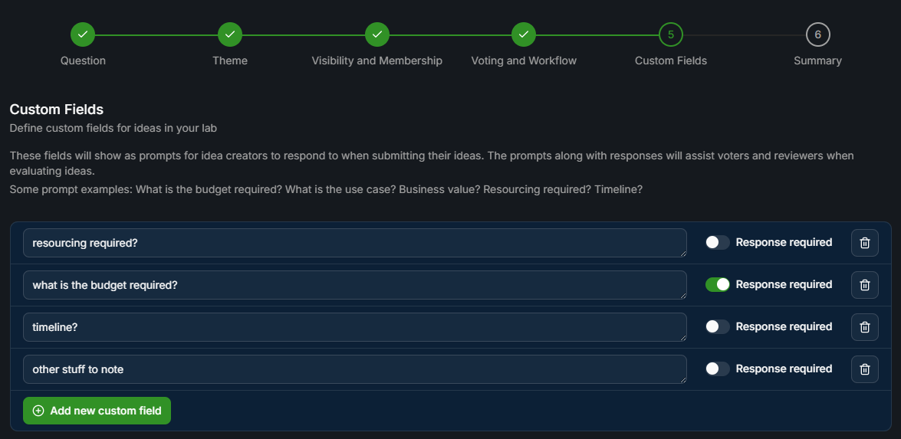
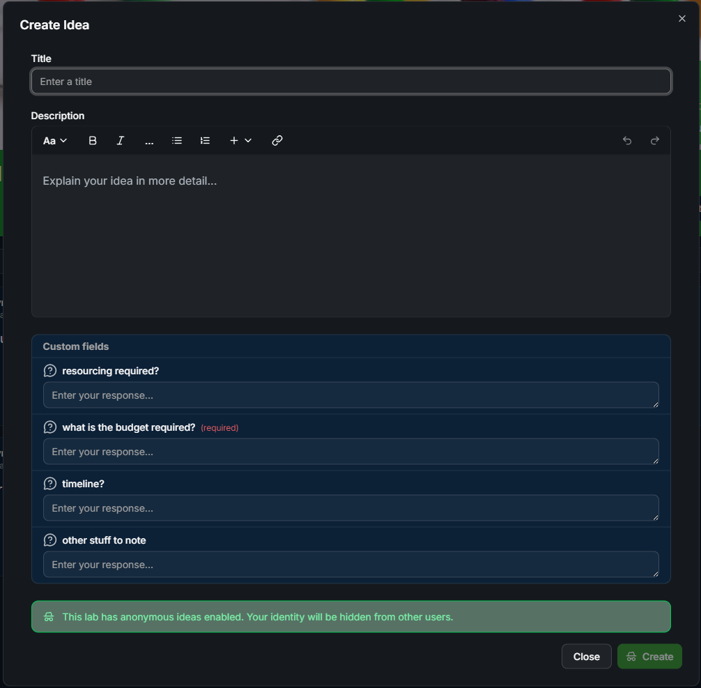
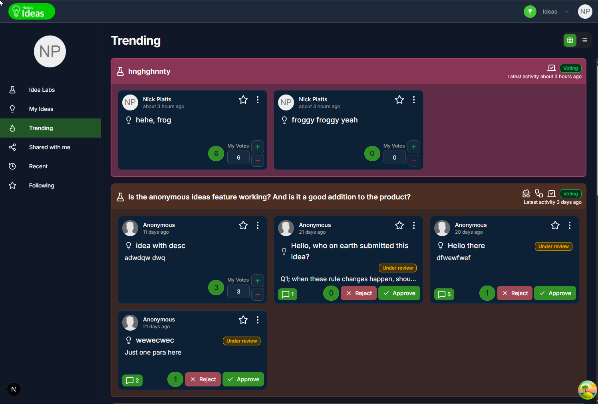
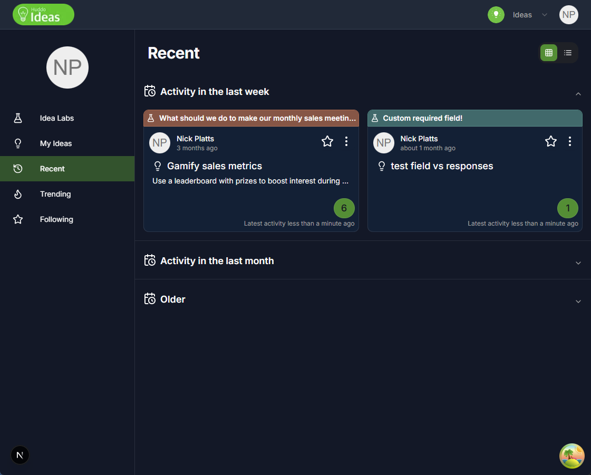

# Huddo Ideas - Latest Features/Updates

## Dec 11, 2025

There have been quite a few new views and features added to Ideas in the last few months. Here's a quick overview of the most notable ones:

### Rich text in Idea Lab / Idea descriptions

A simplified implementation of the Tiptap editor used for Wikis has been integrated, allowing for rich text formatting of descriptions in both Idea Labs and individual Ideas.

-   An attachments service has also been recently developed by Welchy for use generally across the "Collab" apps - this will allow users to attach supporting files of many types to Labs and Ideas, once it has been integrated. It's already being used for uploading hero images in Ideas and Wikis.

### Follow Labs and Ideas

Users can now follow Idea Labs and individual Ideas by clicking the follow icon:

Followed Labs and Ideas can be viewed in the Following view, and in future notifications will be sent for updates to followed items.

### Custom Fields

A direct result of feedback from Dirk at Feinmetall, custom fields can now be defined in an Idea Lab:

The custom fields will show up as prompts when people create an idea in that lab - and fields can be marked as required if a response is necessary.

### Trending sort and view

Add trending sort option to labs view - trending labs are calculated based on the voting and idea activity in the trending period (currently set to last 14 days)

New trending view shows top 20 trending labs with ideas (ideas within the labs also sorted by trending):

### My Ideas Refactor

The My Ideas view has been refactored to display individual ideas rather than my ideas grouped by lab, now the parent lab is shown as a header link at the top of each card:

### Recent Ideas View

New "recent" view which shows ideas (with lab header like my ideas) sorted by most recent updates (latest votes then idea updates).
They are shown in an accordion and grouped into:

-   Activity in the last week, last month, and older

    

### Community Widget

Ideas can now be added as a widget in a community. Authentication with Connections, get Connections context from parent window and app redirects are in place and the widget will show the idea labs for the community:

The widget/app has not yet been added to our "production" ISW Connections instance but will be done soon. The work done for the Ideas widget should be easily reproducible for Wikis and other Collab apps.
