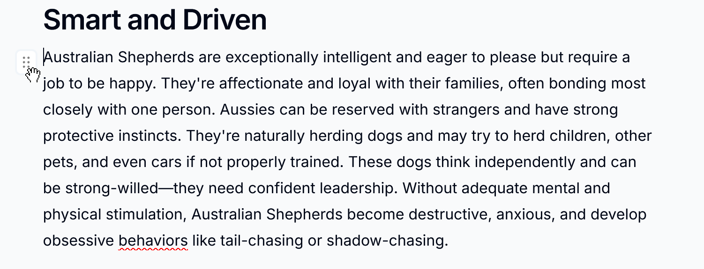
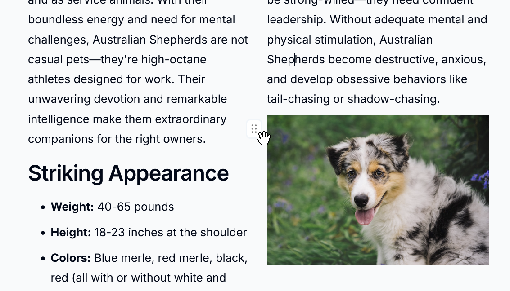

# Creating Columns with Drag and Drop

{ style="max-width: 75%; outline: 1px solid black; display: block; margin: 0 auto;" }

Columns allow you to arrange content side-by-side in your wiki pages. Instead of
using menus or toolbars, you create columns naturally by dragging content where
you want it. This is perfect for comparisons, layouts with images alongside
text, or any time you need a multi-column design.

---

### Using the Drag Handle

{ style="max-width: 75%; outline: 1px solid black; display: block; margin: 0 auto;" }

Every block of content in the editor has a drag handle that appears when you
hover near it.

1. Move your mouse over any content block (paragraph, heading, image, etc.)
1. A drag handle icon appears on the left - it looks like a grid of six dots
1. Click and hold the drag handle to start dragging

---

### Creating a Two-Column Layout

{ style="max-width: 75%; outline: 1px solid black; display: block; margin: 0 auto;" }

To create your first column layout, drag one block next to another.

1. Hover over the content you want to move and grab the drag handle
1. Drag the content toward the right edge of another block
1. Watch for a vertical line indicator showing where your content will land
1. Release to create a two-column layout

The block you dragged to becomes the left column, and the block you dragged
becomes the right column.

---

### Adding More Columns

You can add up to six columns in a single column block.

#### Adding to the edges

{ style="max-width: 75%; outline: 1px solid black; display: block; margin: 0 auto;" }

1. Drag content toward the left or right edge of an existing column block
1. When you see the drop indicator at the edge, release to add a new column

#### Inserting between columns

{ style="max-width: 75%; outline: 1px solid black; display: block; margin: 0 auto;" }

1. Drag content into the gap between two existing columns
1. A vertical indicator appears in the gap
1. Release to insert a new column between them

!!! warning

    Column blocks support a maximum of 6 columns. If you already have 6 columns, you won't be able to add more to that block.

---

### Moving Content Within Columns

{ style="max-width: 75%; outline: 1px solid black; display: block; margin: 0 auto;" }

Once you have columns, you can reorganise content within them.

1. Grab the drag handle of any block inside a column
1. Drag it to a new position within the same column or into a different column
1. The drop indicator shows where the content will be placed
1. Release to move the content

---

### Automatic Cleanup

The editor automatically tidies up your columns as you work:

- **Empty columns are removed** - If you drag all content out of a column, it
  disappears automatically
- **Single columns unwrap** - If a column block ends up with only one column,
  the content is unwrapped back to normal layout

This means you don't need to manually delete empty columns - just drag content
around and the layout adjusts itself.

---

### Tips for Working with Columns

!!! tip "Drag to the padding area"

    You can also create columns by dragging content to the left or right padding area (the margins) of the editor. This works the same as dragging to a block's edge.

!!! tip "Nested columns"

    You can create columns within columns for more complex layouts. Drag content to the edge of a block that's already inside a column to nest another column layout.

!!! info "Content width"

    When working with columns, you may want to use a wider reading width to give your columns more space. Click your avatar in the top right corner to open the user menu, where you'll find the width control.
